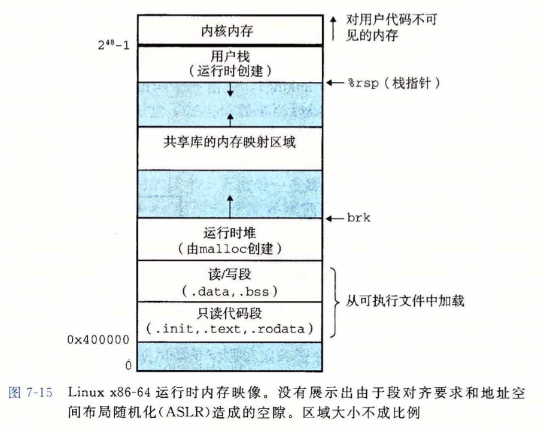

[toc]

# 动态内存



在C++中，内存分成5个区，他们分别是堆、栈、自由存储区、全局/静态存储区和常量存储区。

1. 栈，在执行函数时，函数内局部变量的存储单元都可以在栈上创建，函数执行结束时这些存储单元自动被释放。栈内存分配运算内置于处理器的指令集中，效率很高，但是分配的内存容量有限。

2. 堆，就是那些由new分配的内存块，他们的释放编译器不去管，由我们的应用程序去控制，一般一个new就要对应一个delete。如果程序员没有释放掉，那么在程序结束后，操作系统会自动回收。

3. 自由存储区，就是那些由malloc等分配的内存块，他和堆是十分相似的，不过它是用free来结束自己的生命的。

4. 全局/静态存储区，全局变量和静态变量被分配到同一块内存中，在以前的C语言中，全局变量又分为初始化的和未初始化的，在C++里面没有这个区分了，他们共同占用同一块内存区。

5. 常量存储区，这是一块比较特殊的存储区，他们里面存放的是常量，不允许修改。

静态内存用来保存局部 static 对象、类 static 数据成员以及任何定义在函数之外的（全局）变量；栈内存用来保存定义在函数内的非 static 对象，即局部变量。

分配在静态或栈内存中的对象由编译器自动创建和销毁。

对于栈对象，仅在其定义的程序块运行时才存在；

static 对象在使用之前分配，在程序结束时销毁。

程序用堆 (heap) 来存储动态分配的对象，即在程序运行时分配的对象，其生存期由程序控制，当动态对象不再使用时，必须显式销毁。

## 动态内存与智能指针

C++中动态内存管理通过一对运算符完成：

- new，在动态内存中为对象分配空间，并返回一个指向该对象的**指针**，可以选择对对象进行初始化；
- delete，接受一个动态对象的指针，销毁该对象，并释放与之相关联的内存。

为了更容易使用动态内存，新标准库提供两种智能指针 (smart pointer) 类型来管理动态对象。

**智能指针与普通指针的区别在于它自动释放所指向的对象**，两种智能指针之间的区别在于管理底层指针之间的方式：

- share_ptr 允许多个指针指向一个对象；
- unique_ptr 独占所指向的对象；
- weak_ptr 伴随类，是一种弱引用，指向 shared_ptr 所管理的对象；

头文件 \<memory>

### shared_ptr 类

智能指针是模板，默认初始化的智能指针保存空指针。

shared_ptr 独有操作：

```c++
make_shared<T> (args) // 返回一个shared_ptr，指向一个动态分配的类型为T的对象，使用args初始化此对象
shared_ptr<T> p(q) // p是q的拷贝，此操作递增q中的计数器，q中的指针必须能转化成T*
p=q // p, q都是shared_ptr，所保存的指针必须能相互转换。此操作递减p中计数值，递增q计数值；若p计数为0，则将其管理的原内存释放
p.unique() // 若p.use_count()为1，返回true；否则返回false
p.use_count() // 返回与p共享对象的智能指针数量，速度可能很慢，主要用于调试
```

#### make_shared 函数

make_shared 标准库函数在动态内存中分配一个对象并初始化，返回指向此对象的 shared_ptr。

```c++
shared_ptr<int> p = make_shared<int> (42); // 指向一个值为42的int的shared_ptr
auto p1 = make_shared<int> (); // 指向一个值初始化，即为0的int
```

#### share_ptr 的拷贝和赋值

拷贝和赋值操作时，每个 shared_ptr 会记录有多少个其他 shared_ptr 指向相同对象。

- 拷贝时，引用计数加一：用其初始化另一个 shared_ptr，作为参数传递给一个函数，或作为函数返回值时，都属于拷贝，因此引用计数加一；
- 给一个 shared_ptr 赋予新值或是它被销毁时，引用计数器递减；

#### shared_ptr 自动销毁所管理对象

当指向一个对象的最后一个 shared_ptr 被销毁时，shared_ptr 类通过其析构函数自动销毁此对象，并释放内存。

### 直接管理内存

#### new 动态分配内存和初始化对象

运算符 new 分配动态内存，delete 释放内存。

默认情况下，动态分配的对象是默认初始化的，这意味着**内置类型和组合类型的**对象的值将是未定义的，而类类型对象将用默认构造函数进行初始化。

```c++
string *ps = new string; // 初始化为一个空string
int *pi = new int; // 指向未初始化的int

//直接初始化
int *pi = new int(1024); // 1024
string *ps = new string(10, '9'); // "9999999999"
vector<int> *pv = new vector<int> {1,2,3}; // 三个元素，1，2，3

//值初始化
int *pi = new int(); //值初始化为0

//默认初始化
int *pi1 = new int; //值未定义


int *p1 = new int(); // 分配失败抛出 bad_alloc
int *p2 = new (nothrow) int; // 分配失败返回一个空指针

```

