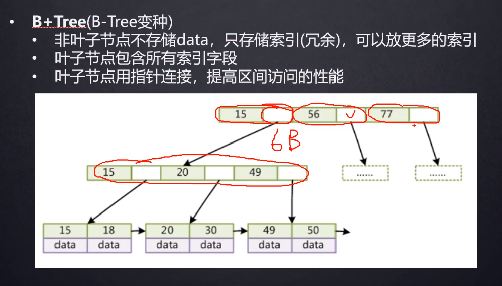
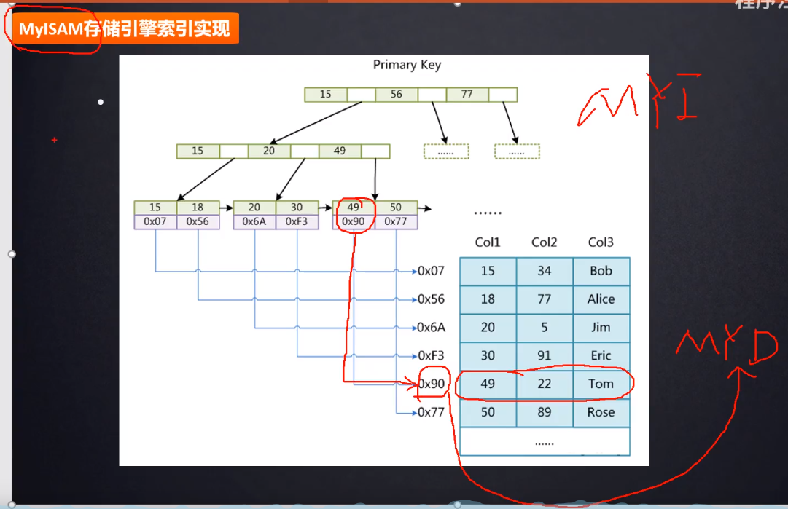
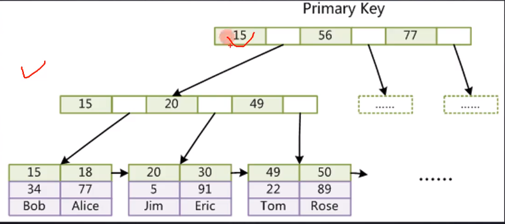
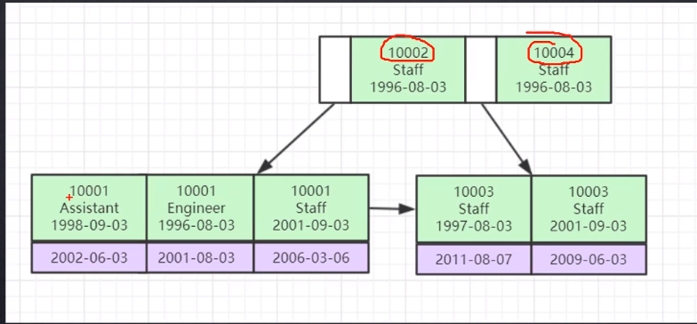

[toc]

<!--readmore--->

# 索引

MySQL 索引主要有两种数据结构：

- B+ 树索引
- hash 索引

Innodb 和 M有ISAM 存储引擎默认 B+ 树索引，Memory 存储引擎默认使用 hash 索引。

B+ 树相较于 hash 索引的优点在于它更适合排序和范围查询操作，而缺点也就是查询速度比 hash 索引慢。

B+ 树的所有索引数据都在叶子节点上，并且增加了顺序访问指针，每个叶子节点都有指向相邻叶子结点的指针。方便了范围查询，提高了范围查询效率。

> 对比红黑树与B+树，为什么 MySQL 使用 B+ 树？
>
> - B+树的树高更低，每个节点出度更大
> - 数据库系统将每一个索引节点大小设置为页大小，使得一次 I/O 操作就能完全载入一个索引节点
> - 读取相同的索引，B+树读取磁盘的次数更少（树深度更浅），因此B+树更适合磁盘数据的读取

## 索引的本质

索引是帮助 MySQL 高效获取数据的 排好序的 数据结构。

在没有索引时，条件查询会造成全表扫描，效率低下。

## 索引数据结构

- 二叉树
- 红黑树
- Hash 表
- B/B+ 树

### 二叉树

二叉搜索树，满足左子节点 < 根节点 < 右子节点的关系，当我们为一个递增存储的字段建立二叉树索引时，索引会退化为链表，查找、插入、删除时间复杂度 $O(N)$，

### 红黑树

平衡二叉树，数据量很大的时候树的高度会很高，查找索引的次数很多。

为了压缩树的高度，让每一个节点可以存储更多的索引元素，分配更多的内存，因此使用 B/B+ 树。

### B 树

B+ 树是 B 树的变种，非叶子节点不存储数据，只存储索引元素，每个节点可以存放更多索引；

> 所谓索引，是索引元素，即索引字段的值；所谓数据，是指指向 索引元素所在行 的磁盘文件地址指针。

叶子节点包含所有索引字段；

叶子节点用指针连接，提高区间访问的能力；

### 哈希表

哈希表查找索引节点效率很高，比 B+树快，但是实际中很少使用。

因为 hash 索引不支持范围查询，而 B+ 树相较于 B 树还具有指向下个节点的指针，可以更高效地支持范围查询。

#### 对比

在 B 树中，每个索引元素只会出现在一个节点中；在 B+ 树中，索引元素是冗余的，叶子节点存放了全部的索引元素，而部分索引节点作为冗余存放在非叶子节点中。

MySQL 中，B+树的每个节点大小相同，可以查看全局变量

```mysql
mysql> SHOW GLOBAL STATUS LIKE 'innodb_page_size';
+------------------+-------+
| Variable_name    | Value |
+------------------+-------+
| Innodb_page_size | 16384 |
+------------------+-------+
1 row in set (0.06 sec)

mysql> 
```

可以看到大小为 16KB。

对于大小相同的每个叶子节点，B+树少存储了数据部分，因此可以存放更多的索引。



B+树的每个索引节点中，每个索引元素与一个指向下一级索引节点的文件地址指针成对出现，MySQL 源码中，该指针的大小为 6 Bytes。

> 假设索引字段为一个 8 字节的 BIT INT，指向下一级索引节点的指针为 6 字节，每个索引节点大小 16 KB，那么每个节点可以存储 1170 个索引元素，假设每个叶子节点存放的数据为 1KB，树高为三层的 B+树就可以存储两千万条数据，也就是说两千万条数据的表，建一个索引，每次查询只需要三次磁盘 I/O。

不同的 MySQL 存储引擎，叶子节点的数据 data 存放的内容不一样。innoDB 存储索引和数据（索引所在行的其他所有字段），而 MyISAM 只存储索引，不存储数据，只有指针。

# MyISAM



在一个条件查询中，如果条件查询的字段是索引字段，MyISAM 会从索引文件的 B+树结构中找到符合条件的叶子节点，根据索引数据到表文件中定位到数据行。

# InnoDB

InnoDB 将索引和数据合并为一个文件。

InnoDB 索引（聚集索引）实现：

- 表数据文件本身就是按 B+树组织的一个索引结构文件
- **聚集索引-叶节点包含了完整的数据记录**
- 为什么 InnoDB 表必须有主键，并且推荐使用整形的自增主键？
  - 因为 InnoDB 的数据组织方式就是 B+树的形式，必须要有一个主键，如果没有指定主键，MySQL 会选择一个唯一键建立主键索引，如果找不到会默认添加一列来维护数据结构；
  - 整形数据比较大小时速度快，并且占用空间小；
  - 主键自增可以减少 B+树调整结构的频次，降低效率损失
- 为什么非主键索引结构叶子节点存储的是主键值？（一致性和节省存储空间）



## 聚集索引、聚簇索引

InnoDB 的主键索引就是聚集索引，而 MyISAM 的主键索引是非聚集索引。

聚集索引就是索引和文件聚集（合并）在同一个文件中，非聚合索引的索引和数据是分开的。

因此利用聚簇索引查询只需要在一个文件中查询，在找到叶子节点之后，只需要把叶子节点载入内存，就可以访问数据；非聚簇索引需要先把叶子节点载入内存，再根据指针去访问数据文件中的数据行，多一次磁盘 I/O。

## 联合索引



上图是联合索引数据结构，图中所示为三个字段的联合索引，而索引排序方式则是按照三个字段的先后顺序，优先对先出现的字段进行排序，当先出现的字段值相同时再对紧接着出现的下一个字段进行排序，以此类推。

联合索引的叶子节点的索引元素之外，其存储的数据为该索引元素所在的行的其余字段值。

因此，最左匹配原则其实就是因为联合索引底层的数据结构中，索引的排列顺序是按照联合字段的顺序来排列的，如果不满足最左匹配原则，那么索引是没有顺序排列的，且没有左侧的索引字段无法对索引文件进行索引。

# MVCC 多版本并发控制

