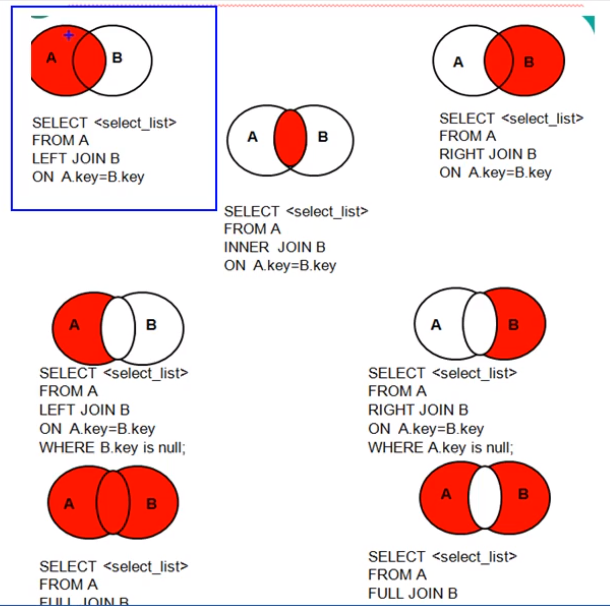
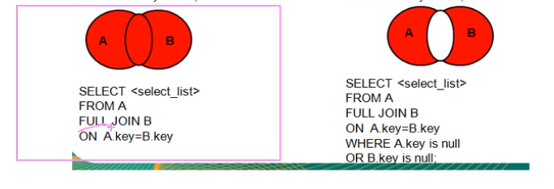
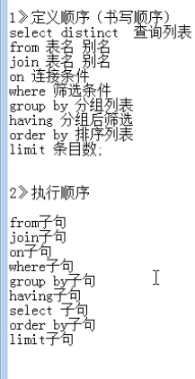
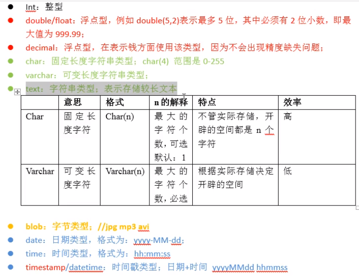
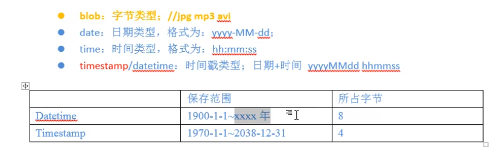
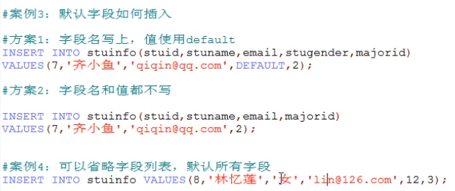
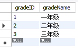
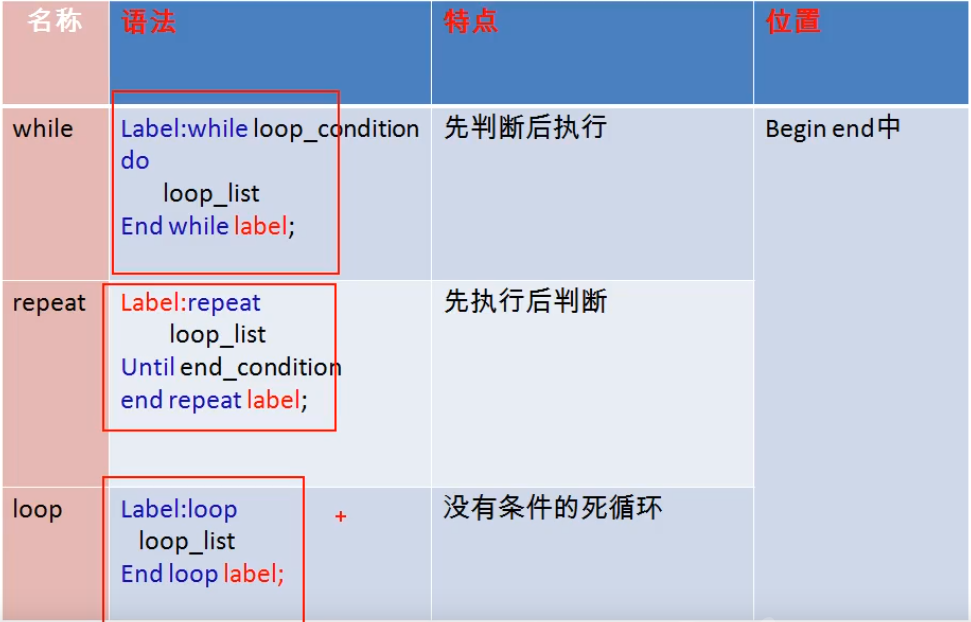

[toc]

<!--readmore-->

# DQL 语句

## 连结表

### 连结

连结对应的语句为 `JOIN`。

为了减少内存浪费、方便更新数据、且维护数据的一致性，在设计关系表时，把信息分解成多个表。

如果某一列在其中一个表中为主键 (primary key)，并且同样的列也被存储在另外一张表中，用来关联两张表，那么这列在另外一张表中叫做外键。  

> 外键 (foreign key)
>
> 外键为某个表中的某一列，包含另一个表中的主键值，定义了两个表之间的关系。

类型

- 内联结（等值连结）  
  基于行的等值匹配，将一个表中的一行与另一个表中的行连结。
- 外部连结  
  除了关联行，还包含没有关联行的那些行。关键字 `OUTER JOIN`，通过 `LEFT` 和 `RIGHT` 关键字指定**包括其所有行的表**。  
  查询结果为主表中的所有的记录，如果从表有匹配项，则显示匹配项；如果从表没有匹配项，则显示 `NULL`。  
  应用场景：一般用于查询主表中有，但是从表没有的记录。  
  特点：  
  - 外联结分主从表，两表顺序不能任意调换
  - 左连接，左表为主表；有链接，右表为主表
- 全外联结  
  既有左连接又有右连接。两张表的所有记录都会返回，没有匹配的都为 NULL。
- 自然连结  
  不常用。
- 自联结





## 子查询

当一个查询语句中又嵌套了另一个完整的 SELECT 语句，则被嵌套的 SELECT 语句成为子查询或内查询，外面的 SELECT 语句称为主查询或外查询。

按照子查询出现的位置进行分类：

- SELECT 后  
  要求：子查询结果为单行单列（标量子查询）
- FROM 后  
  要求：子查询的结果可以为多行多列（无要求）
- WHERE 或 HAVING 后  
  要求：子查询结果必须为单列，单行/多行子查询
- EXIST 后面  
  要求：子查询结果或必须为单列（相关子查询）

### 特点

- 子查询放在条件中，必须放在条件的右侧
- 子查询一般放在小括号中
- 子查询的执行优先于主查询
- 单行子查询对应了单行操作符：`< > >= <= = <>`
- 多行子查询对应了多行操作符：`ANY/SOME ALL IN `

### 多行子查询

- `IN`：判断某字段是否在指定列表内
- `ANY/SOME`：判断某字段的值是否满足其中任意一个
- `ALL`：判断某字段的值是否满足里面所有的

## 分页查询

### 应用场景

当页面上的数据，一页显示不全，需要分页显示。

分页查询的 SQL 命令请求数据库服务器->服务器响应查询到的多条数据->前台页面

语法：

```sql
SELECT 	# 7
FROM 	# 1
JOIN	# 2
ON		# 3
WHERE	# 4
GROUP BY# 5
HAVING	# 6
ORDER BY# 8
LIMIT	# 9
```

### 特点

- 0-indexed，默认为0
- LIMIT 两个参数：起始索引，条目数

假设要显示的页数是 page，每页显示的条目数为 size

```sql
SELECT *
FROM employees
LIMIT (page - 1) * size, size;
```

## 联合查询

当查询结果来自于多张表，但多张表之间没有关联，此时往往使用联合查询。

```sql
SELECT FROM WHERE
UNION
SELECT FROM WHERE
```

多条查询语句的查询列数必须一致。

列必须对应，虽然语法正确，但数据无意义。

`UNION` 自动去重，去除重复行。

`UNION ALL` 可以支持重复项。

## 小结



# DDL 语言

数据定义语言，Data Define Language 数据定义语言，用于对数据库和表的管理和操作。

## 库的管理

```MYSQL
-- 创建数据库
CREATE DATABASE stuDB;
CREATE DATABASE IF NOT EXISTS stuDB;
-- 删除数据库
DROP DATABASE stuDB;
DROP DATABASE IF EXISTS stuDB;
```

## 表的管理

### 创建表

```MYSQL
CREATE TABLE name (
	field type constraint
);

--exmaple

CREATE TABLE IF NOT EXISTS stuinfo (
	stuid INT,
    stuname VARCHAR(20),
    stugender VARCHAR(20),
    birthday DATETIME
);

DESC stuinfo;
	
```

#### 数据类型



- `CHAR()` 固定字符长度，会用空格补齐，效率较高，在数据长度较为固定时使用，长度默认为 1；
- `VARCHAR()` 可变字符长度，不会补齐；



```mysql
-- 整形
TINYINT SMALLINT INT BIGINT
-- 浮点型
FLOAT(m, n)
DOUBLE(m, n)
DECIMAL(m, n)
-- m, n 可选
-- 字符型
CHAR(n) -- 可选
VARCHAR(n) -- 必选
TEXT -- 保存较长文本
-- n表示最长字符个数
-- 日期型
DATE
TIME
DATETIME
TIMESTAMP

-- 二进制型
BLOB -- 存储图片数据
```

#### 常见约束

用于限制表中字段数据的，从而进一步保证数据表中的数据是一致、准确、可靠的。

```mysql
NOT NULL	# 非空，限制该字段为必填项
DEFAULT		# 默认约束，无显示插入值，则显示默认值
PRIMARY KEY	# 主键约束，限制该字段值不能重复，不能为空
UNIQUE		# 限制该字段值不能重复，可以为空，可以有多个唯一列
CHECK (
    age BETWEEN 1 AND 100
)			# 检查，用于限制该字段值必须满足指定条件,MYSQL支持语法但无效果
FOREIGN KEY	# 外键约束，用于限制两个表的关系，要求外键列的值必须来自于主表的关联列
```

- 可多个字段作为一个组合主键，此时作为主键的多个字段不能同时重复
- 主表关联列和从表关联列的类型必须一致
- 主表的关联列要求必须是主键

支持列级约束：`NOT NULL, DEFAULT, UNIQUE, PRIMARY KEY, CHECK`

支持表级约束：`UNIQUE, PRIMARY KEY, FOREIGN KEY`

```mysql
CREATE TABLE stuinfo (
	id INT,
    name VARCHAR(20),
    gender CHAR DEFAULT '男',
    age INT CHECK(age >= 1 AND age <= 100),
    email VARCHAR(20) NOT NULL,
    major_id INT,
    PRIMARY KEY(id), # 添加主键
    CONSTRAINT uq UNIQUE(name), # 添加唯一键
    CONSTRAINT fk FOREIGN KEY(major_id) REFERENCES major(id) # 添加外键
)；
```


### 修改

```mysql
ALTER TABLE name
ADD | MODIFY | CHANGE | DROP COLUMN column_name type [colum_constraint];

# 修改表名
ALTER TABLE major RENAME TO students;
# 添加列并设置约束条件
ALTER TABLE students ADD COLUMN borndate TIMESTAMP NOT NULL;
DESC students;
# 修改列并修改约束条件
ALTER TABLE students CHANGE COLUMN borndate birthday DATETIME NOT NULL;
DESC students;
# 修改字段类型
ALTER TABLE students MODIFY COLUMN birthday TIMESTAMP;
# 删除字段
ALTER TABLE students DROP COLUMN birthday;
DESC students;
```


### 删除表

```mysql
DROP TABLE IF EXISTS tbl_name;
```

### 复制表

```mysql
CREATE TABLE newTable 
LIKE oldTable; # 无内容，仅复制表结构

CREATE TABLE newTable
SELECT  *
FROM SrcTable; # 将数据和表结构都复制
```

# DML 语句

Data Manipulation Language 数据操纵语言

对表中的数据增删改。

## 插入数据

### 语法

```mysql
INSERT INTO tbl_name(field1, field2, ...) VALUES(val1, val2, ...);
```

### 注意事项

- 字段和值列表一一对应，包含类型、约束等必须匹配
- 数值型的值，不用单引号，非数值型的值，必须使用单引号
- 字段顺序无要求

如何插入空字段：只要在 `INSERT` 时忽略这个字段即可。



以上为插入单行，还可以批量插入

```mysql
INSERT INTO tbl_name(field1, field2, ...) 
VALUES(val1, val2, ...), (val1, val2, ...), (val1, val2, ...);
```

## 自增长列

```MYSQL
CREATE TABLE gradeinfo (
	gradeID INT PRIMARY KEY AUTO_INCREMENT,
	gradeName VARCHAR(20)
);

INSERT INTO gradeinfo 
VALUES 
(NULL, '一年级'),
(NULL, '二年级'),
(NULL, '三年级');

SELECT * FROM gradeinfo;
```



如果自增主键不插入 `NULL`，则以插入数据为准。

### 要求

- 自增长列要求必须设置在一个键上，比如主键或唯一键
- 自增长列要求数据类型为数值型
- 一个表至多有一个自增长列

## 修改数据

```MYSQL
UPDATE stuinfo SET balance = balance - 5000
WHERE stuid = 1;
```


## 删除数据

### DELETE 语句

```mysql
DELETE FROM name
WHERE COND;
```

### TRUNCATE 语句

```mysql
# 不支持 WHERE 语句
TRUNCATE TABLE name; # 删除表中所有数据
```

### 区别

- `DELETE` 可以添加 `WHERE` 条件，`TRUNCATE` 不能添加 `WHERE` 条件，一次性清除所有数据。
- `TRUNCATE` 删除旧表，建立新表。
- `TRUNCATE` 效率较高。
- 如果删除带自增长列的表，使用 `DELETE` 删除后，重新插入数据，记录从断点处开始；  
  `TRUNCATE` 删除，重新插入，记录则从 1 重新开始。
- `DELETE` 删除数据，会返回受影响的行数；  
  `TRUNCATE` 删除数据，不会返回受影响行数。
- `DELETE` 删除数据，可以支持事务回滚  
  `TRUNCATE` 删除数据，不支持事务回滚。

常用 `DELETE`。

# 事务

由单条 SQL 语句组成，要么全部成功，要么全部失败。

- 隐式事务，`INSERT, UPDATE, DELETE` 都属于隐式事务
- 显式事务，需要显式开启事务，需要先取消事务的自动提交

```mysql
SET AUTOCOMMIT = 0;
START TRANSACTION;
/*DO SOMETHING*/
# 提交
COMMIT;
# OR 回滚
ROLLBACK;
```

## 三种现象

### 脏读

对于两个事务`T1, T2`，`T1`读取了`T2`更新但还没有被提交的字段，之后，若`T2`回滚，`T1`读取的内容就是临时且无效的。

强调未提交的更新事务。

### 不可重复读

对于两个事务`T1, T2`，`T1`读取了一个字段，然后`T2`**更新并提交**了该字段，之后`T1`再次读取同一个字段，会读取到不同的值。

强调更新事务。

同一事务中两次对同一数据的读取结果不同。

### 幻读

对于两个事务`T1, T2`，`T1`从表中读取了一个字段，然后，`T2`在该表中插入了一些新的行，之后如果，`T1`再次读取同一个表，就会多出几行。

强调提交的插入或者删除事务。

## MySQL 四种隔离级别

MySQL 默认隔离级别：REPEATABLE-READ 可重复读

```mysql
mysql> SELECT @@tx_isolation;
ERROR 1193 (HY000): Unknown system variable 'tx_isolation'
mysql> SELECT @@transaction_isolation;
+-------------------------+
| @@transaction_isolation |
+-------------------------+
| REPEATABLE-READ         |
+-------------------------+
1 row in set (0.00 sec)
```

### READ UNCOMMITTED

读未提交，可能会发生脏读、不可重复读、以及幻读。

### READ COMMITTED

其他事务无法读取未提交的修改（UPDATE）。

但是如果另外一个事务更新并提交，那么正在进行中的事务可能会前后读取到不同的数据。

解决了脏读。

### REPEATABLE READ

可重复读，对于同一个事务来说，对同一个数据进行多次查询得到的结果相同。

解决脏读、不可重复读。

在一个事务中，对于相同数据的两次读取，在两次读取之间有其他事务插入并提交，导致未提交的事务读取到额外的数据，并有可能修改其他事务提交的数据。

### SERIALIZABLE

可串行化。可解决以上三个问题。

在一个事务未提交时，另外一个事务进行**插入、更新、删除**操作时会被阻塞。

性能低，但是可以避免所有并发问题。

### MySQL 设置隔离级别

每启动一个 MySQL 程序，就会获得一个单独的数据库连接，每个数据库连接都有一个全局变量 `@@transaction_isolation`，表示当前的事务隔离级别。

```mysql
SET TRANSACTION ISOLATION LEVEL REPEATABLE READ;
SET GLOBAL TRANSACTION ISOLATION LEVEL REPEATABLE READ;
```

## 回滚点 SAVEPOINT

```MYSQL
SET AUTOCOMMIT = 0;
START TRANSACTION;
DELETE FROM account WHERE id = 25;
SAVEPOINT a; # 设置保存点，只能搭配 ROLLBACK
DELETE FROM account WHERE id = 29;
ROLLBACK TO a; # 回滚到保存点，此时 id 为29的行还没有被删除
```

# 视图

含义：虚拟表，和普通表一样使用，MySQL 5.0.1 版本新特性，是通过表动态生成的数据。

把查询结果封装到一个临时结果集中。

只保存 SQL 逻辑，**不保存数据**。

## 应用场景

- 多个地方用到同样的查询结果
- 该查询结果使用的 SQL 较复杂

### 创建视图

假设我们要从 stuinfo 这张表中查询张姓学生的学生姓名以及专业

```mysql
SELECT stuname, majorname
FROM stuinfo s
JOIN major m ON s.majorid = m.id
WHERE s.stuname LIKE '张%'；

# 为了避免每次索引不同名字的同学时写语句，使用视图QLsql
CREATE VIEW v1
AS
SELECT stuname, majorname
FROM stuinfo s
JOIN major m ON s.majorid = m.id;

# 那么每次使用时
SELECT * FROM v1
WHERE stuname LIKE '张%';
```

### 修改视图

```mysql
# 方式一
CREATE OR REPLACE VIEW myv3
AS
/*NEW VIEW*/

# 方式二
ALTER VIEW myv3
AS
/*NEW VIEW*/
```

### 删除视图 & 查看视图

```mysql
DROP VIEW myv3;

DESC myv3;
SHOW CREATE VIEW myv3; # 会返回整个view创建的过程
```

### 更新视图

- 插入

  ```mysql
  # 首先新建视图
  CREATE OR REPLACE VIEW myv1
  AS
  SELECT last_name, email
  FROM employees;
  
  # 插入，需要注意有些视图不允许插入
  # 插入之后原始表被修改
  INSERT INTO myv1 VALUES('FRANK', 'XXX@XX.COM');
  ```

- 修改

  ```mysql
  UPDATE myv1 SET last_name = 'frank'
  WHERE last_nmame = 'FARNK';
  ```

- 删除  

  ```mysql
  DELETE FROM myv1
  WHERE last_name = 'frank';
  ```

上述更新视图操作**很少使用**。

### 不允许更新的视图

- 包含以下关键字的 SQL 语句：  
  分组函数、DISTINCT、GROUP BY、HAVING、UNION、UNION ALL  
  跟分组、联合查询相关的
- 常量视图
- `SELECT` 包含子查询
- 连接表，虽然可更新但不可插入，统一理解为不能更新
- 嵌套了不能更新的视图
- `WHERE` 子句中的子查询引用了 `FROM` 子句的表

## 优点

- 实现了 SQL 语句的重用
- 简化复杂的 SQL 操作，封装细节
- 保护数据，提高安全性，因为用户不知道基表信息

# 变量

- 系统变量
  - 全局变量
  - 会话变量
- 自定义变量
  - 用户变量
  - 局部变量

## 系统变量

由系统提供，不是用户定义，属于服务器层面。

语法：

```mysql
SHOW VARIABLES; # 查看所有的系统变量
SHOW SESSION VARIABLES;
SHOW GLOBAL VARIABLES;

# 查看满足条件的部分系统变量
SHOW GLOBAL | [SESSION] VARIABLES LIKE '%char%'；

# 查看指定的某个系统变量的值
SELECT @@系统变量名；
SELECT @@GLOBAL | [SESSION].系统变量名；

# 为某个系统变量赋值
SET GLOBAL | [SESSION] 系统变量名 = VAL;
SET @@GLOBAL | [SESSION].系统变量名 = VAL;
```

## 自定义变量

变量是用户自定义的。

使用步骤：

- 声明
- 赋值
- 使用（查看、比较、运算等）

### 用户变量

作用域：针对当前会话（连接）有效，同于会话变量的作用域。

可应用在任何地方。

```MYSQL
# 声明或初始化
SET @用户变量名 = 值;
SET @用户变量名 := 值;
SELECT @用户变量名 := 值;

# 赋值
SET 局部变量名 = 值;
SET 局部变量名 := 值;
SELECT @局部变量名 := 值;

SELECT 字段 INTO 变量名
FROM 表;
```

### 局部变量

作用域仅仅在定义它的 begin end 中有效。

应用在 begin end 中的第一句。

- 声明  
  `DACLARE 变量名 类型;`  
  `DECLARE 变量名 类型 DEFAULT 值;`
- 赋值  
  `SELECT 字段 INTO 局部变量名 FROM 表;`
- 使用  
  `SELECT 局部变量名;`

用户变量

```mysql
# 声明两个变量并赋初始值，求和，并打印
SET @m = 1;
SET @n = 2;
SET @sum = @m + @n;
SELECT @sum;
```

局部变量

```mysql
BEGIN
    DECLARE m INT DEFAULT 1;
    DECLARE n INT DEFAULT 2;
    DECLARE SUM INT;
    SET SUM = m + n;
    SELECT SUM;
END
```

# 存储过程和函数

类似于 C++ 函数。

好处：

- 提高代码重用性
- 简化操作
- 减少了编译次数并且减少了和数据库服务器的连接次数，提高了效率

## 存储过程

一组预先编译好的 SQL
语句的集合，理解成批处理语句。

### 创建

```mysql
CREATE PROCEDURE 存储过程名(args)
BEGIN
	/*存储过程体（一组合法的 SQL 语句）*/
END

# 参数列表
# 参数模式 参数名 参数类型
IN stuname VARCHAR(20)

# 参数模式
IN		# 该参数可以作为输入，该参数需要调用方传入值
OUT		# 该参数可以作为输出，也就是该参数可以作为返回值
INOUT	# 该参数即可已作为输入，有可以作为输出，该参数既需要传入值，又可以返回值

# 如果存储过程体仅仅只有一句话，BEGIN END 可以省略
# 存储过程体中的每条SQL语句的结尾要求必须加分号。
# 存储过程的解为可以使用DELIMITER重新设置
# 语法，举例：
DELIMITER $;
```


### 调用

```MYSQL
CALL 存储过程名(实参列表);
```

### 示例

以下 SQL 语句在客户端（DOS 窗口中运行）

#### 无参存储过程

```MYSQL
DELIMITER $

CREATE PROCEDURE myp1()
BEGIN
	INSERT INTO admin(username, `password`)
	VALUE('XX', '123'),
	VALUE('XXX', '123');
END $

# 调用
CALL myp1() $

# 查看效果
SELECT * FROM admin $
```

#### 带 IN 模式的存储过程

```mysql
CREATE PROCEDURE myp2 (IN beautyName VARCHAR(20))
BEGIN
	SELECT bo.*
	FROM boys bo
	RIGHT JOIN beauty b ON bo.id = b.boyfriend_id
	WHERE b.name = beautyName;
END $

# 调用
CALL myp2('xxx') $

# 创建存储过程，实现判断用户是否登陆成功
CREATE PROCEDURE myp3(IN username VARCHAR(20), IN passwd VARCHAR(20))
BEGIN
	DECLARE res INT DEFAULT ''; # 声明并初始化
	
	SELECT COUNT(*) INTO res # 初始化
	FROM admin
	WHERE admin.username = username
	AND admin.password = passwd;
	
	SELECT IF(res > 0, 'SUCCESS', 'FAIL'); # 使用
END $

CALL myp3('root', 'root') $
```

#### 带 OUT 模式的存储过程

```mysql
CREATE PROCEDURE myp5(IN beautyName VARCHAR(20), OUT boyName VARCHAR(20))
BEGIN
	SELECT bo.boyName INTO boyName
	FROM boys bo
	JOIN beauty b ON b.boyfriend_id = bo.id;
	WHERE b.name = beautyName;
END $

# 调用
SET @bName $ # 可省略
CALL myp5('xxx', @bName) $
SELECT @bName $

# 多输出参数
CREATE PROCEDURE myp6(IN beautyName VARCHAR(20), 
                      OUT boyName VARCHAR(20), 
                      OUT userCP INT)
BEGIN
	SELECT bo.boyName, bo.userCP INTO boyName, userCP
	FROM boys bo
	JOIN beauty b ON b.boyfriend_id = bo.id
	WHERE b.name = beautyName;
END $

CALL myp6('xx', @bName, @userCP) $
SELECT @bName, @userCP $
```

#### 带 INOUT 模式的存储过程

```mysql
# 传入a和b两个值，最终a和b都翻倍并返回
CREATE PROCEDURE doub(INOUT a INT, INOUT b INT)
BEGIN
	SELECT a * 2 INTO a;
	# SET a = a * 2;
	# SET b = b * 2;
	SELECT b * 2 INTO b;
END $

SET @m = 10 $
SET @n = 20 $
CALL doub(@m, @n) $
SELECT @m, @n $
```

### 删除存储过程

```mysql
DROP PROCEDURE 存储过程名; # 一次删除一条
```

### 查看存储过程的信息

```MYSQL
SHOW CREATE PROCEDURE 存储过程名;
```

## 函数

与存储过程的区别在于有且仅有一个返回。

适合处理数据并返回结果。

而存储过程适合批量插入、批量更新。

### 创建

```mysql
CREATE FUNCTION func(args) RETURNS return_type
BEGIN
	/*函数体*/
END
# 参数列表 args 包含两部分：参数名 参数类型
# 函数体：有return语句，放在函数体最后
# 函数体中仅有一条 SQL 语句时可以省略begin和end
# 使用 delimiter 语句设置结束标记
```

## 调用

```MYSQL
# 返回公司的员工个数
SET DELIMITER $

CREATE FUNCTION count_of_emp() RETURNS INT
BEGIN
	DECLARE ret INT DEFAULT 0;
	SELECT COUNT(*) INT ret
	FROM employees;
	RETURN ret;
END $

SELECT count_of_emp() $

# 根据员工名，返回工资
CREATE FUNCTION get_sal(emp_name VARCHAR(20)) RETURNS DOUBLE
BEGIN
	DECLARE sal DOUBLE DEFAULT 0;
	SELECT salary INTO sal
	FROM employees
	WHERE emp_name = last_name;
	RETURN sal;
END $

SELECT get_sal('xxx') $

# 根据部门名，返回该部门的平均工资
CREATE FUNCTION avg_sal(dep_name VARCHAR(20)) RETURNS DOUBLE
BEGIN
	DECLARE ret DOUBLE DEFAULT 0;
	SELECT AVG(salary) INTO ret
	FROM employees e
	JOIN departments d ON e.department_id = d.department_id
	WHERE d.department_name = dep_name;
	RETURN ret;
END $

SELECT avg_sal('xxx') $
```

## 查看函数

```MYSQL
SHOW CREATE FUNCTION func;
```

## 删除函数

```MYSQL
DROP FUNCTION func;
```

# 流程控制结构

- 顺序结构：程序从上往下依次执行
- 分支结构：程序从两条或多条路径中选择一条去执行
- 循环结构：程序在满足一定条件的基础上，重复执行一段代码

## if 函数

```mysql
IF(cond, branch1, branch2); # 如果cond成立则执行branch1，否则执行branch2
```

## case 结构

- 类似 C++ 的 switch 语句，一般用于实现等值判断  

  ```MYSQL
  CASE variable | expression | field_name
  WHEN case1 THEN return_val1 | 语句1;
  WHEN case2 THEN return_val2 | 语句2;
  ELSE return_valn | 语句n;
  END CASE;
  ```

- 类似于 多重 if 语句，一般用于实现区间判断  

  ```MYSQL
  CASE
  WHEN cond1 THEN ret_val1 | 语句1;
  WHEN cond2 THEN ret_val2 | 语句2;
  ELSE ret_valn | 语句n;
  END CASE;
  ```

可以作为表达式嵌套在其它语句中使用，可以放在任何地方。

可以作为独立的语句使用，只能放在 BEGIN END 之间。

执行顺序：

- 满足条件，则执行对应语句然后结束
- 如果条件都不满足，则执行 ELSE 对应语句然后结束
- 如果 ELSE 省略且没有 CASE 被满足，那么返回 NULL

```MYSQL

CREATE PROCEDURE grade(IN grd INT)
BEGIN
	CASE
	WHEN grd < 100 AND grd >= 90 THEN SELECT 'A';
	WHEN grd >= 80 THEN SELECT 'B';
	WHEN grd >= 60 THEN SELECT 'C';
	ELSE SELECT 'D';
	END CASE;
END $

CALL grade(95) $
```

## if 结构

```mysql
IF cond1 THEN 语句1;
ELSEIF cond2 THEN 语句2;
ELSE 语句n;
END IF;
```

应用在 BEGIN END 中。

```mysql
CREATR FUNCTION test_if(score INT) RETURNS CHAR
BEGIN
	IF score >= 90 AND score <= 100 THEN RETURN 'A';
	ELSEIF score >= 80 THEN RETURN 'B';
	ELSEIF score >= 60 THEN RETURN 'C';
	ELSE RETURN 'D';
	END IF;
END $
```

## 循环结构

- `WHILE`
- `LOOP`
- `REPEAT`

循环控制：

- `ITERATE`，类似于 `continue`，结束本次循环，继续下一次
- `LEAVE`，类似于 `break`，跳出，结束当前循环

```MYSQL
# WHILE
[tag:] WHILE cond DO
	/*DO SOMETHING*/;
END WHILE [tag];

# LOOP
[tag:] LOOP
	/*DO SOMETHING*/;
END LOOP [tag];

# REPEAT
[tag:] repeat
	/*DO SOMETHING*/;
UNTIL cond
END REPEAT [tag];

```

```MYSQL
# 插入指定次数次
CREATE PROCEDURE pro_while(IN insert_num INT)
BEGIN
	DECLARE i INT DEFAULT 1;
	WHILE i <= insert_num DO
	INSERT INTO admin(username, `password`)
	VALUES(CONCAT('Rose', i), 'xxx');
	SET i = i + 1;
	END WHILE;
END $

TRUNCATE TABLE admin $

# 最多插入20次
CREATE PROCEDURE test_while1(IN insert_time INT)
BEGIN
	DECLARE i INT DEFAULT 1;
	a: WHILE i <= insert_time DO
		INSERT INTO admin(username, `password`)
		VALUES(CONCAT('XXX', i), 'XXX');
		IF i = 20 THEN LEAVE a;
		END IF; # 注意分支结构结束都要加 end
	END WHILE a;
END $

CALL test_while1(100) $
```

### 循环结构小结



## 流程控制经典案例

- 已知表`stringContent`，其中  
  字段 `id` 自增长  
  `content VARCHAR(20)`  
  向该表插入指定个数的，随机的字符串

  ```mysql
  DROP TABLE IF EXISTS stringcontent;
  CREATE TABLE stringcontent(
  	id INT PRIMARY KEY AUTO_INCREMENT,
      content VARCHAR(20)
  );
  
  DELIMITER $
  
  # 因为是批量插入，所以我们使用存储过程procedure
  CREATE PROCEDURE insert_rand(IN num INT)
  BEGIN
  	DECLARE i INT DEFAULT 1;
  	# DECLARE str VARCHAR(26) DEFAULT 'abcdefghijklmnopqrstuvwxyz';
  	ins: WHILE i <= num DO
  		SET i = i + 1; # 不要忘记更新循环变量
  		INSERT INTO stringcontent(content)
  		VALUES(substr(MD5(RAND()), 1, 20));
  		END WHILE ins;
  END $
  
  CALL insert_rand(20) $
  
  SELECT * FROM stringcontent;
  ```

  tips: `RAND()` 生成 `[0, 1)` 之间的随机数，可以乘以某个数并加上偏移，再利用 `FLOOR()` 或者 `CEIL()` 来构造新的区间。

# SQL 总结
## 系统变量  

```MYSQL
SHOW [GLOBAL | SESSION] VARIABLES [LIKE 'XXX']; # 默认session
SELECT @@[GLOBAL. | SESSION.]VAR; # 查看指定名称系统变量
# 赋值
SET [GLOBAL | SESSION] VAR = VAL;
SET @@GLOBAL.var = val;
SET @@var = val;
```
- 全局变量
- 会话变量

## 自定义变量  

- 用户变量  
  作用域：针对当前连接（会话）生效  
  位置：任意位置  
  使用：  
  
  ```mysql
  # 声明并赋值 或 更新值
  SET @var = val;
  SET @var := val;
  SELECT @var := val;
  # 更新值
  SELECT xx INTO @var FROM tbl;
  # 使用
  SELECT @var;
  ```
- 局部变量  
  作用域：仅仅在定义它的代码块中有效  
  位置：只能放在代码块中，而且只能放在最前面（首先定义局部变量）     
  ```mysql  
  # 声明
DECLARE var type [default val];
  # 赋值或更新
  SET var = val;
  SET var := val;
  SELECT var := val;
  SELECT xx INTO var FROM tbl;
  #使用
  SELECT var;  
  ```

## 存储过程和函数  

### 存储过程

说明：将一组完成特定功能的逻辑语句包装起来，对外暴露方法名  
好处：  

1. 提高重用性  
2. 调用语句简单  
3. 减少了和数据库服务器连接的次数，提高效率
一、创建  
```mysql  
# 参数模式：IN OUT INOUT，其中 IN 可以省略
# 存储过程体的每一条SQL语句都需要以分号结尾
CREATE PROCEDURE name(mode name type)
BEGIN
/*BODY*/
END $
```
二、调用     
```mysql  
# 调用in模式参数
CALL name(args);
# 调用out模式参数
SET @arg;
CALL name(arg);
# 调用inout模式的参数
SET @arg = val;
CALL name(arg);
```
三、查看与删除
```mysql
SHOW CREATE PROCEDURE name;
DROP PROCEDURE name;
```

### 函数

一、创建

```mysql
CREATE FUNCTION name(arg type) RETURNS type
BEGIN
	/*BODY*/
END
```

二、调用

```mysql
SELECT func(args);
```

三、查看

```MYSQL
SHOW CREATE FUNCTION func;
```

四、删除

```mysql
DROP FUNCTION func;
```

## 流程控制结构

- 顺序结构
- 分支结构
- 循环结构

### 分支结构

- `IF`结构

  ```MYSQL
  BEGIN
  	IF cond THEN branch1;
  	ELSEIF cond2 THEN branch2;
  	ELSE branch;
  	END IF;
  END $
  ```

  **只能放在代码块中**。

- `CASE` 结构

  ```mysql
  BEGIN
  	CASE XXX
  	WHEN cond1 THEN branch1;
  	WHEN cond2 THEN branch2;
  	ELSE branch;
  	END CASE;
  END $
  ```

  **既可以在代码块内，也可以在代码块之外。**

  - 放在代码块之外，只能作为表达式，结合其他语句使用
  - 放在代码块之内，则既可以作为表达式，也可以作为独立语句使用

需要在代码块中。

### 循环结构

- `WHILE`

  ```MYSQL
  [tag:]WHILE cond DO
  	/*SOMETHING*/
  END WHILE tag;
  ```

  

- `LOOP`

  ```mysql
  [tag:]LOOP
  	/*SOMETHING*/
  END LOOP tag;
  ```

  

- `REPEAT`

  ```mysql
  [tag:]REPEAT
  	/*SOMETHING*/
  UNTIL cond
  END REPEAT tag;
  ```

对比：

- 三种循环都可以省略名称（tag），但如果循环中添加了循环控制语句`（LEAVE | ITERATE）`，则必须添加名称
- `LOOP` 一般用于实现简单的死循环  
  `WHILE` 先判断后执行  
  `REPEAT` 先执行后判断，无条件至少执行一次

### 循环控制语句

- `LEAVE`，相当于 `break`，用于跳出所在循环
- `ITERATE`，相当于 `continue`，用于结束当此循环

一般搭配循环名称。