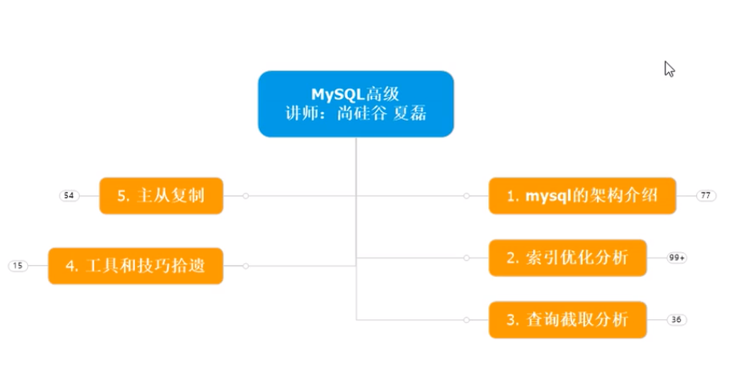

[toc]



# MySQL 架构介绍

- 数据库内部结构和原理
- 数据库建模优化
- 数据库索引建立
- 数据库索引建立
- SQL 语句优化
- SQL 编程（自定义函数、存储过程、触发器、定时任务）
- MySQL 服务器的安装配置
- 数据库的性能监控分析与系统优化
- 各种参数常量设定
- 主从复制（提高可用性）
- 分布式架构搭建、垂直切割和水平切割（提出方案）
- 数据迁移（提出方案）
- 容灾备份和恢复
- shell 或 python 脚本语言开发
- 开源数据库进行二次开发

## MySQL 安装

Ubuntu 16.04 下配置清华源，直接 `apt` 安装 MySQL。

```shell
sudo apt update
sudo apt install mysql-server
sudo apt install mysql-client
sudo apt install libmysqlclient-dev # 应用编程接口库
```

初始化 MySQL

```shell
sudo mysql_secure_installation
```

安装完成后，启动服务和查询服务状态。

```shell
systemctl start mysqld
systemctl status mysqld
```

查询系统自启动任务

```shell
systemctl list-unit-files | grep mysqld

frank@frank-VirtualBox:~$ systemctl list-unit-files | grep mysql
mysql.service                              enabled     
```

安装完毕之后用 root 登录：

```shell
frank@frank-VirtualBox:~$ mysql -uroot -p
Enter password: 
ERROR 1698 (28000): Access denied for user 'root'@'localhost'
```

解决方案

> https://stackoverflow.com/questions/39281594/error-1698-28000-access-denied-for-user-rootlocalhost
>
> **Option 2:** (replace YOUR_SYSTEM_USER with the username you have)
>
> ```sql
> $ sudo mysql -u root # I had to use "sudo" since is new installation
> 
> mysql> USE mysql;
> mysql> CREATE USER 'YOUR_SYSTEM_USER'@'localhost' IDENTIFIED BY '';
> mysql> GRANT ALL PRIVILEGES ON *.* TO 'YOUR_SYSTEM_USER'@'localhost';
> mysql> UPDATE user SET plugin='auth_socket' WHERE User='YOUR_SYSTEM_USER';
> mysql> FLUSH PRIVILEGES;
> mysql> exit;
> 
> $ service mysql restart
> ```


# 索引优化分析

# 查询截取分析

# 工具和技巧

# 主从复制