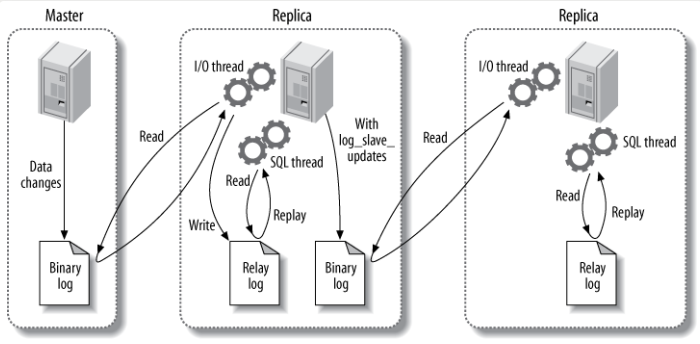

---

title: MySQL高级
date: 2020-08-17 20:38:33
toc: true
categories:
- 数据库
tags:
- MySQL
---

[toc]


# MySQL 架构介绍

- 数据库内部结构和原理
- 数据库建模优化
- 数据库索引建立
- 数据库索引建立
- SQL 语句优化
- SQL 编程（自定义函数、存储过程、触发器、定时任务）
- MySQL 服务器的安装配置
- 数据库的性能监控分析与系统优化
- 各种参数常量设定
- 主从复制（提高可用性）
- 分布式架构搭建、垂直切割和水平切割（提出方案）
- 数据迁移（提出方案）
- 容灾备份和恢复
- shell 或 python 脚本语言开发
- 开源数据库进行二次开发

## MySQL 安装

Ubuntu 16.04 下配置清华源，直接 `apt` 安装 MySQL。

```shell
sudo apt update
sudo apt install mysql-server
sudo apt install mysql-client
sudo apt install libmysqlclient-dev # 应用编程接口库
```

初始化 MySQL

```shell
sudo mysql_secure_installation
```

安装完成后，启动服务和查询服务状态。

```shell
systemctl start mysqld
systemctl status mysqld
```

查询系统自启动任务

```shell
systemctl list-unit-files | grep mysqld

frank@frank-VirtualBox:~$ systemctl list-unit-files | grep mysql
mysql.service                              enabled     
```

安装完毕之后用 root 登录：

```shell
frank@frank-VirtualBox:~$ mysql -uroot -p
Enter password: 
ERROR 1698 (28000): Access denied for user 'root'@'localhost'
```

解决方案

> https://stackoverflow.com/questions/39281594/error-1698-28000-access-denied-for-user-rootlocalhost
>
> **Option 2:** (replace YOUR_SYSTEM_USER with the username you have)
>
> ```sql
> $ sudo mysql -u root # I had to use "sudo" since is new installation
> 
> mysql> USE mysql;
> mysql> CREATE USER 'YOUR_SYSTEM_USER'@'localhost' IDENTIFIED BY '';
> mysql> GRANT ALL PRIVILEGES ON *.* TO 'YOUR_SYSTEM_USER'@'localhost';
> mysql> UPDATE user SET plugin='auth_socket' WHERE User='YOUR_SYSTEM_USER';
> mysql> FLUSH PRIVILEGES;
> mysql> exit;
> 
> $ service mysql restart
> ```

在修改 my.cnf 设置默认字符集的时候，忘记使用 sudo 运行 vim，无法保存无法退出。

解决：

```
w !sudo tee %
```

完美解决，`w` 是写入，`!` 是运行 `shell` 命令。

然后`:qa!` 退出 `vim`。

但是！！服务启动失败了。看来是找错文件了。

> https://blog.csdn.net/sweeper_freedoman/article/details/52781248

解决：默认读取的配置文件是 `/etc/mysql/mysql.conf.d/mysqld.cnf`。

## 字符集、权限问题

### 字符集

`MySQL` 默认配置文件中没有配置默认字符集，字符集默认是 `latin1`，此时插入中文是乱码，需要修改配置文件，重启服务，并修改已经创建的库和表的字符集。

```mysql
mysql> SHOW CREATE DATABASE test;
+----------+-----------------------------------------------------------------+
| Database | Create Database                                                 |
+----------+-----------------------------------------------------------------+
| test     | CREATE DATABASE `test` /*!40100 DEFAULT CHARACTER SET latin1 */ |
+----------+-----------------------------------------------------------------+
1 row in set (0.00 sec)

mysql> ALTER DATABASE test character set 'utf8';
Query OK, 1 row affected (0.00 sec)

mysql> SHOW CREATE DATABASE test;
+----------+---------------------------------------------------------------+
| Database | Create Database                                               |
+----------+---------------------------------------------------------------+
| test     | CREATE DATABASE `test` /*!40100 DEFAULT CHARACTER SET utf8 */ |
+----------+---------------------------------------------------------------+
1 row in set (0.01 sec)

mysql> ALTER TABLE mytbl CONVERT TO character set 'utf8';
Query OK, 1 row affected (0.06 sec)
Records: 1  Duplicates: 0  Warnings: 0

mysql> DESC mytbl;
+---------+-------------+------+-----+---------+----------------+
| Field   | Type        | Null | Key | Default | Extra          |
+---------+-------------+------+-----+---------+----------------+
| id      | int(11)     | NO   | PRI | NULL    | auto_increment |
| usrname | varchar(20) | YES  |     | NULL    |                |
+---------+-------------+------+-----+---------+----------------+
2 rows in set (0.00 sec)
```

### 权限

其他用户无法建立 `MySQL` 连接，需要修改权限，该配置存在 `mysql` 库中。

新建用户：

```MYSQL
CREATE USER xxx IDENTIFIED BY 'xxxxxx';
# 创建用户名为 xxx 的用户，密码为 xxxxxx
GRANT ALL PRIVILEGES ON *.* TO root@'%' IDENTIFIED BY '073104';
# 授予通过网络方式登陆的 root 用户，对所有库所有表的全部权限，密码为073104，若暂无该用户，会新建一个用户
```

配置好超级用户 root 之后，尝试在 win 下 mysql workbench 进行连接。

查询 Ubuntu 下 mysqld 的端口号

```shell
# 首先查询进程号
ps -ef | grep mysqld
# 其次查询端口号
sudo netstat -anp | grep <port>
```

校园网不能用桥接模式上网，所以只能使用 host-only 模式连接主机和虚拟机的网络。

好了，使用 workbench 连接 Ubuntu MySQL 服务器。

### sql_mode

语法检查规则，本地开发时要与测试数据库的规则相同。

## 总体概览


缓存和缓冲：

- 缓存，缓存不命中则走接口

#### 利用 show profile 查看 sql 执行周期

在配置文件中新增

```
query_cache_type=1
```

然后重启 MySQL。

先后两次从同一张表读同一个数据，查看执行计划：

```mysql
mysql> show profile cpu,block io for query 3;
+--------------------------------+----------+----------+------------+--------------+---------------+
| Status                         | Duration | CPU_user | CPU_system | Block_ops_in | Block_ops_out |
+--------------------------------+----------+----------+------------+--------------+---------------+
| starting                       | 0.000017 | 0.000006 |   0.000009 |            0 |             0 |
| Waiting for query cache lock   | 0.000002 | 0.000002 |   0.000002 |            0 |             0 |
| starting                       | 0.000002 | 0.000000 |   0.000001 |            0 |             0 |
| checking query cache for query | 0.000032 | 0.000014 |   0.000018 |            0 |             0 |
| checking permissions           | 0.000005 | 0.000002 |   0.000002 |            0 |             0 |
| Opening tables                 | 0.000011 | 0.000005 |   0.000006 |            0 |             0 |
| init                           | 0.000016 | 0.000007 |   0.000010 |            0 |             0 |
| System lock                    | 0.000005 | 0.000003 |   0.000003 |            0 |             0 |
| Waiting for query cache lock   | 0.000002 | 0.000000 |   0.000001 |            0 |             0 |
| System lock                    | 0.000012 | 0.000005 |   0.000006 |            0 |             0 |
| optimizing                     | 0.000007 | 0.000003 |   0.000004 |            0 |             0 |
| statistics                     | 0.000011 | 0.000005 |   0.000006 |            0 |             0 |
| preparing                      | 0.000008 | 0.000003 |   0.000004 |            0 |             0 |
| executing                      | 0.000003 | 0.000001 |   0.000001 |            0 |             0 |
| Sending data                   | 0.000032 | 0.000014 |   0.000018 |            0 |             0 |
| end                            | 0.000003 | 0.000001 |   0.000002 |            0 |             0 |
| query end                      | 0.000005 | 0.000003 |   0.000003 |            0 |             0 |
| closing tables                 | 0.000004 | 0.000001 |   0.000002 |            0 |             0 |
| freeing items                  | 0.000006 | 0.000003 |   0.000004 |            0 |             0 |
| Waiting for query cache lock   | 0.000002 | 0.000001 |   0.000001 |            0 |             0 |
| freeing items                  | 0.000013 | 0.000005 |   0.000007 |            0 |             0 |
| Waiting for query cache lock   | 0.000002 | 0.000001 |   0.000001 |            0 |             0 |
| freeing items                  | 0.000002 | 0.000001 |   0.000001 |            0 |             0 |
| storing result in query cache  | 0.000002 | 0.000001 |   0.000001 |            0 |             0 |
| cleaning up                    | 0.000010 | 0.000004 |   0.000006 |            0 |             0 |
+--------------------------------+----------+----------+------------+--------------+---------------+
25 rows in set, 1 warning (0.00 sec)

mysql> show profiles;
+----------+------------+--------------------------------------+
| Query_ID | Duration   | Query                                |
+----------+------------+--------------------------------------+
|        1 | 0.00175775 | show variables like '%profiling%'    |
|        2 | 0.00005275 | select * mytbl2 where id=2           |
|        3 | 0.00021125 | select * from mytbl2 where id=2      |
|        4 | 0.00004625 | show profile cpu,block io for query3 |
|        5 | 0.00003875 | select * from mytbl2 where id=2      |
+----------+------------+--------------------------------------+
5 rows in set, 1 warning (0.00 sec)

mysql> show profile cpu,block io for query 5;
+--------------------------------+----------+----------+------------+--------------+---------------+
| Status                         | Duration | CPU_user | CPU_system | Block_ops_in | Block_ops_out |
+--------------------------------+----------+----------+------------+--------------+---------------+
| starting                       | 0.000015 | 0.000006 |   0.000008 |            0 |             0 |
| Waiting for query cache lock   | 0.000003 | 0.000001 |   0.000002 |            0 |             0 |
| starting                       | 0.000002 | 0.000001 |   0.000001 |            0 |             0 |
| checking query cache for query | 0.000004 | 0.000001 |   0.000002 |            0 |             0 |
| checking privileges on cached  | 0.000002 | 0.000001 |   0.000001 |            0 |             0 |
| checking permissions           | 0.000005 | 0.000002 |   0.000003 |            0 |             0 |
| sending cached result to clien | 0.000006 | 0.000003 |   0.000003 |            0 |             0 |
| cleaning up                    | 0.000003 | 0.000001 |   0.000002 |            0 |             0 |
+--------------------------------+----------+----------+------------+--------------+---------------+
8 rows in set, 1 warning (0.00 sec)

mysql> 

```

第二次命中缓存了，查询时间大幅缩短。

缓存中缓存的内容使 key val 键值对，key 是 sql 语句，而 val 是查询结果。

想要命中缓存，那么 sql 语句需要一模一样。

## MySQL 存储引擎

|     对比项     |                          MyISAM                          |                            InnoDB                            |
| :------------: | :------------------------------------------------------: | :----------------------------------------------------------: |
|      外键      |                          不支持                          |                             支持                             |
|      事务      |                          不支持                          |                             支持                             |
|     行表锁     | 表锁，即使操作一条记录也会锁住整个表，不适合高并发的操作 | 行锁，操作时只锁某一行，不对其他行有影响。**适合高并发的操作** |
|      缓存      |                只缓存索引，不缓存真实数据                | 不仅缓存索引还要缓存真实数据，对内存要求较高，而且对性能有决定性的影响 |
|     关注点     |                节省资源、消耗少、简单业务                |                    并发写、事务、更大资源                    |
|    默认安装    |                            Y                             |                              Y                               |
|    默认使用    |                            N                             |                              Y                               |
| 自带系统表使用 |                            Y                             |                              N                               |

企业使用的数据库一般不设外键，效率低，每次插入都需要查外键索引的表。 

> 行锁会出现死锁，表锁不会死锁。
>
> MySQL有三种锁的级别：页级、表级、行级。
>
> 表级锁：开销小，加锁快；不会出现死锁；锁定粒度大，发生锁冲突的概率最高,并发度最低。
>
> 行级锁：开销大，加锁慢；会出现死锁；锁定粒度最小，发生锁冲突的概率最低,并发度也最高。
>
> 页面锁：开销和加锁时间界于表锁和行锁之间；会出现死锁；锁定粒度界于表锁和行锁之间，并发度一般。
>
> 
>
> 死锁的关键在于**：两个(或以上)的Session加锁的顺序不一致。**
>
> 那么对应的解决死锁问题的关键就是：让不同的session加锁有次序

更具体的区别：

### InnoDB

- 是 MySQL 默认的事务型存储引擎，只有在需要它不支持的特性时，才考虑使用其他存储引擎
- 实现了四个标准的隔离级别，默认级别是可重复读。在该隔离级别下，InnoDB 通过**多版本并发控制（MVCC）以及 Next-key locking** 防止幻读

### MyISAM

# 索引


MySQL 会为主键自动创建主键索引。

## 连接

MySQL 没有全连接 `FULL OUTER JOIN`，可用 `UNION` 和 `UNION ALL` 实现全连接，后者效率更高。

MySQL 单表数据瓶颈 500 万行。

## 索引

索引是帮助 MySQL 高效获取数据的数据结构。

索引往往以索引文件的形式存储在硬盘上。

### 优点

- 提高数据检索效率，降低数据库 IO 成本；

- 通过索引列对数据进行排序，降低了数据排序的成本，降低了 CPU 的消耗。

### 缺点

- 降低更新表的速度，例如增删改，因为同时还需要更新索引文件
- 实际上索引也是一张表，保存了主键与索引字段，并指向实体表的记录，所以索引列也是要占用空间的

### 数据结构

#### B Tree，平衡树

- 非叶子节点包含指向数据的指针
- 包含数据
- 包含向下的指针

插入、查找、删除的时间复杂度均为 $O(logN)$（一般情况和最差情况）。

#### B+ Tree

- 非叶子节点只包含数据和向下的指针

B Tree 需要的内存比 B+ Tree 要多，单个节点所占用的内存也多，因此每一次缺页产生的 IO 读入的索引数据会更少，在一直不命中的情况下可能会产生更多 IO，影响效率，且相同内存大小的前提下，B+ Tree 可以在内存中存更多的索引。

因此，在内存有限的前提下，MySQL 采用的是 B+ Tree。

### 聚簇索引

聚簇索引，是一种数据存储方式，按照索引的属性排序。

也称为**主索引**，可以建立在任何搜索码上，而聚集索引的搜索码往往是主键。

### 非聚簇索引

搜索码指定顺序与索引文件中记录的物理顺序不同的索引称为非聚集索引或辅助索引。


以上两种索引都属于顺序索引。

### 创建索引

#### 单值索引

```mysql
CREATE INDEX idx_name ON tbl_name(field_name);
```

#### 唯一索引

```mysql
CREATE UNIQUE INDEX idx_name ON tbl_name(field_name);
```

> # 唯一索引和非唯一索引
>
> 唯一索引是这样一种索引，它通过确保表中没有两个数据行具有完全相同的键值来帮助维护数据完整性。
>
> 为包含数据的现有表创建唯一索引时，会检查组成索引键的列或表达式中的值是否唯一。如果该表包含具有重复键值的行，那么索引创建过程会失败。为表定义了唯一索引之后，每当在该索引内添加或更改键时就会强制执行唯一性。此强制执行包括插入、更新、装入、导入和设置完整性以命名一些键。除了强制数据值的唯一性以外，唯一索引还可用来提高查询处理期间检索数据的性能。
>
> 非唯一索引不用于对与它们关联的表强制执行约束。相反，非唯一索引通过维护频繁使用的数据值的排序顺序，仅仅用于提高查询性能。

#### 主键索引

已经有数据的旧表不要修改主键。

#### 复合索引

对多个字段建立一个索引。

```mysql
CREATE INDEX idx_name ON tbl_name(field_name1, field_name2);
```

实际建立了多个索引，每个索引有自己的 seq。

### 什么时候需要创建索引

- 主键自动建立唯一索引
- 频繁作为查询条件的字段应该创建索引
- 查询中与其他表关联的字段，外键关系建立索引
- 单键/组合索引的选择问题，组合索引性价比更高
- 查询中排序的字段，排序字段若通过索引访问将大大提高排序速度
- 查询中统计或者分组字段

### 什么时候不需要索引

- 表记录太少
- 经常增删改的字段或者表，写或变慢
- `WHERE` 条件里用不到的字段不创建索引
- 过滤性不好的不适合建索引，对过滤数据价值很低的字段不适合建索引（比如性别）

### 性能分析 explain

使用 `EXPLAIN` 关键字可以模拟优化器执行 SQL 查询语句，从而知道 MySQL 是如何处理这些 SQL 语句的。

从而分析查询语句或者表结构的性能瓶颈。

---

使用：`EXPLAIN + SQL`。

#### id 字段

表的读取顺序，id 越大越先执行，id 一样则从上往下依次执行。

#### type 查询类型

查询使用了何种类型，特别注意 `ALL, INDEX, RANGE` 三种，是需要优化的。

查询使用的类型：

- `ALL`，全表扫描，性能最差
- `INDEX`，索引全表扫描，把索引从头到尾扫一遍。
- `RANGE`，只检索给定范围的行，使用一个索引来选择行，这种范围扫描索引扫描比全表扫描要好。

需要避免出现全表扫描。如果出现全表扫描，则需要为该表建索引。

> 覆盖索引是[select](https://baike.baidu.com/item/select/12504672)的数据列只用从索引中就能够取得，不必读取数据行，换句话说查询列要被所建的索引覆盖。

#### key_len

查询用到的索引长度（字节数）。

只计算 `WHERE` 条件用到的索引长度。

#### rows 字段

MySQL 估算的需要物理扫描的行数（不精确），原则上越少越好。

#### extra 字段

看 `GROUP BY, ORDER BY` 以及关联查询有没有用上索引。

> 复习：在实际应用中，经常需要在一个查询语句中显示多张表的数据，这种多表数据记录关联查询，简称关联查询。

- `USING FILESORT`，排序未使用索引，需要优化
- `USING TEMPORARY`，分组未使用索引，而分组包含排序操作，更需要优化
- `USING JOIN BUFFER`，两表关联字段未使用索引，需要给关联字段建立索引

## 批量创建数据

### log_bin

是 MySQL 的二进制日志，用来做 MySQL 的主从复制。

> 主从复制原理简介
>
> 有主机、从机上的两个数据库，主机把所有的写操作写到一个二进制日志（bin_log），从机去读这个日志，保证从机与主机的写操作相同。
>
> 然而考虑一个场景，当主机把当前系统时间写入数据库时，从机执行相同指令所写入的当前时间与主机的数据不一致，此时造成了主从复制不一致的情况。
>
> bin_log 为了避免主从复制不一致的情况，严禁用户自定义函数。

```MYSQL
SHOW VARIABLES LIKE 'log_bin_trust_function_creators'; # 是否允许用户自定义函数
SET GLOBAL log_bin_trust_function_creators = 1; # 允许自定义函数
```

## 优化单表索引

```mysql
# 优化前，效率很低
SELECT SQL_NO_CACHE * FROM emp WHERE emp.age = 30;
# 建索引优化
CREATE INDEX idx_age ON emp(age);

## 同理，多个筛选条件时
SELECT SQL_NO_CACHE * FROM emp WHERE emp.age = 30 AND emp.dept_id = 4 AND emp.name = 'abcd';
# 建索引优化，建立复合索引
CREATE INDEX idx_age_deptid_name ON emp(age, dept_id, name);
```

**如果调整多个筛选条件的顺序，是否会影响索引的使用？**

答：不会，依然使用索引。

```mysql
SELECT SQL_NO_CACHE * FROM emp WHERE emp.dept_id = 4 AND emp.age = 30 AND emp.name = 'abcd';
# 此时依然可以用到上面建立的复合索引
```

解释：优化器 optimizer 自动优化了 SQL 语句顺序。

然而如果改变的不是顺序，而是去掉一个筛选条件：

```mysql
# 索引
CREATE INDEX idx_age_deptid_name ON emp(age, dept_id, name);
# 这种情况下能用上索引，但是只能命中age
SELECT SQL_NO_CACHE * FROM emp WHERE emp.age = 30 AND emp.name = 'abcd';
# 这种情况用不上索引
SELECT SQL_NO_CACHE * FROM emp WHERE emp.dept_id = 4 AND emp.name = 'abcd';
```

原因：索引的数据结构 B+ 树，复合索引的结构如下（视频讲的是错的）

只有一棵树，树的叶子节点保存了多个字段而不是一个字段。

- **最佳左前缀法则**：如果索引了多列，要遵循最左前缀法则，指的是查询从索引的最左前列开始并且不跳过索引中的列。

---

```mysql
SELECT SQL_NO_CACHE * FROM emp WHERE emp.name LIKE 'abc%';
SELECT SQL_NO_CACHE * FROM emp WHERE LEFT(emp.name, 3) = 'abc';
# 建立索引
CREATE INDEX idx_name ON emp(name);
# 再次查询
SELECT SQL_NO_CACHE * FROM emp WHERE emp.name LIKE 'abc%';
SELECT SQL_NO_CACHE * FROM emp WHERE LEFT(emp.name, 3) = 'abc';
```

在建索引之前，上述两行 SQL 效率相近，第一行为模糊查询，第二行为等值匹配。

然而再次查询的结果是，模糊匹配用到了索引，等值匹配没有用到索引。

因为第二行筛选条件用到了函数使索引失效。

- **不要在索引列上做任何操作（计算、函数、类型转换），会导致索引失效而转向全表扫描。**

---

```mysql
SELECT SQL_NO_CACHE * FROM emp 
WHERE emp.age = 30
AND emp.deptId > 20
AND emp.name = 'abc';
# 建索引优化
CREATE INDEX idx_age_deptId_name ON emp(age, deptId, name);
# 正确的索引
CREATE INDEX idx_age_deptId_name ON emp(age, name, deptId);
```

上述优化的效果并不十分理想，尽管仍然有效果。

索引类型是 `RANGE`，并且只命中了两个 `INT` 类型的字段。

- 范围查询（的索引）右侧的查询，索引失效。此处范围查询的字段是 `deptId`，其右侧索引为 `name`，该字段索引失效。

---

```mysql
SELECT SQL_NO_CACHE * FROM emp WHERE emp.name <> 'abc';
# 该索引失效
CREATE INDEX idx_name ON emp(name);
```

- **不等于 (<>) 使索引失效**

---

```mysql
SELECT SQL_NO_CACHE * FROM emp WHERE age IS NULL;
SELECT SQL_NO_CACHE * FROM emp WHERE age IS NOT NULL;
# 建立索引
CREATE INDEX idx_name ON emp(age);
# 只有第一条SQL用到了索引，第二条没有用到
```

- `IS NOT NULL` 使索引失效

---

```mysql
SELECT SQL_NO_CACHE * FROM emp WHERE emp.name LIKE '%abc%';
# 索引失效
CREATE INDEX idx_name ON emp(name);
```

- 首字母不确定的模糊查询无法使用索引

---

```mysql
SELECT SQL_NO_CACHE * FROM emp WHERE emp.name = 123;
# 索引失效
CREATE INDEX idx_name ON emp(name);
```

- 对字段进行类型转换时索引失效

### 一般性建议

- 对于单键索引，尽量选择针对当前查询过滤性更好的索引
- 在选择组合索引的时候，当前查询中国过滤性最好的字段在索引字段顺序中，位置越靠前越好
- 在选择组合索引的时候，尽量选择可以能够包含当前查询中 `WHERE` 筛选条件中更多字段的索引
- 在选择组合索引的时候，如果某个字段可能出现范围查询时，尽量把这个字段放在索引次序的最后面
- 写 SQL 语句的时候，尽量避免造成索引失效的情况

## 关联、子查询索引优化

- 在关联查询**（这里特指外联结）**的时候，根据关联顺序，两张表分为**驱动表**和**被驱动表**。较好的方法是给被驱动表被查询字段建索引，而驱动表索引因为是覆盖索引，无法避免全表扫描，优化效果不好。
- 而对于**内连接**，驱动表和被驱动表的角色由 MySQL 选择，它会优先选择有索引的表作为被驱动表来优化 SQL 顺序。
- 对于两张数据量差距较大的表，将数据量小的表作为驱动表，减少全表扫描的时间。

### 建议

- 保证被驱动表的 `JOIN` 字段已经被索引
- `LEFT JOIN` 时尽量选择小表作为驱动表，大表作为被驱动表
- `INNER JOIN` 时，MySQL 会将小结果集的表选为驱动表（5.7版本之后）
- 子查询尽量不要放在被驱动表，因为临时表无法建索引
- 能够直接多表关联的尽量直接关联，不用子查询（子查询生成临时表，用不到索引，且多一次查询）

### 子查询优化

将子查询优化为关联查询。

尽量不要使用 `NOT IN` 或者 `NOT EXISTS`，用 `LEFT OUTER JOIN ON xxx IS NULL` 来代替。

### 排序分组优化

```mysql
# 建索引
CREATE INDEX idx_age_deptid ON emp(age, deptid, name);

EXPLAIN SELECT SQL_NO_CACHE * FROM emp ORDER BY age, deptid; # extra字段using filesort
EXPLAIN SELECT SQL_NO_CACHE * FROM emp ORDER BY age, deptid LIMIT 10;
```

第一行查询没用到索引，第二行用到了索引。

- `ORDER BY` 没有过滤条件的话，不会使用索引。
- 索引顺序与分组顺序不同，也不会使用索引。因为优化器必须保证查询结果相同才可以调整 SQL 顺序，但是分组查询交换字段顺序会影响查询结果。
- 不同分组字段同时出现升序和降序排序，不会使用索引。

```mysql
EXPLAIN SELECT SQL_NO_CACHE * FROM emp 
WHERE age = 40 
AND deptid < 11000 
ORDER BY name;

# 为上述语句建立索引
CREATE INDEX idx_age_name ON emp(age, name);				# 1
CREATE INDEX idx_age_deptid ON emp(age, deptid);			# 2
CREATE INDEX idx_age_deptid_name ON emp(age, deptid, name);	# 3
```

上述三个索引，在查询中索引 `2` 和 `3` 等效，因为 `deptid` 字段使用了范围查询，后面的 `name` 字段索引会失效。

索引 `1` 不会出现 `using filesort`，索引 `2` 会出现，具体使用哪个索引由 MySQL 选择。

### filesort 排序算法

- 单路排序，从磁盘读取需要查询的所有列，按照排序字段在**缓冲区**对它们进行排序，效率更高，避免二次读取数据
- 双路排序，扫描两次磁盘，效率低。

### 分组查询

分组查询中，就算没有过滤条件，也可以用索引。

### 覆盖索引

最后的优化手段：使用覆盖索引。

只需要通过索引就可以返回查询所需要的数据，而不必通过二级索引查到主键主键之后再去查询表。

### STRAIGHT_JOIN

该关键字可以指定驱动表与被驱动表。

```mysql
SELECT * FROM `驱动表`
STRAIGHT_JOIN `被驱动表` ON `连接字段`;
```

# 查询截取分析

- 慢查询日志
- `SHOW PROCESSLIST`
- 全局日志，最吃性能

## 慢查询日志

MySQL 的慢查询日志是 MySQL 提供的一种日志记录，它用来记录在 MySQL 中响应时间超过阈值的语句，具体指运行时间超过 long_query_time 值的 SQL，则会被记录到慢查询日志中。

long_query_time 的默认值为10，意思是运行 10s 以上的语句。

```mysql
# 查询是否开启慢查询日志
SHOW VARIABLES LIKE '%slow_query_log%';
# 打开慢查询日志
SET GLOBAL slow_query_log = 1;
# 查看阈值
SHOW VARIABLES LIKE '%long_query_time%';
# 设置慢查询阈值（会话变量）
SET long_query_time = 1;
```

## 日志分析工具 mysqldumpslow

用于分析慢查询日志。

## SHOW PROCESSLIST

用于显示连接信息，用户、host、使用的数据库。

可以用来检测死锁，使用 `KILL` 杀掉连接。

```mysql
KILL id;
```

# 工具技巧

## 视图 VIEW

将一段查询 SQL 封装为一个虚拟表，只保存 SQL 逻辑，不保存任何查询结果。

作用：

- 封装复杂 SQL，提高复用性
- 逻辑放在数据库中，更新不需要发布程序，面对频繁的需求变更更灵活

使用场景：

很多地方可以共用的一组查询结果。

```mysql
CREATE VIEW v
AS
SELECT /*something*/;

SELECT * FROM v;
```

> MySQL 5.5 的视图中不允许在 FROM 后面有子查询。

# 锁机制

按照是否可以共享分为

- 读锁（共享锁）
- 写锁（排他锁）

按照粒度分为

- 行锁
- 表锁
- 页锁

## 表锁

MySQL 中的一个连接在使用读锁**锁表**之后，可以从该表中读数据，但不能写数据，在未释放该锁的前提下也不能读写其他表的数据。理解：在一个事务获取一个锁之后，不能再试图获取第二个锁，避免死锁。

当一个事务持有读写锁时，另一个事务对被锁住的数据进行写操作时会被阻塞。

## MyISAM 的表锁

MyISAM 的读写锁调度永远是写优先，因此 MyISAM 不适合做**以写为主**的表的引擎。

## 行锁

InnoDB 存储引擎支持行锁和表锁，默认使用行锁，开销比表锁大，加锁慢；锁定粒度最小，发生锁冲突的概率最低，并发度也最高。

一个事务在修改一行数据且未提交时，另一个事务的修改操作会被阻塞。

对两行不同的数据进行修改，事务之间互不影响。

一个事务中的读操作读不到其他事务修改并提交的数据。

> 建立索引之后，若使用不当，索引失效的情况下，行锁升级为表锁。
>
> **不要在索引列上做任何操作（计算、函数、类型转换），会导致索引失效而转向全表扫描。**
>
> ### 为什么表锁会升级为行锁？
>
> 首先，因为行锁的实现实际上是**通过给索引上的索引项加锁来实现的**，InnoDB 行级锁只有通过索引条件检索数据，才使用行级锁，否则，InnoDB 使用表锁，因此，在条件查询不走索引的时候，InnoDB 使用表锁而不是行锁。
>
> **总结:就是在没有使用索引的情况下InnoDB就会使用表级锁(共享锁不会有这个情况)**

对一行显式加锁：

```mysql
SELECT * FROM name WHERE cond FOR UPDATE;
```

### 优化建议

- 尽可能让所有数据检索都通过索引来完成，避免无索引行锁升级为表锁
- 合理设计索引，尽量缩小锁的范围
- 见可能减少检索条件，避免间隙锁
- 尽量控制事务大小，减少锁定资源量和锁定时间
- 尽可能低级事务隔离？？？应该看需求的吧

## 间隙锁

当我们用范围查询检索数据时，并请求读写锁时，InnoDB 会给符合条件的已有数据记录的索引项加锁；对于键值在条件范围内但并不存在的记录，叫做“间隙”。

InnoDB 也会对这个间隙加锁，这种锁机制就是所谓的间隙锁（Next-key lock）。

可以有效防止 RR 级别下的幻读。

查询执行过程中通过范围查找的话，会锁定整个范围内的所有的索引键值，即使这个键值并不存在。某些场景下会影响系统性能。

## 页锁

- 开销和加锁时间介于行锁与表锁之间；

- 会出现死锁；

- 粒度介于行锁与表锁之间，并发度一般。

# 主从复制



##  基本原理

从机从主机读取 binlog 来进行数据同步。

- binlog 线程：主机修改数据，负责将主服务器上的数据更改写入二进制文件中
- I/O 线程：从机从主服务器读取二进制文件，并写入从服务器的中继日志 (relay log)
- SQL 线程：从服务器读取中继日志，解析出主服务器已经执行的数据更改，并在服务器中重放

复制的最大问题：时延。


binlog_format

- statement，记录修改数据的 SQL 语句
- row，记录每一行数据的改变
- mixed，对调用了函数的 SQL 语句使用 row模式，否则使用 statement 模式，解决了一部分数据不一致的问题，但是如果引用了系统变量，也会出现数据不一致问题


从机需要配置一个用户来访问主机 binlog。 

# 读写分离、分库分表

Mycat 是一种数据库中间件，核心功能是分库分表，前身是阿里的 cobar。与 Nginx 类似。

作用：

- 读写分离

- 数据分片

  - 垂直拆分
  - 水平拆分
  - 垂直+水平拆分

  拆分到不同的机器上。

- 多数据源整合

## 原理

“拦截”：拦截了用户发送的 SQL 语句，首先对 SQL 语句做了一些特定分析：如分片分析、路由分析、读写分离分析、缓存分析等，然后将此 SQL 发往后端的真实数据库，并将返回的结果做适当处理，最终再返回给用户。

## 负载均衡

负载均衡类型，目前的取值有四种：

- balance = “0”，不开启读写分离机制，所有的读操作都发送到当前可用的 writeHost 上
- balance = "1"，全部的 readHost 与 stand by writeHost 参与 select 语句的负载均衡。举个例子，当双主双从模式 (M1->S1, M2->S2，并且 M1 与 M2 互为主备)，正常情况下，所有的主机都参与 select 语句的负载均衡
- balance = "2"，所有读操作都随机地再 writeHost 和 readHost 上分发
- balance = "3"，所有读请求随机地分发到 readHost 上执行，writeHost 不负担读压力，真正实现读写分离

先实现 MySQL 的主从复制，才能实现读写分离。

## 分库

单库达到 5000万条数据时，达到瓶颈。

> 场景：
>
> 电商平台运行一段时间后，数据库积累了一定的客户信息，具体有：
>
> 客户表 20万行
>
> 订单表 600万行
>
> 订单详情表 600万行（每个订单对应一个详情）
>
> 订单状态字典表 20行

分到两个库中的表，但同一台机器上可以连结，但是在不同的机器上不能连结。

因此，拆分到两个库中的表不要出现关联的情况，因此可以把客户表拆分到另外的库当中去。

比如每次打开电商 APP 需要先登录，登录之后，账户信息（ID）已经保存在 session 当中，用账户信息就可以查询订单以及订单详情。

分库需要两个空库，通过 mycat 进行分库操作，配置哪些表在哪个数据节点。

在中间件中，schema 是一个逻辑库，并不真实存在。在逻辑库中配置表，以及它对应的数据节点。

每个数据节点对应一台主机上的某个数据库。

## 分表

将一张表中的数据，使用对某个字段进行哈希的方式，通过中间件配置到不同的数据节点（不同数据库中）。

### 水平分表

#### 跨库联合查询

ER 表：

- 为了使相关联的表行尽量分在一个库下
- 建相关表

全局表

- 设定为全局的表，会直接复制给每个数据库一份，所有写操作也会同步给多个库
- 一般不能是大数据表或者是更新频繁的表
- 一般是字典表或者系统表为宜

## 全局序列

应用场景：为了使得分到不同库中的表行中的自增序列键值不重复。

实现：数据库方式，比直接在配置中间件的主机上保存配置文件抗风险能力要高，比时间戳方式节省空间。

需要在数据库中建序列表。

```mysql
CREATE TABLE mycat_sequence (
	name VARCHAR(50) NOT NULL,
    current_value INT NOT NULL,
    increment INT NOT NULL DEFAULT 100,
    PRIMARY KEY(name)
) ENGINE = INNODB;
```

还需要创建序列脚本，然后初始化表。

配置全局序列所在的数据节点，以及全局序列方式。