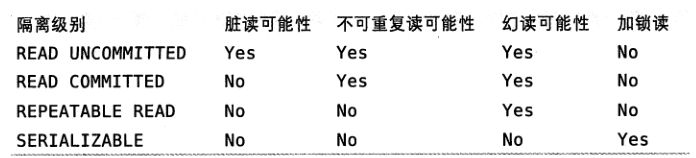

[toc]

# 高性能MySQL笔记

## 第一章

### 1.3.1 隔离级别

SQL 标准中规定的四种隔离级别，每种级别规定了**一个事务中所做的修改**，哪些修改在事务内和事务间是可见的，哪些是不可见的。

较低级别的隔离具有更低的开销，也可以执行更高的并发。

四种隔离级别：

- 未提交读 (READ UNCOMMITED)

  事务中的修改，即使没有被提交，对其他事务也都是可见的。

  划重点，未提交修改对其他事务可见。

  事务可以读取未提交数据，这也被称为脏读。

  该隔离级别弊大于利，很少使用。

- 提交读 (READ COMMITED)

  大多数数据库系统的默认隔离级别是**提交读**，但 MySQL 不是。

  一个事务开始时，只能看见已经提交的事务所做的修改；一个事务所做的未提交的修改对其他事务都是不可见的。

  **不可重复读**，因为两次执行相同的查询，可能得到不一样的结果。

- 可重复读 (REPEATABLE READ)

  解决了脏读的问题。

  保证了两次相同的查询得到相同的结果。

  无法解决**幻读**问题。

  幻读：当某个事务在读取某个范围内的记录时，另外一个事务又在该范围内插入了新的记录，当之前的事务再次读取去该范围内的记录时，会产生幻行。

  InnoDB 和 XtraDB 通过 MVCC (Multiple Version Concurrency Control) 多版本并发控制，解决了幻读的问题。

  MySQL 的默认隔离级别是可重复读。

- 可串行化 (SERIALIZABLE)

  强制事务串行执行。

  在读取的**每一行上都加锁**，导致大量超时和锁争用问题。

  很少用到，需要确保数据一致性而且可以接受没有并发的情况下，才考虑使用。

- 只有串行化是**读加锁**
- 可重复读，不可以修改正在被读事务操作的已有数据，只能 INSERT 插入新的数据
- 提交读可以修改正在被读事务操作的已有数据，不可以读其他事务的未提交修改

### 1.3.2 死锁

InnoDB 处理死锁的方法是，将持有最少行级排他锁（写锁）的事务进行回滚。

死锁发生以后，只有部分或者完全回滚其中一个事务，才能打破死锁。

### 1.3.4 MySQL 中的事务

MySQL 提供两种事务性的存储引擎。

#### 自动提交

MySQL 默认采用自动提交(AUTOCOMMIT)，如果不显式地开始一个事务，则每个查询都被当作一个事务提交操作。

如果禁用自动提交，所有的查询都在一个事务当中，直到显式执行 COMMIT 提交或者 ROLLBACK 回滚，事务结束，同时开始一个新的事务。

### 1.4 多版本并发控制

MVCC 只在可重复读、提交读两种隔离等级下工作，与未提交读、可串行化不兼容。

### 1.5.1 InnoDB 存储引擎

InnoDB 是 MySQL 的默认事务型引擎。

被设计用来处理大量的短期事务，大部分正常提交，很少被回滚。

#### InnoDB 概览

采用 MVCC 实现高并发，并实现了四个标准的隔离级别，默认级别为可重复读。

通过**间隙锁 (next-key locking)** 策略防止幻读的出现，不仅仅锁定查询涉及的行，还锁定索引间的间隙，以防止幻影行的插入。

InnoDB 表基于聚簇索引建立，对于主键查询有很高的性能。