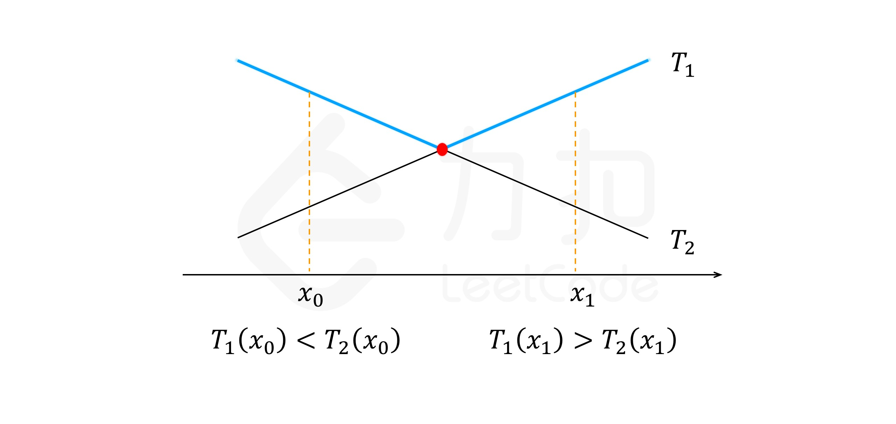

结果很差，原因是输入输出不熟练，加之被 leetcode 惯坏，震惊之下半小时就这么出去了，引以为戒。

第一题可以用贪心可以用回溯，我本来是想 dfs 直接回溯法暴力通关，结果递归函数写错了。

# 第一题、[605. 种花问题](https://leetcode-cn.com/problems/can-place-flowers/)

> 假设你有一个很长的花坛，一部分地块种植了花，另一部分却没有。可是，花卉不能种植在相邻的地块上，它们会争夺水源，两者都会死去。
>
> 给定一个花坛（表示为一个数组包含0和1，其中0表示没种植花，1表示种植了花），和一个数 n 。能否在不打破种植规则的情况下种入 n 朵花？能则返回True，不能则返回False。
>
> 示例 1:
>
> ```
> 输入: flowerbed = [1,0,0,0,1], n = 1
> 输出: True
> ```
>
>
> 示例 2:
>
> ```
> 输入: flowerbed = [1,0,0,0,1], n = 2
> 输出: False
> ```
>
>
> 注意:
>
> 1. 数组内已种好的花不会违反种植规则。
> 2. 输入的数组长度范围为 [1, 20000]。
> 3. n 是非负整数，且不会超过输入数组的大小。
>
> 来源：力扣（LeetCode）
> 链接：https://leetcode-cn.com/problems/can-place-flowers
> 著作权归领扣网络所有。商业转载请联系官方授权，非商业转载请注明出处。

这个问题很容易分解成子问题并且写出状态转移方程。我们用 `flowerbed` 和 `n` 作为状态，`dp[flowerbed][n]` 表示在此情况下能否种入 `n` 朵花。我们也可以把问题转化为在子数组表示的范围内最多能多种多少。

为了简化问题，我们也可以增加一种状态，用 -1 表示，表示该格没有植物，但是禁止种植，这样处理一遍数组之后，我们可以将问题变为多个在全零数组上填最多个 1 的问题，问题之间彼此独立。而向全零数组填 1 的最大个数为 $\frac{n+1}{2}$。

```c++
#include <iostream>
#include <sstream>
#include <chrono>
#include <vector>
#include <algorithm>
#include <deque>
#include <list>
#include <forward_list>
#include <array>
#include <stack>
#include <map>
#include <cmath>
#include <random>
#include <queue>
#include <unordered_map>
#include <unordered_set>
#include <cctype>s
#include <bitset>

using namespace std;

struct ListNode {
    int val;
    ListNode* next;
    ListNode() = default;
    ListNode(int x): val(x), next(nullptr) {}
};

class Solution {

public:
    bool canPlaceFlowers(vector<int>& flowerbed, int n) {
        if(flowerbed.empty()) return n == 0;
        if(n > flowerbed.size()) return false;
        for(int i=0; i<flowerbed.size(); ++i) {
            if(flowerbed[i] == 1) {
                if(i > 0) flowerbed[i-1] = -1;
                if(i < flowerbed.size()-1) flowerbed[i+1] = -1;
            }
        }
        int sum = 0;
        int cnt = 0;
        for(const int stat:flowerbed) {
            if(stat == 0) ++cnt;
            if(stat == -1) {
                sum += (cnt+1)/2;
                cnt = 0;
            }
        }
        return sum >= n;
    }
};


int main(int argc, char* args[]){

    /*===============================Args Def================================*/
    const size_t test_case_num = 1;

    Solution solution;
    vector<int> flowerbed;
    int n = 0, stat = 0;
    /*===========================Input processing============================*/
    for(int cnt=0; cnt<test_case_num; ++cnt) {
        while(cin.peek() != '\n') {
            cin >> stat;
            flowerbed.emplace_back(stat);
        }
        flowerbed.emplace_back(-1);
        cin.get();
        cin >> n;
        cout << boolalpha << solution.canPlaceFlowers(flowerbed, n) << endl;
        flowerbed.clear();
    }

    return 0;
}


```

题解方法为贪心，只要满足条件就插，贪心的正确性用归纳来证明。

# 第二题、[887. 鸡蛋掉落](https://leetcode-cn.com/problems/super-egg-drop/)

原题，下面重新做一遍，不过以后做题，在熟练之前都要写完整代码，当然重复工作少做。

> 你将获得 K 个鸡蛋，并可以使用一栋从 1 到 N  共有 N 层楼的建筑。
>
> 每个蛋的功能都是一样的，如果一个蛋碎了，你就不能再把它掉下去。
>
> 你知道存在楼层 F ，满足 0 <= F <= N 任何从高于 F 的楼层落下的鸡蛋都会碎，从 F 楼层或比它低的楼层落下的鸡蛋都不会破。
>
> 每次移动，你可以取一个鸡蛋（如果你有完整的鸡蛋）并把它从任一楼层 X 扔下（满足 1 <= X <= N）。
>
> 你的目标是确切地知道 F 的值是多少。
>
> 无论 F 的初始值如何，你确定 F 的值的最小移动次数是多少？
>
>  
>
> 示例 1：
>
> ```
> 输入：K = 1, N = 2
> 输出：2
> 解释：
> 鸡蛋从 1 楼掉落。如果它碎了，我们肯定知道 F = 0 。
> 否则，鸡蛋从 2 楼掉落。如果它碎了，我们肯定知道 F = 1 。
> 如果它没碎，那么我们肯定知道 F = 2 。
> 因此，在最坏的情况下我们需要移动 2 次以确定 F 是多少。
> ```
>
>
> 示例 2：
>
> ```
> 输入：K = 2, N = 6
> 输出：3
> ```
>
>
> 示例 3：
>
> ```
> 输入：K = 3, N = 14
> 输出：4
> ```
>
>
> 提示：
>
> 1. 1 <= K <= 100
> 2. 1 <= N <= 10000
>
> 来源：力扣（LeetCode）
> 链接：https://leetcode-cn.com/problems/super-egg-drop
> 著作权归领扣网络所有。商业转载请联系官方授权，非商业转载请注明出处。

其实考试的时候，我对题目理解是有偏差的，第一反应是二分查找，只是有特殊的次数限制，但是我们要求的不是哪层是我们要找的临界点，而是找到答案所需要的最小次数，这时我们需要考虑所有情况，每一种临界点的可能位置，我们都要计算它的最少次数，**取所有最坏情况下最少次数的最小值**。

那么什么是最坏情况呢，假设我们在某层楼 x 丢鸡蛋，通过判断鸡蛋有没有碎可以知道临界点 m 在 x 的哪一侧，此时问题就变成了原问题的一个子问题，即把 m 可能存在的一侧的剩余楼层作为新的问题，需要注意的是鸡蛋数也是一种状态。

- 每一次抛鸡蛋，可能碎了，说明恰好不碎的楼层在更低，不含本层
- 如果没碎，那么答案在包括本层及本层以上的楼层
- 以上两种情况各对应一个最小搜索次数，我们需要找出最差情况，取大者

$$
dp[k][n] = \min_{1\le x \le n}(1+max(dp[k-1][x-1], dp[k][n-x]))
$$

而我们在每一层楼都可以丢鸡蛋，最终是要遍历每一层楼丢鸡蛋的情况，在所有最差情况中，选出丢鸡蛋的最好位置（次数最少）。

而我们在搜索最优 x 位置的同时，考虑到对于每个子问题，如果其楼层越高，那么保证找到答案所需的最少步骤一定越多，因此 dp 在 n 的方向上是单调递增的，而通过公式可知，每一次丢鸡蛋，对应的两种情况，其 dp 一种随 x 递增，一种递减。由于我们先进行了取最大值操作，因此曲线为 V 型，而我们又要找最小值，因此找到两种情况随 x 值变化曲线的交点即可找到最小值。



（以上图片来自https://leetcode-cn.com/problems/super-egg-drop/solution/ji-dan-diao-luo-by-leetcode-solution-2/）

```c++
#include <iostream>
#include <sstream>
#include <chrono>
#include <vector>
#include <algorithm>
#include <deque>
#include <list>
#include <forward_list>
#include <array>
#include <stack>
#include <map>
#include <cmath>
#include <random>
#include <queue>
#include <unordered_map>
#include <unordered_set>
#include <cctype>
#include <bitset>

using namespace std;

class Solution {
public:
    int superEggDrop(int k, int n) {
        vector<vector<int>> dp(k+1, vector<int>(n+1, 0));
        return helper(k, n, dp);
    }
private:
    int helper(int k, int n, vector<vector<int>>& dp) {
        if(n == 0) return dp[k][n] = 0;
        if(k == 1) return dp[k][n] = n;
        if(dp[k][n] > 0) return dp[k][n];
        int lo = 1, hi = n;
        while (true) {
            int mid = (lo + hi) / 2;
            int if_not_broken = helper(k, n-mid, dp);
            int if_broken = helper(k-1, mid-1, dp);
            if(if_not_broken > if_broken) lo = mid;
            else if(if_not_broken < if_broken) hi = mid;
            else lo = hi = mid;
            if(lo +1 >= hi) {
                return dp[k][n] = 1 + min(max(helper(k, n-lo, dp), helper(k-1, lo-1, dp)), max(helper(k, n-hi, dp), helper(k-1, hi-1, dp)));
            }
        }
    }

};


int main(int argc, char* args[]){

    /*===============================Args Def================================*/
    Solution solution;
    int K = 0, N = 0;
    /*===========================Input processing============================*/

    while(cin >> K >> N) {
        cout << solution.superEggDrop(K, N) << endl;
    }
    
    /*===============================End main================================*/

    return 0;
}


```

# 第三题、[合并K个排序链表](https://leetcode-cn.com/problems/merge-k-sorted-lists/)

> 合并 k 个排序链表，返回合并后的排序链表。请分析和描述算法的复杂度。
>
> 示例:
>
> ```
> 输入:
> [
>   1->4->5,
>   1->3->4,
>   2->6
> ]
> 输出: 1->1->2->3->4->4->5->6
> ```
>
> 来源：力扣（LeetCode）
> 链接：https://leetcode-cn.com/problems/merge-k-sorted-lists
> 著作权归领扣网络所有。商业转载请联系官方授权，非商业转载请注明出处。

```c++
#include <iostream>
#include <sstream>
#include <chrono>
#include <vector>
#include <algorithm>
#include <deque>
#include <list>
#include <forward_list>
#include <array>
#include <stack>
#include <map>
#include <cmath>
#include <random>
#include <queue>
#include <unordered_map>
#include <unordered_set>
#include <cctype>
#include <bitset>

using namespace std;

struct ListNode {
    int val;
    ListNode* next;
    ListNode() = default;
    ListNode(int x): val(x), next(nullptr) {}
};

class Solution {
public:
    ListNode* mergeKLists(vector<ListNode*>& lists) {
        if(lists.empty()) return nullptr;
        sort(lists.begin(), lists.end(), [](ListNode* node1, ListNode* node2){return node1->val < node2->val;});
        auto head = lists[0];
        for(int i=1; i<lists.size(); ++i) {
            head->next = lists[i];
            head = head->next;
        }
        return lists[0];
    }
};


int main(int argc, char* args[]){

    /*===============================Args Def================================*/
    Solution solution;
    int nodeval = 0;
    vector<ListNode*> lists;
    /*===========================Input processing============================*/

    while(cin >> nodeval) {
        auto* node = new ListNode(nodeval);
        lists.emplace_back(node);
    }
    /*==============================Output calculation=======================*/

    auto output = solution.mergeKLists(lists);
    while(output) {
        cout << output->val;
        if(output->next) {
            cout << ' ';
            auto to_delete = output->next;
            *output = *(output->next);
            delete to_delete;
        }
        else {
            delete output;
            break;
        }
    }
    /*=============================Memory free===============================*/


    /*===============================End main================================*/

    return 0;
}


```

以上是直接忽略输入的换行，将所有数据接收到一个容器里直接排序并输出。

但是如果要使用分治算法，就要重新调整输入输出。

```c++
#include <iostream>
#include <sstream>
#include <chrono>
#include <vector>
#include <algorithm>
#include <deque>
#include <list>
#include <forward_list>
#include <array>
#include <stack>
#include <map>
#include <cmath>
#include <random>
#include <queue>
#include <unordered_map>
#include <unordered_set>
#include <cctype>
#include <bitset>

using namespace std;

struct ListNode {
    int val;
    ListNode* next;
    ListNode() = default;
    ListNode(int x): val(x), next(nullptr) {}
};

class Solution {
public:
    ListNode* mergeKLists(vector<ListNode*>& lists) {
        return merge(lists, 0, lists.size()-1);
    }

    ListNode* merge(vector<ListNode*>& lists, int lo, int hi) {
        if(lists.empty() || lo > hi) return nullptr;
        if(lo == hi) return lists[lo];
        int mid = (lo + hi) / 2;
        return mergeTwoLists(merge(lists, lo, mid), merge(lists, mid+1, hi));
    }

    void deleteNode(ListNode* head) {
        if(!head) return;
        while(head->next) {
            auto tmp = head->next;
            *head = *(head->next);
            delete tmp;
        }
        delete head;
        head = nullptr;
    }
private:
    ListNode* mergeTwoLists(ListNode* list1, ListNode* list2) {
        if(!list1 && !list2) return nullptr;
        auto head = new ListNode(0);
        if(list1) {
            if(list2) {
                if(list1->val > list2->val) {
                    head->val = list2->val;
                    head->next = mergeTwoLists(list1, list2->next);
                }
                else {
                    head->val = list1->val;
                    head->next = mergeTwoLists(list1->next, list2);
                }
            }
            else {
                head->val = list1->val;
                head->next = mergeTwoLists(list1->next, list2);
            }
         }
        else {
            head->val = list2->val;
            head->next = mergeTwoLists(list1, list2->next);
        }

        return head;
    }
};


int main(int argc, char* args[]){

    /*===============================Args Def================================*/
    Solution solution;
    int nodeval = 0;
    vector<ListNode*> lists;
    /*===========================Input processing============================*/
    while (cin) {
        auto *fake_head = new ListNode(0);
        auto pre = fake_head;
        while(cin.peek() != '\n') {
            if(cin.eof()) break;
            cin >> nodeval;
            pre->next = new ListNode(nodeval);
            pre = pre->next;
        }
        cin.get();
        auto head = fake_head->next;
        delete fake_head;
        lists.emplace_back(head);
    }

    /*==============================Output calculation=======================*/

    auto output = solution.mergeKLists(lists);

    while(output) {
        cout << output->val;
        if(output->next) {
            cout << ' ';
            auto to_delete = output->next;
            *output = *(output->next);
            delete to_delete;
        }
        else {
            delete output;
            break;
        }
    }
    /*=============================Memory free===============================*/
    for(auto& v:lists) {
        solution.deleteNode(v);
    }


    /*===============================End main================================*/

    return 0;
}


```

