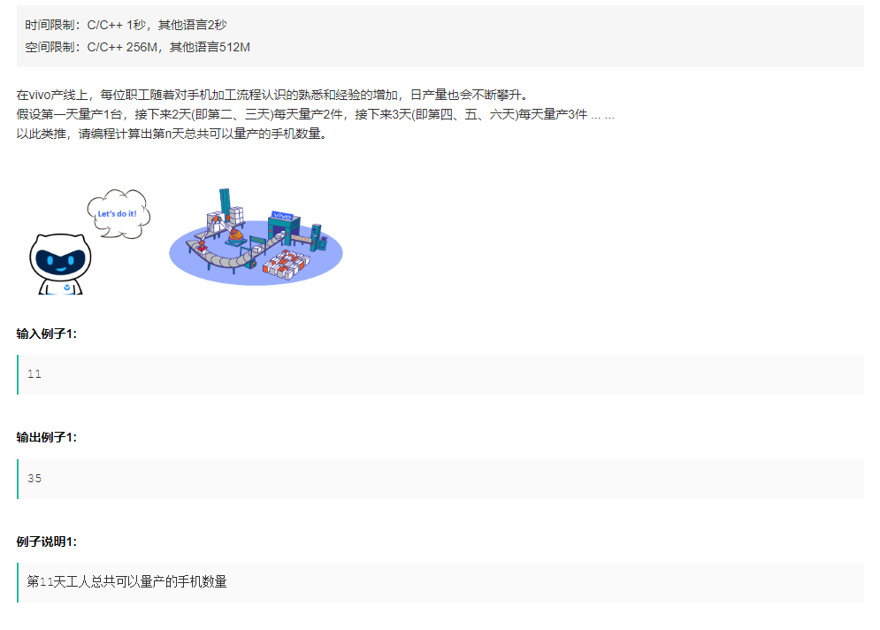

# 题目

> 

# 思路

这题先后做两遍：

第二遍的思路是直接上数学推导。

```c++
class Solution {
public:
    /**
     * 
     * @param n int整型 第n天
     * @return int整型
     */
    int solution(int n) {
        // write code here
        int round = 0, remaider = 0;
        int sum = 0;
        while(sum < n)
            sum += ++round;
        remaider = n - (sum - round);
        sum = 0;
        for(int i=1; i<round; ++i) {
            sum += i*i;
        }
        sum += round * remaider;
        return sum;
    }
};
```

而第一遍的做法虽然更符合编程逻辑但是可能计算量更大，思路是对每一天计算当前所属轮次，累积和。但是其实可以用动态规划适当优化，使用一个大小为 `n+1` 的数组`dp[n]`，`dp[i]`表示第`i`天所属轮次，那么如何判断`i-1`天是否是其所属轮次的最后一天呢？如果`dp[i-1-dp[i-1]+1] = dp[i-dp[i-1]`与`dp[i-1]`属于同一轮次，那么`dp[i] = dp[i-1]+1`，否则`dp[i] = dp[i-1]`。

```c++
class Solution {
public:
    /**
     * 
     * @param n int整型 第n天
     * @return int整型
     */
    int solution(int n) {
        // write code here
        vector<int> dp(n+1, 0);
        dp[1] = 1;
        dp[2] = dp[3] = 2;
        int sum = 5;
        for(int day=4; day<=n; ++day) {
            if(dp[day-dp[day-1]] == dp[day-1]) dp[day] = dp[day-1]+1;
            else dp[day] = dp[day-1];
            sum += dp[day];
        }
        return sum;
    }
};
```

