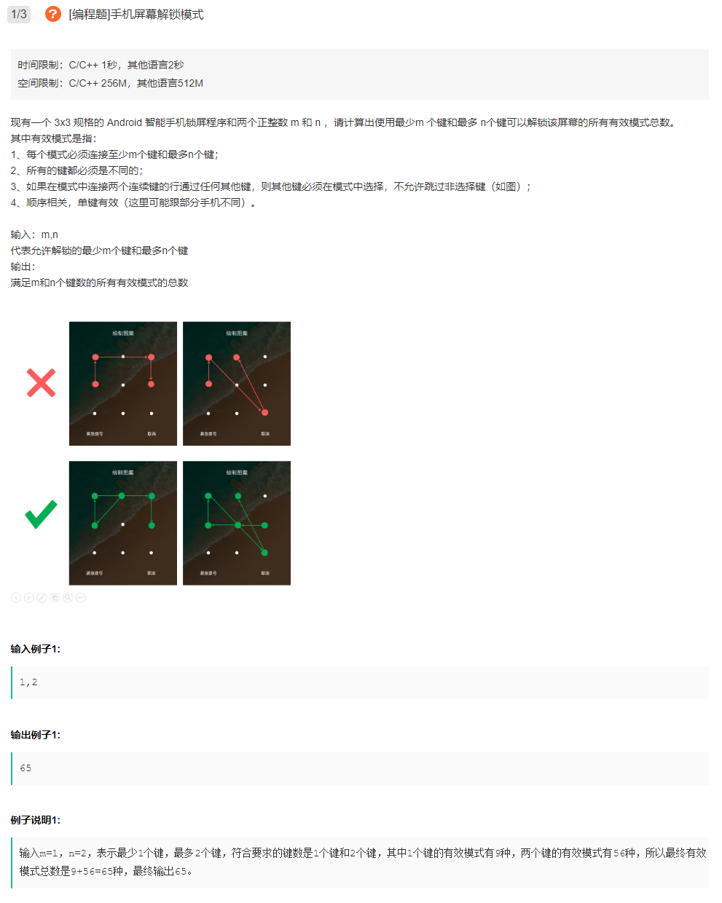

# 题目



# 思路

DFS，搜索每个位置。

```c++
class Solution {
public:
    /**
     * 实现方案
     * @param m int整型 最少m个键
     * @param n int整型 最多n个键
     * @return int整型
     */
    int solution(int m, int n) {
        // write code here
        if(m > 9 || n < 0 || m > n) return 0;
        if(n == 1) return 9;
        if(n == 0) return 0;
        mark.resize(3, vector<bool>(3, false));
        int ans = 0, cnt = 1;
        for(int i=0; i<3; ++i) {
            for(int j=0; j<3; ++j) {
                ans += dfs(m, n, i, j, cnt);
            }
        }
        return ans;
        
            
    }
    vector<vector<bool>> mark;
    int dfs(int m, int n, int row, int col, int cnt) {
        if(mark[row][col] || cnt > n) return 0;
        mark[row][col] = true;
        int ans = 0;
        
        for(int i=0; i<3; ++i) {
            for(int j=0; j<3; ++j) {
                if(row == i && col == j) continue;
                if((col+j)&1 || (row+i)&1) {
                    ans += dfs(m, n, i, j, cnt+1);
                }
                else if(mark[(row+i)/2][(col+j)/2]) {
                    ans += dfs(m, n, i, j, cnt+1);
                }
            }
        }
        mark[row][col] = false;
        return cnt>=m?ans+1:ans;
    }
};
```

关键思路：如何判断当前选择是否跳过非选择键？此处需要归纳：当前点与目标点的中点（若存在）必须已经被选中。
