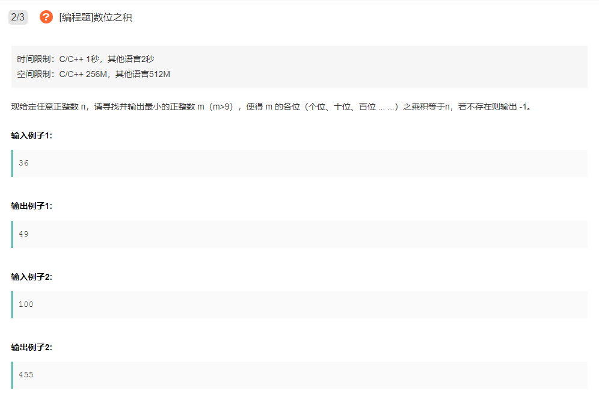

# 题目

> 

# 代码

```c++
class Solution {
public:
    /**
     * 输入一个整形数值，返回一个整形值
     * @param n int整型 n>9
     * @return int整型
     */
    int solution(int n) {
        // write code here
        if(n <= 0) throw("Invalid input.");
        if(n < 10) return n;
        return traceback(n, 1);
    }
    
    int traceback(int n, int currbitnum) {
        // 结束条件，该位小于10（可用一位十进制表示）；
        int origin = 0, scale = pow(10, currbitnum-1);
        if(n < 10) return n * scale;        
        for(int i=9; i>1; --i) {
            if(n % i) continue;
            int rest = traceback(n/i, currbitnum+1);
            if(rest != -1) {
                origin = i * scale + rest;
                return origin;
            }
        }
        return origin -1;
    }
};
```

实际上是回溯+剪枝。

思路是：位数越少，m 一定越小；低位尽可能大，高位才能尽可能小。