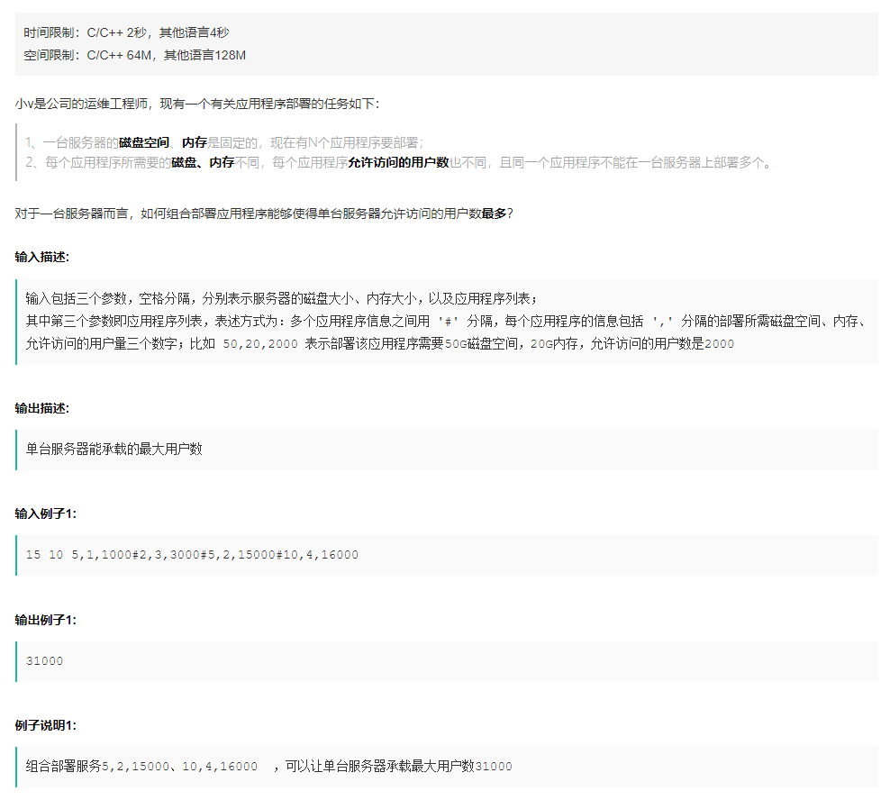

# 题目

> 

# 题解

```c++


#include <iostream>
#include <cstdio>
#include <cstdlib>
#include <vector>


using namespace std;

/*
* Welcome to vivo !
*/

int getCountOfApp(const char* input){
    if(NULL == input){
        return 0;
    }
    int cnt = 0;
    for(int i=0;input[i]!=0;++i){
        if(input[i] == ','){
            ++cnt;
        }
    }
    return cnt/2;
}

//id start from 0
int getPositionOfApp(const char* input, const int id){
    int cntOfComma = id*2 + 1;
    int i=0;
    for(;input[i]!=0&&cntOfComma!=0;++i){
        if(input[i] == ','){
            --cntOfComma;
        }
    }
    while(input[--i]!=' '&&input[i]!='#');
    return i+1;
}

#define APP_MAX 1000
#define DP_MAX 2048
int disks[APP_MAX];
int mems[APP_MAX];
int users[APP_MAX];
int dp[DP_MAX*DP_MAX];

int solution(const char* input){
    const int countOfApp = getCountOfApp(input);
    if(0 == countOfApp){
        return 0;
    }
    int res = 0;

    int disk = 0;
    int mem = 0;

    sscanf(input, "%d %d", &disk, &mem);

    for(int i=0; i< countOfApp;++i){
        const int pos = getPositionOfApp(input, i);
        sscanf(input+pos, "%d,%d,%d", &disks[i], &mems[i], &users[i]);
    }

    // TODO Write your code here!
    auto pre = new vector<vector<int>>(disk+1, vector<int>(mem+1, 0));
    auto curr = new vector<vector<int>>(disk+1, vector<int>(mem+1, 0));
    for(int appID=0; appID<countOfApp; ++appID) {
        for(int currdisk=disk; currdisk>=0; --currdisk) {
            for(int currmem=mem; currmem>=0; --currmem) {
                if(currdisk >= disks[appID] && currmem >= mems[appID])
                    (*curr)[currdisk][currmem] = max((*pre)[currdisk-disks[appID]][currmem-mems[appID]] + users[appID],
                            (*pre)[currdisk][currmem]);
                else
                    (*curr)[currdisk][currmem] = (*pre)[currdisk][currmem];
            }
        }
        swap(pre, curr);
    }
    res = (*pre)[disk][mem];
    return res;
}

int main(int argc, char* args[])
{
    char input[10000];
    cin.getline(input,10000);
    cout<<solution(input)<<endl;
}
```

其中核心代码：

```c++
// TODO Write your code here!
    auto pre = new vector<vector<int>>(disk+1, vector<int>(mem+1, 0));
    auto curr = new vector<vector<int>>(disk+1, vector<int>(mem+1, 0));
    for(int appID=0; appID<countOfApp; ++appID) {
        for(int currdisk=disk; currdisk>=0; --currdisk) {
            for(int currmem=mem; currmem>=0; --currmem) {
                if(currdisk >= disks[appID] && currmem >= mems[appID])
                    (*curr)[currdisk][currmem] = max((*pre)[currdisk-disks[appID]][currmem-mems[appID]] + users[appID],
                            (*pre)[currdisk][currmem]);
                else
                    (*curr)[currdisk][currmem] = (*pre)[currdisk][currmem];
            }
        }
        swap(pre, curr);
    }
    res = (*pre)[disk][mem];
```

做这道题时发现对0-1背包问题还是有误解。现在重新捋一遍思路。

0-1背包本质是动态规划，那么用动态规划的思路，我们如何把背包问题分解为子问题？

我们每次只需要对一件物品做一次决定，而这个决定如何做，取决于哪个决定可以给我们带来最优结果。假设我们现在已经处理到最后一件物品了，假设此时我们的状态为`pre`，那么我们需要求做完此次决定之后的最优状态集合`curr`：

- 一定要注意我们所选择的状态的含义：在做选择之前，剩余容量为`c`，`curr[c]`代表以此状态为初始状态进行选择，所能获得的最优结果，简单来说，其 key-value 为初始状态-最优结果；

- 在做选择之前，我们处于`pre`的状态集合中，当前物品重量`w`，价值`p`，对于每一种`c`的初始状态，我们需要做选择得到最优结果；
- 如果我们选择了这个物品，那么总价值就要添加`p`，而为了选择这个物品，我们的背包容量首先得足够容纳它，其次，我们剩余的背包容量要发挥最大作用，也就是要剩余背包容量的限制下做到最优，也就是`pre[c-w]`，此时总价值`curr[c]=pre[c-w]+p`；
- 如果不选，那么背包剩余空间不变，我们要使其发挥最大作用，此时`curr[c]=pre[c]`；

以上是递归思路，而我们实现时一般使用迭代，相当于将物品依次添加到集合中。

将递归实现的思路理解为这样一种过程：现在来了一件新物品，我选还是不选？我现在已经知道不同的背包容量情况下，在不计算这件物品时我能取得的最大价值，我只需要比较两种选择的结果选最优即可。

