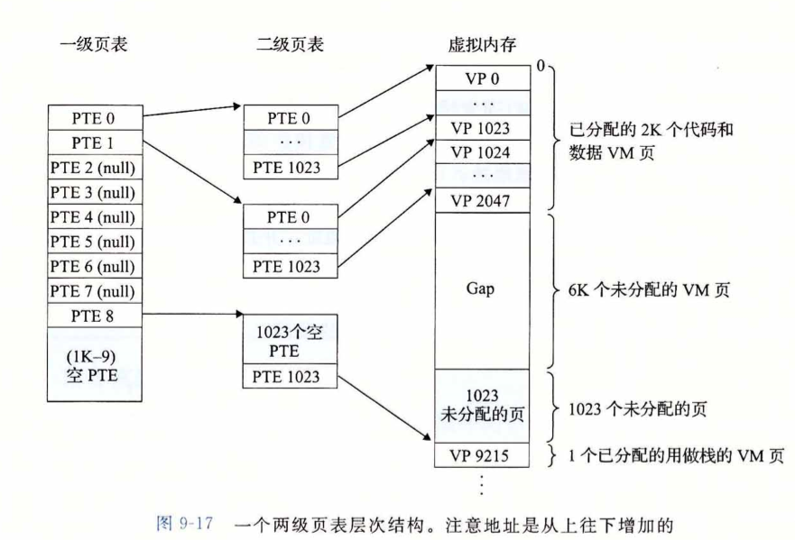
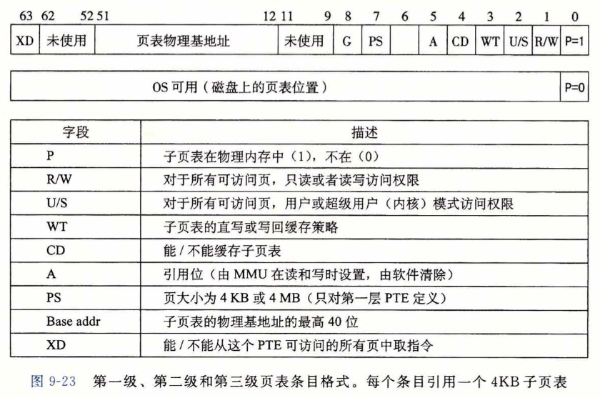
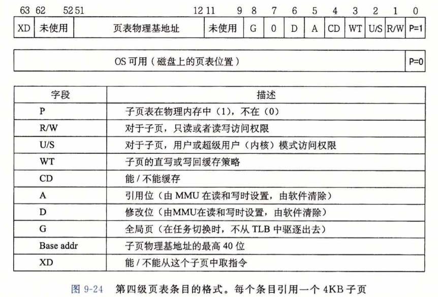
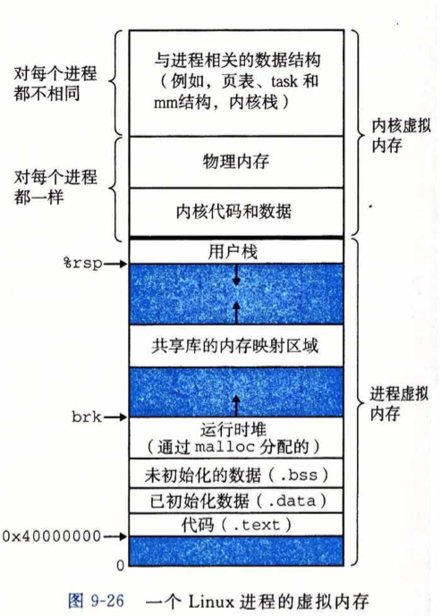
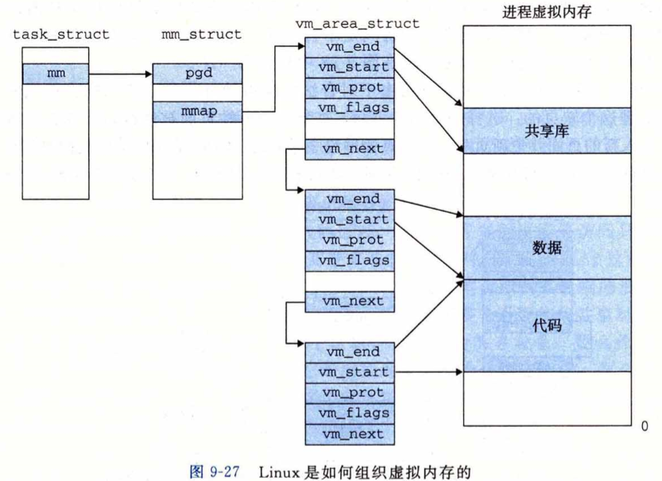

[toc]

# 异常控制流

## 异常

**异常 (exception)**是异常控制流的一种形式，一部分由硬件实现，一部分由操作系统实现。虽然其实现是硬件相关，但是其基本思想是相同的。

**异常**就是控制流中的突变，用来响应**处理器状态的某些变化**。

**状态变化**称为事件 (event)，可能和当前指令的执行直接相关：

- 发生虚拟内存缺页
- 算术溢出等等

或者与当前指令的执行无关：

- 系统定时器产生信号
- 一个 I/O 请求完成

当处理器检测到有**事件**（处理器状态变化）发生时，通过**异常表 (exception table)** ，它是一个跳转表，进行一个间接过程调用，到一个**操作系统子程序（异常处理程序 (exception handler)）**。异常处理程序完成处理后，**根据引起异常的事件类型**，发生以下三种情况：

- 将控制返回当前指令$I_{curr}$，即事件发生时正在执行的指令；
- 将控制返回给$I_{next}$，即 如果未发生异常 将会执行的下条指令；
- 处理程序**终止**被中断的程序。

### 异常处理

系统中可能的每种类型的异常，都有一个**唯一的、非负整数的异常号 (exception number)**。

系统启动时，操作系统分配和初始化一张称为**异常表**的跳转表。

跳转表中的每个表目$k$包含异常$k$的处理程序的地址。

处理器检测到事件发生，并确定异常号之后，通过**执行间接过程调用**触发异常。

异常号 是 **到异常表中的索引**，异常表的起始地址存放在叫做 异常表基址寄存器 的 **特殊CPU寄存器**中。

异常类似于过程调用，但也存在不同之处：

- 过程调用时，在跳转到处理程序之前，处理器将返回地址压入栈中。根据异常类型，返回地址要么是当前指令，要么是下条指令；
- 处理器将一些额外的处理器状态入栈；
- 如果控制从 用户程序 转移到 内核，所有这些项目被压入内核栈，而不是用户栈；
- 异常处理程序运行在内核模式下，对所有系统资源都有完全访问权限。

### 异常类别

异常分为四类：

- 中断 (interrupt)
- 陷阱 (trap)
- 故障 (fault)
- 终止 (abort)

| 类别 | 原因                | 异步/同步 | 返回行为             |
| ---- | ------------------- | --------- | ------------------- |
| 中断 | 来自 I/O 设备的信号 | 异步      | 总是返回到下一条指令 |
| 陷阱 | 有意的异常          | 同步      | 总是返回到下一条指令 |
| 故障 | 潜在可恢复的错误    | 同步      | 可能返回到当前指令   |
| 终止 | 不可恢复的错误      | 同步      | 不会返回             |

异步异常是由处理器外部的 I/O 设备中的事件中产生的；

同步异常是执行一条指令的直接产物。

#### 中断

中断**不是由任何一条专门的指令造成的**，从这个意义上来说，它是**异步的**。

一个例子：网络适配器、磁盘适配器、定时器芯片，通过向处理器芯片上的一个引脚发信号 （电平信号），并将异常号放到系统总线上，来触发中断，而异常号**表示了触发中断的设备**。

剩下的异常类型是**同步**发生的，是执行当前指令的结果。这类指令叫做**故障指令**。

#### 陷阱和系统调用

**陷阱**是**有意的异常**。

最重要的用途是**在用户程序和内核之间提供一个像过程一样的接口**，叫做**系统调用**。

用户程序向内核**请求服务**的例子：

- 读一个文件 read
- 创建一个新的进程 fork
- 加载一个新的应用程序 execve
- 终止当前进程 exit

**注意：**中断和陷阱都是在执行完当前指令后跳转到异常处理程序，所以返回时返回到下一条指令。

#### 故障

故障由错误情况引起，**可能**可以被故障处理程序修正。

- 如何处理程序能够修正这个错误情况，处理程序将控制返回到引起故障的指令，重新执行；
- 否则，处理程序返回到**内核中的abort例程**，abort 例程终止引起故障的应用程序。

典型的故障示例：**缺页异常**。当指令引用一个虚拟地址，而该虚拟地址**对应的物理页面**不在内存中，必须从磁盘取出时，会引发故障。缺页处理程序从磁盘中加载适当的页面，然后将控制返回给引起故障的指令，重新执行。

#### 终止

通常是一些硬件错误。终止处理程序将控制返回给一个 abort 例程，abort 例程负责终止该应用程序。

## 进程

进程是资源分配的基本单位；线程是独立调度的基本单位。

进程的经典定义，是一个**执行中程序的实例**。

系统中每个程序都运行在某个进程的**上下文**中。

上下文由程序正确运行所需的状态组成，包括存放在内存中的代码和数据、栈、通用目的寄存器的内容、程序计数器、环境变量以及打开文件描述符的集合。

**程序计数器**是用于存放下一条指令所在单元的地址的地方。

程序计数器是计算机[处理器](https://baike.baidu.com/item/处理器)中的[寄存器](https://baike.baidu.com/item/寄存器)，它包含当前正在执行的指令的地址（位置）。当每个[指令](https://baike.baidu.com/item/指令)被获取，程序计数器的存储地址加一。在每个指令被获取之后，程序计数器指向顺序中的下一个指令。

### 进程提供给应用程序的抽象

- 一个独立的逻辑控制流，提供一个假象，好像我们的程序独立地使用处理器；
- 一个私有的地址空间，提供一个假象，好像我们的程序独占地使用内存系统。

#### 逻辑控制流

程序计数器的值唯一地对应于包含在程序的可执行目标文件中的指令，或是包含在运行的时候动链接到程序的共享对象中的指令。

这个PC值的序列称为逻辑控制流。

**进程是轮流使用处理器的。**每个进程执行它的流的一部分，然后被抢占，轮到其他进程。

#### 并发流

逻辑流的不同形式的例子：异常处理程序、进程、线程、信号处理程序等等。

一个逻辑流的执行，在时间上与另一个流重叠，称为并发流，换句话说，这两个流**并发地运行**。

**多个流并发地执行**这个现象，被称为**并发 (concurrency)**。

一个进程和其他进程轮流运行，称为**多任务**。

一个进程**执行它的控制流的一部分**的**每一时间段**叫做**时间片  (time slice)**。

因此，多任务也叫**时间分片**。

并发流的思想，与处理器核数 和 计算数 无关。只要在时间上重叠，两个流就是并发的，即使他们运行在同一个处理器上。

#### 私有地址空间

在一台$n$位地址的机器上，地址空间可能是$2^n$个地址的集合。

进程为每个程序提供它自己的**私有地址空间**。**一般来说**，和这个空间中 某个地址相关联的 内存字节 **不能被其他进程读写**。从这个意义上说，这个地址空间是私有的。

每个私有地址空间有相同的**通用结构**。

```
==========================
内核虚拟内存（用户代码不可见）
代码、数据、堆、栈
-------------------------- < 0xFFFFFFFFFFFF
	用户栈（运行时创建）
--------------------------
	自由空间
--------------------------
	运行时堆
--------------------------
	读写段 (.data, .bss)
--------------------------
只读段 (.init, .text, .rodata)
-------------------------- < 0x400000 
	禁止访问
==========================
```

内核虚拟内存是保留给内核（操作系统常驻内存的部分），包含了**内核在代表进程执行指令时**（比如应用程序进行系统调用时）使用的代码、数据、栈。

#### 用户模式、内核模式

处理器通常用某个控制寄存器中的一个**模式位**描述进程当前享有的特权。

- 当设置了模式位时，进程运行在**内核模式**运行在内核模式的进程可以执行指令集中的任何指令，并且访问系统中的任何内存位置；
- 没有设置模式位时，进程运行在**用户模式**，不允许运行特权指令 (privileged instruction)，比如停止处理器、改变模式位、或发起`I/O`操作，也不允许用户模式中的进程**直接引用**地址空间中内核区的代码和数据。用户程序必须通过调用**系统接口**间接访问内核代码和数据。

运行应用程序代码的进程 初始时运行在**用户模式**。

进程从**用户模式**转变为**内核模式**的唯一方法是 通过[**异常**](#异常)进入:

- 中断
- 故障
- 系统调用

异常发生时，控制传递到**异常处理程序**，处理器将模式从 用户模式 变为 内核模式。异常处理程序运行在内核模式中，当它返回到应用程序代码时，处理器把模式从 内核模式 变为 用户模式。

/proc 文件系统将许多内核数据结构的内容输出为一个**用户程序可读的文本文件的层次结构**。

#### 上下文切换

 操作系统内核通过**上下文切换**来实现多任务。

**上下文切换**是一种较高层形式的异常控制流。

内存为每个进程维持一个**上下文**，**上下文**就是内核重新启动一个被强占的进程所需的状态，这些状态通常包括：通用目的寄存器、浮点寄存器、程序计数器、用户栈、状态寄存器、内核栈和各种内核数据结构。

在进程执行的某些时刻，内核可以决定**抢占该进程**，并重新开始一个之前被强占的进程。这种决策叫做**调度  (scheduling)**，由内核中称为**调度器**的代码处理。

当内核选择一个新的进程运行时，我们说内核**调度**了这个进程。

在内核调度了一个新的进程运行后，它抢占当前进程，并使用**上下文切换**的机制来转换到另一个进程。

上下文切换：

- 保存当前进程上下文；
- 恢复某个先前被强占的进程的上下文；
- 将控制传递给这个新恢复的进程。

上下文切换可能发生在：

- 内核代表用户执行系统调用时，因为等待某个事件而发生阻塞。比如 read 系统调用需要访问磁盘，内核可以选择切换上下文，切换到另一个进程，而不是等待数据从磁盘到达内存；
- 内核代表用户执行的系统调用本身请求了上下文切换：sleep 系统调用显式地请求**让调用进程休眠**；
- 中断可能引发上下文切换。

## 进程控制

### 获取进程ID

每个进程都有一个唯一的正数进程ID (PID)。

```c
# include <sys/type.h>
# include <unistd.h>

pid_t getpid(void); // 返回进程pid
pid_t getppid(void); // 返回父进程pid
```

`pid_t` 在 Linux 系统上，在 `type.h` 中被定义为 `int`。

### 创建和终止进程

进程的三种状态：

- 运行：在 CPU 中执行，或等待被执行且最终被调度；
- 停止：进程执行被挂起 (suspended)，且不会被调度，保持停止直到收到 SIGCONT 信号，此时进程再次开始运行；
- 终止：进程永远停止。进程终止的三种方式：
  - 收到一个信号，该信号的默认行为是终止进程；
  - 从主程序返回；
  - 调用 exit 函数；

#### 创建进程

**父进程**通过调用 fork 函数创建一个新的运行的**子进程**。

```c#
# include <sys/type.h>
# include <unistd.h>

pid_t fork(void);
```

新创建的子进程得到与父进程**用户级虚拟地址空间相同的但是独立的**一份副本，包括**代码段、数据段、堆、共享库、用户栈**。

子进程还获得与**父进程任何打开文件描述符相同的副本**，意味着子进程可以读写父进程打开的任何文件。

**文件描述符**在形式上是一个非负整数。实际上，它是一个**索引值**，指向[内核](https://zh.wikipedia.org/wiki/内核)为每一个[进程](https://zh.wikipedia.org/wiki/进程)所维护的该进程打开文件的记录表。当程序打开一个现有文件或者创建一个新文件时，内核向进程返回一个文件描述符。

用 fork 创建子进程的示例：

```c
int main()
{
    pid_t pid;
    int x = 1;
    
    pid = Fork();
    if(pid == 0) {/* child */
        printf("child : x=%d\n", ++x);
        exit(0);
    }
    /* Parent */
    print("parent : %d\n", --x);
    exit(0);
}
```

在 Unix 系统运行时，结果如下：

```shell
parent : x=0
child : x=2
```

注意：上面的子进程创建并不会无限创建子进程，因为新创建的子进程从父进程中创建该子进程的下一条语句的副本开始执行。

还需要注意：Fork 返回到父进程中的返回值为子进程的 pid，而返回到子进程的返回值为0。

- 调用一次，返回两次。一次返回到父进程，返回值为0，一次返回到新创建的进程；
- 并发执行。父进程与子进程是并发运行的独立进程。从上述例子的结果来看，先返回父进程，再返回新创建的子进程，而这个结果是**系统实现相关的**，不同系统可能有不同结果，因为两个进程独立运行，内核以任意方式交替执行两个进程的逻辑控制流中的指令；
- 相同但是独立的地址空间，他们都有自己私有的地址空间；
- 共享文件。由于**子进程继承了父进程所有的打开文件**，而父进程调用 fork 时，stdout 文件是打开的，并指向屏幕。

### 回收子进程

当一个进程因为某种原因终止时（终止信号、运行结束返回、系统调用终止），内核不是立即将其从系统中清除。相反，进程被保持在一种已终止的状态，**直到被父进程回收 (reaped)**。当父进程回收已经终止的子进程时，**内核将子进程的退出状态传递给父进程**，然后**抛弃已终止的进程**。从此时开始，该进程就不存在了。

一个终止了但还未被回收的进程称为**僵尸进程** (zombie)。

如果一个父进程终止了，内核会安排 init 进程称为它的**孤儿进程**的**养父**。

init 进程的 pid 为1，是在系统启动时由**内核**创建的，他不会终止，是所有进程的祖先。

如果父进程没有回收它的僵尸子进程就终止了，那么内核会安排 init 进程去回收他们。

**一个进程可以通过调用 waitpid 函数来等待它的子进程终止或者停止。**

```c
# include <sys/types.h>
# include <sys/wait.h>

pid_t waitpid(pid_t pid, int *statusp, int options); // 默认情况（options=0）时，挂起调用进程的执行，直到它的等待集合中的一个子进程终止。如果等待集合中的一个子进程在刚调用的时候就已经终止了，则立即返回。
// 以上两种情况下，waitpid返回已终止子进程的pid。
// 此时，已终止的子进程已经被回收。
```

#### `waitpid`函数

1. 判定等待集合的成员  
     等待集合 (wait set) 的成员由参数 `pid`确定：

   1. `pid>0`，那么等待集合是一个单独的子进程，其进程 ID 为 `pid`；
   2. 如果`pid=-1`，那么等待集合是父进程的所有子进程的集合；

   支持其它类型的等待集合，包括 Unix 进程组；

2. 修改默认行为  
   `option`可以设置为单个常量或组合：

   1. WNOHANG：（不挂起）等待子进程中任何子进程都还未终止，那么立即返回（返回值0）；
   2. WUNTRACED：（未被追踪的，即被停止的子进程）挂起调用进程的执行，直到等待集合中的**一个进程**变成已终止或者被停止。返回**导致返回的已终止或者被停止子进程的PID**，与默认状态的区别在于它会返回被停止的子进程的 PID；
   3. WCONTINUED：（恢复了而继续运行的）挂起调用进程的执行，直到**集合中一个正在运行的进程终止或等待集合中一个被停止的进程收到 SIGCONT信号重新开始执行**，与默认状态的区别在于他会返回之前被停止，然后又重新运行的子进程 PID；
   4. WNOHANG | WUNTRACED：（不挂起 且 返回停止或终止的进程 PID）立即返回。如果等待集合中所有子进程都没有终止或被停止，返回0；如果有一个停止或终止，则返回该子进程 PID；

3. 检查已回收子进程的退出状态  
   如果`statusp`非空，那么`waitpid`在其指向的地址中存放**导致返回的子进程的状态信息**：

   1. WIFEXITED(status)：（正常返回并退出）子进程通过系统调用 exit 或 return 正常返回，status 为 true；
   2. WEXITSTATUS(status)：（正常返回并退出的进程的状态）返回一个正常终止的子进程的退出状态，只有`WIFEXITED()==true`时，才会定义这个状态；
   3. WIFSIGNALED(status)：（由信号终止）子进程是因为一个（未被捕获的）信号终止的，status 为 true；
   4. WTERMSIG(status)：（由信号终止时该信号的编号）返回导致子进程终止的**信号编号**，只有`WISIGNALED（）==true`时定义这个状态；
   5. WIFSTOPPED(status)：（是否为停止状态）如果引起返回的子进程是停止的（不是终止）的，status 为 true；
   6. WSTOPSIG(status)：（造成子进程停止的信号编号）返回引起子进程停止的信号编号，只有`WSTOPPED()==true`时定义这个状态；
   7. WIFCONTINUED(status)：（由 SIGCONT 信号重新启动）如果子进程收到 SIGCONT 信号重新启动，status 为 true；

4. 错误条件  
   如果调用进程没有子进程，返回`-1`，并设置`errno`为`ECHILD`;  
   如果`waitpid`被信号中断，返回`-1`，并设置`errno`为`EINTR`；

5. wait 函数  
   wait 函数是 waitpit 的简单版本

   ```c#
   # include <sys/type.h>
   # include <sys/wait.h>
   
   pid_t wait(int *statusp);
   // 以下调用等价
   pid_t pid = wait(&status);
   pid_t pid = waitpid(-1, &status, 0);
   ```

6. 一个使用`waitpid`不按照特定顺序等待所有子进程结束的例子

   ```c++
   # include <sys/type.h>
   # include <sys/wait.h>
   # include <errno.h>
   
   int main()
   {
       const int N = 2;
       int status = 0, i = 0;
       pid_t pid = 0;
       
       /* Parent creates N children. */
       for(; i<N; ++i) {
           if((pid = Fork()) == 0) // child
               exit(100+i); // 子进程什么都不做
       }
       /* Parent reaps N children in no particular order. */
       while(pid = waitpid(-1, &status, 0) > 0) { // 返回有效PID，即waitpid本身没有出错
           if(WIFEXITED(status)) // 有一个进程号为pid的子进程正常返回并终止
               printf("child %d terminated normally with exit status %d.\n", pid, WEXITSTATUS(status));
           else
               printf("child %d terminated abnormally.\n", pid);
       }
       /* The only normal termination is if there are no more children. */
       if(errno != ECHILD) // waitpid本身出错
           unix_error("waitpid error.");
       exit(0);
   }
   ```

### 让进程休眠

`sleep`函数将一个进程挂起一段指定的时间。

```c
# include <unistd.h>

unsigned int sleep(unsigned int secs);
int pause(void);
```

如果请求时间量到了，`sleep`返回0，否则返回还剩下的要休眠的秒数。

后一种情况在`sleep`函数被一个信号中断而过早返回的情况下发生。

`pause`将进程挂起直到收到一个信号。

### 加载并运行程序

`execve`函数在当前进程的上下文中**加载并运行**一个新程序。

```c
# include <unistd.h>

int execve(const char *filename, const char *argv[], const char *envp[]);
```

只有当出现错误时，函数返回调用程序。

`execve`函数加载`filename`之后，它调用启动代码。启动代码设置栈，并将控制传递给新程序的主函数。

#### 程序与进程

程序是一堆代码和数据，可以作为目标文件存在磁盘上，或者作为段存在于地址空间中。

进程是执行中程序的一个实例。

fork 在新的子进程中运行相同程序；

execve 在当前进程的上下文中加载并运行一个新的程序，覆盖当前进程的地址空间，拥有相同的 PID，继承调用进程的已打开的所有文件描述符。

## 信号

`Linux信号`允许进程和内核中断其他进程。

每种信号类型对应某种**系统事件**。底层硬件异常由**内核异常处理程序**处理，对用户进程是不可见的。

信号提供一种机制，通知用户发生了哪种类型的异常。

信号是一种软件异常。

### 信号术语

传送一个信号到目的进程的步骤：

- 发送信号。  
  内核通过**更新目的进程上下文**的某个状态，发送一个信号给目的进程。发送信号的原因：
  - 内核检测到一个**系统事件**，比如零错误或子进程终止；
  - 一个进程调用了 kill 函数，显式地要求内核发送信号给目的进程；
- 接收信号。  
  目的进程被内核强迫以某种方式对信号的发送作出反应时，它就接受了信号。一个进程可以**有选择性地**阻塞某种信号，当信号被阻塞时，他仍可以被发送，但是不会被接收，直到进程取消对这种信号的阻塞。  
  一个信号只能被接收一次。  
  内核为每个进程在 pending 位向量中维护一个**待处理信号的集合**，在 block 位向量中维护**被阻塞的信号集合**。传送信号时，内核设置 pending 相应位，接收后，内核清除 pending 相应位。

### 发送信号

#### 进程组

每个进程都**只属于一个**进程组，**进程组**由一个正整数进程组 ID 来标识。

```c
# include <unistd.h>

pid_t getpgrp(void); // 获取当前进程所在进程组ID
int setpgid(pid_t pid, pid_t pgid); // 改变自己或其他进程的进程组
// pid为0则使用调用进程的pid，pgid为0则使用调用进程pid作为pgid
```

#### 用 /bin/kill 程序发送信号

kill 程序可以向另外的进程发送任意信号。

```shell
linux> kill -9 15213 # 向GPID为15213的进程组的每个进程发送编号为9的SIGKILL信号
```

#### 从键盘发送信号

Unix shell 使用**作业 (job)**这个抽象概念来表示为**对一条命令行求值而创建的进程**。

在任何时刻，最多只有一个前台作业和0个或多个后台作业。

#### 用 kill 函数发送信号

```c
# include <sys/type.h>
# include <signal.h>

int kill(pid_t pid, int sig); // 发送信号号码sig给PID为abs(pid)的进程，如果pid==0，那么发送sig给调用进程所在进程组的所有进程，包括自己
```

#### alarm 函数发送信号

```c
# include <unistd.h>

unsigned int alarm(unsigned int secs); // 安排内核在 secs 秒之后发送一个SIGALRM信号给调用进程，对alarm函数的任何调用都会取消待处理的闹钟，并返回剩余秒数；如果没有待处理闹钟，返回0
```

### 接收信号

当进程**从内核模式切换到用户模式**，内核检查**进程为被阻塞的待处理信号集合 (pending & ~blocked)**。

- 集合为空，内核将控制返回到进程**逻辑控制流**的下一条指令；
- 否则，内核选择某个信号（通常为最小），并强制进程接收该信号。收到信号**会触发进程采取某种行为**，当完成该行为时，控制传回进程逻辑控制流中的下一条指令。

每个信号类型都有默认行为：

- 进程终止
- 进程终止并转储内存
- 进程（停止）挂起，等待 SIGCONT 信号重启
- 进程忽略该信号

进程可以通过使用`signal`函数**修改信号相关的默认行为**，除 SIGSTOP 和 SIGKILL 外。

```c
# include <signal.h>
typedef void (*sighandler_t)(int);

sighandler_t signal(int signum, sighandler_t handler); 
```

- `if(handler == SIG_IGN)`，忽略`signum`的信号
- `if(handler == SIG_DFL)`，`signum`信号关联行为恢复默认
- 否则，`handler`为用户定义函数地址，该函数为信号处理程序。

将处理程序的地址传递到`handler`称为**设置信号处理程序**。

调用**信号处理程序**称为**捕获信号**。

执行**信号处理程序**称为**处理信号**。

### 阻塞和解除阻塞信号

- 隐式阻塞机制。内核默认阻塞任何**当前信号处理程序正在处理的信号类型**的待处理信号。
- 显式阻塞机制。使用 sigprocmask 函数及其赋值函数，明确阻塞和解除阻塞的信号类型。

### 编写信号处理程序

#### 安全的信号处理

编写处理程序的原则：

- 处理程序要尽可能简单

- 在处理程序中只调用**异步信号安全**的函数。  
  **异步信号安全的函数**（简称为安全的函数）能够被信号处理程序安全调用，原因有二：

  - 要么是**可重入**的（例如只访问局部变量）
  - 要么不能被信号处理程序中断

- 保存和恢复 `errno`

- 阻塞所有信号，保护对共享全局数据结构的访问

- 用`volatile`声明全局变量  
  `volatile`类型限定符定义一个变量，告诉编译器**不要缓存这个变量**。  
  考虑一个处理程序和 main 函数，他们共享一个全局变量 g。处理程序更新 g，main 函数周期性访问 g，那么对于一个优化编译器来说，g 的值看上去完全没有变过，因此使用缓存在寄存器中的副本来满足对 g 的每次引用是安全的。但是这样，main 函数永远无法看到处理程序更新过的 g。

- 用`sig_atomic_t`声明标志。  
  在常见的处理程序设计中，处理程序会写全局标志来记录接收到了信号。主程序周期性地读这个标志，响应信号，再清除该标志。  
  对于这种方式共享的标志，C 提供一种**整形数据类型 sig_atomic_t** ，对它的读写保证会是**原子的（不可中断的）**，因为可以用一条指令（区别于一行代码）来实现它们：

  ```c
  volatile sig_atomic_t flag;
  ```

  注意：这里对原子性的保证**只适用于单个的读写**，不适用于`flag++`等，他们可能需要更多指令。

#### 正确的信号处理

未处理的信号是**不排队的**，因为 pending 位向量中每种类型的信号只有一位。

所以当**信号处理程序**未返回时，该类型信号被处理程序阻塞，在该时间段内，第二个到达的信号被阻塞，之后的信号都被丢弃，不会触发信号捕获和处理。

为了解决上述情况，我们总结出：**不能用信号来对其他进程中发生的事件计数**。

因此，我们在处理函数中，以回收僵尸子进程为例，应该回收尽可能多的僵尸子进程。这样保证了，当有信号被抛弃时，它所对应的事件（子进程终止）已经被当前运行的处理函数所处理。

### 同步流以避免讨厌的并发错误

读写相同存储位置的并发流，可能遇到如下问题：

**竞争 (race)**，经典的同步错误：由于**并发进程的逻辑控制流的交错**导致的意料之外的指令运行顺序，引发错误结果。比如读写顺序的错误。

解决方法：在正确的位置阻塞对触发时间敏感的信号，使得信号接收发生在正确的时间。

注意：父进程的信号阻塞集合会被子进程所继承，因此子进程运行时首先需要解除阻塞。

### 显式地等待信号

有时候主程序需要显式地等待某个信号处理程序运行。比如 Linux shell 在创建一个前台作业时，在接收下一条用户命令之前，必须等待作业终止，被 SIGCHLD 处理程序回收。

```c
sigset_t mask, prev;
Sigemptyset(&mask);
Sigaddset(&mask, SIGCHLD);


while(1) {
    Sigprocmask(SIG_BLOCK, &mask, &prev); // 显式阻塞SIGCHLD，避免父子进程竞争
    if(Fork() == 0) { // 子进程
        exit(0);
    }
    
    pid = 0; // 如果不对SIGCHLD阻塞，pid=0可能发生在处理程序运行之后
    Sigprocmask(SIG_SETMASK, &prev, NULL); // 取消阻塞，因为此后触发处理程序都是正确的
    
    while(!pid) { // 等待僵尸子进程回收
        ;
    }
    printf("Do some thing after receiving SIGCHLD.");
}
```

以上函数正确，但问题在于其中的嵌套循环等待僵尸子进程被回收，浪费了处理器资源，因为父进程需要不停地检测 pid，其余地什么都不做。

- 方法一：

  ```c
  while(!pid)
      /* 此时收到信号，回收僵尸子进程后父进程仍被挂起，不会再收到SIGCHLD信号，也就会永远睡眠 */
      pause(); // 挂起父进程直到收到一个信号
  ```

- 方法二：

  ```c
  while(!pid)
      sleep(1); // 太慢，无法选择合适的时间
  ```

- 合适的方法三：

  ```c
  # include <signal.h>
  
  int sigsuspend(const sigset_t *mask); // return -1
  // 等价于以下代码的原子（不可中断）版本
  sigprocmask(SIG_SETMASK, &mask, &prev); // 
  pause();
  sigprocmask(SIG_SETMASK, &prev, NULL);
  ```

  使用`sigsuspend`函数：

  ```c
  sigset_t mask, prev;
  Sigemptyset(&mask);
  Sigaddset(&mask, SIGCHLD);
  
  
  while(1) {
      Sigprocmask(SIG_BLOCK, &mask, &prev); // 显式阻塞SIGCHLD，避免父子进程竞争
      if(Fork() == 0) { // 子进程
          exit(0);
      }
      
      pid = 0; // 如果不对SIGCHLD阻塞，pid=0可能发生在处理程序运行之后
      
      while(!pid) { // 等待僵尸子进程回收
          sigsuspend(&prev); // 暂时取消阻塞SIGCHLD并挂起，直到收到信号，此时恢复阻塞并返回
      }
      Sigprocmask(SIG_SETMASK, &prev, NULL); // 可选地取消阻塞
      printf("Do some thing after receiving SIGCHLD.");
  }
  ```

### 非本地跳转

C 语言提供了用户级**异常控制流**的形式，称为**非本地跳转 (nonlocal jump)**，将控制直接从一个函数转移到另一个当前正在执行的函数，而不需要进行正常的**调用-返回**。

C 语言中，非本地跳转通过 `setjmp` 和 `longjmp` 函数提供：

```c
# include <setjmp.h>

int setjmp(jmp_buf env); // 在env缓冲区中保存当前调用环境，供longjmp使用，并返回0.调用环境包括 程序计数器、栈指针、通用目的寄存器，其返回值不能给变量赋值！！！
int sigsetjmp(sigjmp_buf env, int savesigs);

void longjmp(jmp_buf env, int retval); // 从env缓冲区中回复调用环境，然后触发一个从最近一次初始化env的setjmp调用的返回，并返回带有非零的返回值的retval
int siglpngjmp(sigjump_buf env, int retval);
```

#### 非本地跳转的应用1

非本地跳转的一个重要应用是：允许从一个深层嵌套的函数调用中立即返回。

```c
# include ...

jum_buf buf;

int error1 = 0, error2 = 1;
void foo(void), bar(void);

int main() {
    switch(setjmp(buf)) { // 初次调用setjmp，将当前调用环境保存在buf中，返回0
        case 0:
            foo(); // 初次保存环境后执行foo
            break;
        case 1:
            printf("Detected an error1 condition in foo.\n");
            break;
        case 2:
            printf("Detected an error2 condition in foo.\n");
            break;
        default:
            printf("Unknown error condition in foo.\n");
    }
    exit(0);
}

void foo(void) {
    if(error1)
        longjmp(buf, 1);
    bar();
}

void bar(void) {
    if(error2)
        longjmp(buf, 2);
}
```

然而`longjmp`可以跳过所有中间调用的特性可能产生意外后果。

内存泄漏：在中间函数的调用中分配了动态内存，预期在结尾释放，而结尾被跳过。 

#### 非本地跳转的应用2

使一个信号处理程序分支到一个特殊的代码位置，而不是返回到被信号中断了的指令位置（此时信号处理函数不是正常返回）。

由于`longjmp`不是**异步信号安全**的函数（不是可重入也不是原子的），因此在`longjmp`可到达的区域必须使用**异步信号安全**的函数。

```c
# include ...

sigjmp_buf buf;

void handler(int sig) {
    siglongjmp(buf, 1);
}

int main() {
    if(!sigsetjmp(buf, 1)) { // 必须先保存环境，再设置信号处理程序，避免longjmp在set之前发生
        Signal(SIGINT, handler); // 设置信号处理程序
        Sio_puts("Starting...\n"); // 异步信号安全函数
    }
    else
        Sio_puts("Restarting...\n"); // 异步信号安全函数
    
    while(1) {
        Sleep(1); // 异步信号安全函数
        Sio_puts("Processing...\n"); // 异步信号安全函数
    }
    exit(0); // 不安全，Control never gets here
}
```

### 操作进程的工具

```shell
$ STRACE # 打印一个正在运行的程序和他的子进程调用的每个系统调用的轨迹
$ ps # 列出当前系统的进程（包括僵尸进程）
$ top # 打印出关于当前进程资源使用的信息
$ pmap # 显示进程的内存映射
```

# 虚拟内存

## 内存和主存的区别

内存由**RAM（主存）**和**ROM**组成。

**RAM**有 SRAM 和 DRAM。

**ROM**有 PROM，EPROM，EEPROM。

## 物理和虚拟地址

计算机系统的主存被组织成由 M 个连续字节大小的单元组成的数组。

每个**字节**都有一个唯一的物理地址。

CPU 使用物理地址访问内存的方式叫做**物理寻址**。

使用**虚拟寻址**，CPU 通过生成一个虚拟地址 (virtual address, VA) 来访问**主存**，在被送到内存之前先转换成合适的**物理地址**。

将虚拟地址转换为物理地址叫做**地址翻译**。

CPU 上叫做**内存管理单元 (Memory Management Unit, MMU)** 的专用硬件，利用主存中的**查询表**来动态翻译虚拟地址。

查询表由**操作系统**管理。

## 地址空间

**地址空间**是一个非负整数地址的有序集合。

如果地址空间中的地址是连续的，这个地址空间是**线性地址空间**。

CPU 在线性地址空间中生成**虚拟地址**，这个地址空间成为**虚拟地址空间**。

内存中**每字节**都有一个物理地址和虚拟地址。

## 虚拟内存作为缓存工具

概念上，**虚拟内存**被组织为一个由**存放在磁盘上**的 N 个**连续的字节大小的单元**组成的数组。

每字节有唯一的虚拟地址，作为到数组的索引。

磁盘上数组的内容被分割成块 (block)，缓存在主存中。

VM 系统将虚拟内存分割成**虚拟页 (virtual page, VP)**的**大小固定的块**。

每个虚拟页大小为$P=2^p$字节。类似的，物理内存被分割为物理页。

在任意时刻，虚拟页面的集合都分为三个互不相交子集：

- 未分配：没有与任何数据相关联，不占用任何磁盘空间；
- 缓存的：已缓存在物理内存中的已分配页；
- 未缓存的：已分配，未缓存的页。

### 页表

页表将**虚拟页映射到物理页**。

页表就是一个**页表条目 (Page Table Entry, PTE)** 的数组。

虚拟地址空间中，每个页在页表中的一个固定偏移量处都有一个 PTE，指明当前虚拟页是否被缓存，以及缓存在物理内存中的物理页的起始位置。

### 页命中

CPU 想要读虚拟内存的一个字时，地址翻译硬件查询到该虚拟页已被缓存，从而定位和读取它。

### 缺页

**虚拟内存系统**的缓存不命中称为**缺页**。

CPU 引用了**虚拟页** VP 中的某个字，地址翻译硬件从**内存中**读取对应 PTE，推断出该虚拟页未被缓存，触发缺页异常。进程调用缺页异常处理程序，该程序选择一个**牺牲页** VP1，若该牺牲页被修改，那么写回并修改该牺牲页的 PTE（将 VP1 从主存中删除，将 VP 缓存在主存中）。

虚拟系统中，块被称为页。

**磁盘和内存**之间传送页的活动叫做**页面调度**。

发生不命中时才**换入**页面的策略，为**按需页面调度**。

### 分配页面

例如，调用 malloc 时：虚拟内存系统**在磁盘上**创建空间，并更新 PTE，使它指向**磁盘上**新创建的页面。

我们假设页表通过设置有效位，来区分 PTE 指向的物理内存地址还是磁盘地址。

## 虚拟内存作为内存管理的工具

操作系统为**每个进程提供了一个独立的页表**，因此也就是一个**独立的虚拟内存空间**。

多个虚拟页可以映射到同一个共享物理页。

## 虚拟内存作为内存保护的工具

操作系统需要控制进程对内存系统的访问：

- 不允许用户进程写它的只读代码段
- 不允许用户进程**读写**任何内核代码和数据结构
- 不允许一个用户进程**读写**其他进程的私有内存
- 不允许一个用户进程**写**任何**与其他进程共享的虚拟页面**

通过在页表条目 PTE 中添加一些额外的许可位来控制一个进程对其虚拟页面的访问。

如果进程逻辑控制流中的一条指令违反了上述限制，那么 CPU 触发一个**一般保护故障**，将控制传递给异常处理程序。

Linux shell 一般将这种异常报告为**段错误 (segment fault)**。

## 地址翻译

形式上来说，地址翻译是一个**虚拟地址空间**到**物理地址空间**的映射。

#### 页命中时

1. CPU 生成虚拟地址，传送给 MMU；
2. MMU 生成 PTE 地址，从高速缓存/主存中请求 PTE；
3. 高速缓存/主存向 MMU 返回 PTE；
4. MMU 构造物理地址，传送给高速缓存/主存；
5. 高速缓存/主存返回所请求的数据字给 CPU。

完全由硬件处理。

#### 缺页时

1. CPU 生成虚拟地址，传送给 MMU；
2. MMU 生成 PTE 地址，向高速缓存/主存请求 PTE；
3. 高速缓存/主存向 MMU 返回 PTE;
4. MMU 检测到该虚拟页**未被缓存**，因此**触发缺页异常**，传递 CPU 控制到操作系统内核中的缺页异常处理程序；
5. 缺页异常处理程序选择**物理内存中的牺牲页**，如果该页已被修改，那么把它换出到磁盘（写回）；
6. 缺页处理程序调入新页面，更新内存中的 PTE；
7. 缺页处理程序返回调用进程，再次执行缺页指令，此时回到第一步，并完成一个**页命中**的过程。

### 利用TLB加速地址翻译

每次 CPU 产生一个虚拟地址，MMU 就必须查阅一个 PTE，这回要求从内存多取一次数据，代价是**几十到几百个周期**。

如果 PTE 碰巧缓存在 L1 高速缓存中，那么开销就下降到了1到2个周期。

MMU 中因此包括了一个关于 PTE 的缓存，称为**翻译后备缓冲器 (Translation Lookaside Buffer)**。

### 多级页表

使用 B-Trees 结构更高效地利用内存空间存储 PTE。



在 k 级页表层次结构的地址翻译中，虚拟地址被划分为 k 个 VPN 和一个 VPO。为了构造物理地址，MMU 必须访问 k 个 PTE。

TLB 将不同层次的页表 PTE 缓存起来加速翻译。

## Intel Core i7/Linux 内存系统

L1, L2, L3 高速缓存是物理寻址的，块大小64字节。

TLB 是虚拟寻址的。

页大小可以在系统启动时配置为 4KB 或者 4MB。

Linux 使用 4KB 的页。

### Core i7 地址翻译

Core i7 采用**四级页表**层次结构。每个进程有它自己私有的页表层次结构。

与已分配页相关联的**页表**驻留在内存中。CR3 控制寄存器指向第一级页表的起始位置，CR3 的值是每个进程上下文的一部分。每次上下文切换时，CR3 都会被恢复。



上图为前三级页表条目 PTE 的格式，其中每个 PTE 引用一个 4KB 子页表。每个条目 64位，8 字节，因此每一级页表层次包含 512 个子页表起始位置。

当 P=1 时，即该子页表为已缓存状态时，地址字段包含一个**子页表的物理基地址的最高40位**的物理页号，指向适当的页表的起始位置。这使得物理页表必须 4KB 对齐。**（为什么）**

类似地，物理页也被要求 4KB 对齐。



当 MMU 翻译每一个虚拟地址时，它会更新另外两个内核缺页处理程序会用到的位。

每访问一个页，MMU 设置**引用位**。内核可以用这个引用位实现它的页替换算法。

每对一个位进行写之后，MMU 设置修改位（脏位，dirty bit），告诉内核在复制替换页之前是否必须写回牺牲页。

### Linux 虚拟内存系统



内核虚拟内存位于用户栈之上（更高地址）。

内核虚拟内存的某些区域被映射到所有进程共享的物理页面。例如，每个进程共享**内核代码和全局数据结构**。

Linux 也将一组连续的虚拟页面（大小等于系统中 DRAM 总量）映射到相应的一组连续的物理页面。这为内核提供了访问物理内存中任意位置的便利方法。

内核虚拟内存的其他区域包含每个进程都不同的数据（进程相关）。

#### Linux 虚拟内存区域

Linux 将虚拟内存组织成一些区域（段）的集合。

一个区域 (area) 就是**已分配的**虚拟内存的连续片 (chunk)。

区域的概念，允许虚拟地址之间有间隙，而这些间隙不用被内核记录，不占用内存、磁盘或者内核本身中的任何额外资源。

内核为系统中每个进程维护一个**单独的任务结构**，任务结构中的每个元素包含或者指向运行该进程所需要的所有信息（PID，指向用户栈的指针，可执行目标文件名称，程序计数器）。



- vm_start：指向区域起始处；
- vm_end：指向区域结束处；
- vm_prot：描述该区域包含的所有页的读写权限；
- vm_flags：这个区域内的页面是与其他进程共享还是私有；
- vm_next：指向链表中下个结构区域。

pgd 指向第一级页表（页全局目录）的基址；mmap 指向一个链表，该链表描述了虚拟内存的组织结构。

#### Linux 缺页异常处理

假设 MMU 在试图翻译一个虚拟地址 A 时发生了缺页（该虚拟页没有缓存在内存中），触发了一个缺页异常。该异常导致控制转移到缺页处理程序，处理程序执行以下步骤：

- 检查该**虚拟地址**是否合法（存在，就是说该虚拟地址存在于任何一个段中）：在这里，如果从到到尾顺序搜索链表使得算法的时间复杂度较高，因此 Linux 在链表中构建了一棵树（猜测为线段树），并在树中进行查找。访问的虚拟地址不合法的错误叫做段错误：企图访问一个不存在的虚拟页面；
- 检查对该**虚拟页面**的访问是否合法：如果对虚拟页面的访问是不合法的，那么缺页处理程序**触发一个保护异常**，从而终止进程；
- 否则，内核知道该缺页是由于对合法虚拟地址进行合法访问造成的。按照以下步骤处理缺页：
  - 选择牺牲页面
  - 如果该页面被修改过（检查修改位），那么将它交换出去，换入新的页面，并更新页表

## 内存映射

Linux 通过将一个虚拟内存区域（段）与磁盘上的一个对象关联起来，以初始化这个虚拟内存区域（段）的内容，这个过程叫做**内存映射 (memory mapping)**。

### 再看共享对象

一个对象可以被映射到虚拟内存的任意一个区域，要么作为**共享对象**，要么作为**私有对象**。

如果一个进程将共享对象映射到它的虚拟地址空间的一个区域内，那么这个进程对该共享对象的任何写操作，对其它同样映射了该共享对象的进程是可见的，同时它也改变了磁盘的原始对象。

对一个映射到私有对象的区域的改变，对其他进程不可见，并且进程对该区域的任何写操作都**不会反映在磁盘上的原始对象中**。

根据以上，对于一个区域映射到共享对象还是私有对象，可以将区域分为**共享区域**和**私有区域**。

私有对象使用一种叫做**写时复制 (copy on write)** 的技术被映射到虚拟内存中。由于不同进程的私有对象中的数据可能不同，因此一种直观的方式似乎是为每一个进程中的私有区域映射到的私有对象保留一份单独的副本。然而**写时复制**技术使得两个映射到同一个私有对象的进程共享这一对象的物理副本，并且每个进程中与该私有对象相关的页表条目都被标为**只读**，一旦某个进程对私有区域内的某个页进行写操作时，这个写操作会触发保护故障。

故障处理程序注意到保护异常是由于进程试图写一个**私有的写时复制区域**中的一个页面时，它就会在物理内存中创建这个**页面**的一个副本，然后更新页表条目指向这个新的副本页面，然后恢复该页面的写权限。

故障从处理程序返回时，CPU 重新执行写操作，就可以正常执行了。

通过延迟私有对象中的副本直到最后可能的时刻，写时复制最充分地利用了稀有的物理内存。

### 再看 fork 函数

当 fork 函数被当前进程调用时，内核为子进程**分配一个唯一的 PID**，为了给新进程创建虚拟内存，内核创建了调用进程的**mm_struct、区域结构和页表的原样副本**，并将两个进程中的所有页面标记为只读，并将两个进程中的个每个区域都标记为私有的写时复制。（如果加载了共享库呢？）

fork 从新进程中返回时，新进程现在的虚拟内存刚好和调用时调用进程的虚拟内存相同。这两个进程中的任意一个进行写操作时，写时复制机制就会为这个进程创建新页面，因此，为每个进程保持了私有空间的抽象概念。

### 再看 execve 函数

execve 函数加载可执行目标文件中的程序，并用该程序替代当前程序。加载并运行一个可执行目标文件需要以下步骤：

- 删除已存在用户区域：删除当前虚拟空间中用户部分已存在的区域结构；
- 映射私有区域：为新程序的**代码、数据、bss 和栈区域创建新的区域结构**。所有这些新的区域都是私有的，写时复制的。
- 映射共享区域：共享对象动态链接到程序，再映射到用户虚拟地址空间中的共享区域内；
- 设置程序计数器：设置当前进程上下文中的程序计数器，使其指向程序入口。

### 使用 mmap 函数的用户级内存映射

Linux 进程可以使用 mmap 函数**创建新的虚拟内存区域**，并将对象映射到这些区域中。

```c
# include <unistd.h>
# include <sys/mman.h>

void *mmap(void *start, size_t length, int prot, int flags, int fd, off_t offset);
```

`mmap`函数要求内核创建一个新的**虚拟内存区域**，最好是从地址 start 开始的一个区域，并将文件描述符 fd 指定的对象的连续的片映射到这个新的区域。连续的对象片大小为 length 字节，从据文件开始处偏移 offset 字节的地方开始。

参数 prot 包含描述新映射的虚拟内存区域的访问权限位：

- PROT_EXEC：该区域页面由可以被 CPU 执行的指令组成；
- PROT_READ：该区域内页面可读；
- PROT_WRITE：该区域内页面可写；
- PROT_NONE：该区域页面不可访问。

flags 由描述被映射对象的位组成：

- MAP_ANON：被映射的对象为匿名对象，而相应的虚拟页面请求**二进制零**；
- MAP_PRIVATE：被映射的对象是一个私有的、写时复制的对象；
- MAP_SHARED：被映射的对象是一个共享对象。

munmap 函数删除虚拟内存的区域：

```c
# include <unistd.h>
# include <sys/mman.h>

int munmap(void *start, size_t length);
```

munmap 删除从 start 开始的 length 字节的虚拟内存区域。

## 动态内存分配

当运行时需要额外虚拟内存时，用**动态内存分配器 (dynamic memory allocator)** 更方便，且有更好地的移植性。

动态内存分配器维护着一个进程的**虚拟内存区域**，称为**堆 (heap)**。

对每个进程，内核维护一个**指向堆顶部**的变量 brk。

分配器将**堆**视为一组大小不同的块的集合来维护，每个块是一个连续的虚拟内存片 (chunk)，要么已分配，要么空闲。

分配器有两种基本风格，都要求应用显式地分配块，不同之处在于由哪个实体来负责释放已分配的块：

- 显式分配器 (explicit allocator)，要求应用显式释放任何已分配的块。例如 malloc 和 free，new 和 delete；
- 隐式分配器 (implicit allocator)，要求分配器检测一个已分配块何时不再被程序所使用，那么就释放这个块。隐式分配器也叫做垃圾收集器 (garbage collector)，而自动释放已分配而未使用的块的过程叫做垃圾收集 (garbage collection)。

### 为什么要使用动态内存分配

某些数据结构地大小直到运行时才能获得。

### 分配器的要求和目标

显式分配器的限制：

- 处理任意请求序列
- 立即响应请求
- 只使用堆
- 对齐要求
- 不修改已分配块

在以上制约下对以下两个性能目标进行权衡：

- 最大化吞吐率
- 最大化内存利用率

### 碎片

碎片 (segmenation) 是一种现象，当**虽然有未分配的内存但不能满足分配请求时**，就发生这种现象。

- 内部碎片  
  **已分配块**比**有效荷载**大时发生。比如，分配器可能会增加块大小以满足对齐要求。
  内部碎片的量化方式：已分配块大小和它们的有效荷载大小之差的和。
- 外部碎片  
  当内存空间合计起来足够满足一个分配请求，但是没有一个单独的空闲块足够大来满足分配请求。
  因为外部碎片难以量化而且不可能预测，分配器通常采用启发式策略来试图维持少量大的空闲块。

## 垃圾收集

垃圾收集器是一种**动态内存分配器**，自动释放程序不再需要的已分配块（连续的虚拟页），这些已分配块称作垃圾。

自动回收堆存储的过程叫做垃圾收集。

在一个支持垃圾收集的系统中，应用显式地分配堆块，但从不显式地释放。

### 垃圾收集器的基本知识

垃圾收集器将内存视为一张**有向图**。该图的节点被分为**一组根节点**和**一组堆节点**，每个堆节点对应**堆中的一个已分配块**。

在任意时刻，不可达节点属于垃圾。

垃圾收集器通过释放不可达节点，并且把他们返回给空闲列表来实现定期回收。

Java 的垃圾回收器能够维护可达图的精确表示，因此能够回收所有垃圾。

C 和 C++ 这样的语言通常不能维持可达图的精确表示，它们的收集器也叫做**保守的垃圾收集器**，即每个可达块都被正确标记了，但是某些不可达的块可能被错误标记为可达，使得垃圾收集器不能收集所有垃圾。

### Mark & Sweep 垃圾收集器

- 标记阶段 (mark)：对每个根节点进行一次 DFS，标记所有未标记的块；结束后，所有未标记的块都是不可达的；
- 清除阶段 (sweep)：在堆中每个块上反复循环，释放所有未标记已分配的块，将它们加入空闲列表；

### C 程序的保守 Mark & Sweep

- 我们无法知道一个输入参数是否是一个指针，它有可能是一个标量伪装成的指针，而它的值碰巧对应于其他已分配块有效荷载中的一个地址；
- 无法判断这个指针是否指向一个已分配块的有效荷载中的某个位置，解决：维护一棵平衡二叉树来保存已分配的块的信息，每个节点包含两个指向其他已分配块头部的指针，并且维护左子节点地址小，右子节点地址大的不变性。每一步都通过头部中的大小字段作为区间，判断该指针指向的位置是否在该区间中，即该位置是否在该已分配块中。

## C 程序中常见的内存错误

### 间接引用坏指针

```c
scanf("%d", &val);
scanf("%d", val); // 严重的内存错误，scanf把val的值解释为一个地址，可能引发异常或者合法地覆盖目的地址内容
```

### 读未初始化的内容

bss 内存位置总是被加载器初始化为0，但是**堆内存不会被初始化**。

### 允许栈缓冲区溢出

一个程序不检查输入串的大小就写入目标缓冲区，那么这个程序就会发生缓冲区溢出错误。

### 假设指针和它们指向的对象大小相同

### 造成错位错误

注意，C 和 C++ 是 zero-indexed 的。

### 引用指针，而不是它所指向的对象

```c
*size--; // 这里由于解引用符和后置自减运算符优先级相同，因而从右向左结合
```

### 误解指针运算

指针的算术操作是以**他们指向的对象大小为单位**来进行的，不一定是字节。

### 引用不存在变量

函数返回将被释放的局部变量的引用会引发错误。

### 引用空闲堆块中的数据

引用已经被释放了的堆块的数据。

### 引起内存泄露

忘记释放已分配快，在堆里创建垃圾时，会引起内存泄漏。

# 系统级 I/O

## Unix I/O

一个 Linux 文件就是一个 m 字节的序列。

所有的 I/O 设备都被模型化为**文件**。

Linux I/O 是 Linux 系统内核引出的**简单、低级的应用接口**，使得所有输入输出都能够以一种统一且一致的方式来执行。

- 打开文件。一个应用程序通过要求内核**打开相应的文件**，来宣告它想要访问一个 I/O 设备。内核返回一个小的**非负整数**，叫做**描述符**，在后续对此文件的所有操作中**标识这个文件**。内核记录这个打开文件的所有信息；
- Linux shell 创建的每个进程开始时都有三个打开的文件：标准输入（描述符0），标准输出（描述符1），标准错误（描述符2）；
- 对于每个打开的文件，内核保持着一个**文件位置 k**，初始为0。这个文件位置是从文件开头起始的偏移量，应用程序可以通过 seek 操作显式设置文件当前位置；
- 读写文件。一个**读操作**就是**从文件复制  n>0 个字节到内存**，从当前文件位置开始，然后将 k 增加到 k+n。当 k>m 时触发一个称为 EOF 的条件==（如何实现？）==，应用程序能够检测到这个条件。**文件结尾处没有明确的 EOF 符号**；
- 关闭文件。内核释放文件打开时创建的数据结构，并将这个描述符恢复到**可用的描述符池**。无论一个进程因为何种因素**终止**，内核都会关闭所有打开的文件并释放内存资源。

## 文件

每个 Linux 文件都有类型属性。

- 普通文件 (regular file)：  

  包含任意数据。内核不需要而应用程序需要区分：

  - 文本文件 (text file)
  - 二进制文件 (binary file)

- 目录 (directory):  

  包含一组链接的文件，其中每个链接都将一个文件名 (filename) 映射到一个文件，这个文件可能是另一个目录。
  每个目录至少包含两个条目：

  - `.`是到自身的链接
  - `..`是到目录层次结构中父目录 (parent directory) 的链接。

- 套接字 (socket) 是用来与另一个进程进行跨网络通信的文件。

- 命名通道

- 符号链接

- 字符

- 块设备

Linux 内核将所有目录组织为一个目录层次结构 (directory hierarchy)。

系统中每个文件都是根目录直接或间接的后代。

作为**上下文的一部分**，每个进程都一个**当前工作目录 (current working directory)**。

## 打开和关闭文件

## 读写文件

## RIO包

## 读取文件元数据

## 读取目录内容

## 共享文件

内核用三个相关的数据结构表示打开的文件。

- 描述符表 (descriptor table)。**每个进程都有它独立的描述符表**，每个 entry 由打开的文件描述符索引，每个打开的文件描述符表项指向**文件表**中的一个表项；

- 文件表 (file table)。文件表表示一个**打开文件的集合**，**所有进程**共享这张表。文件表的每个 entry 包括

  - 当前文件位置
  - 引用计数
  - 指向 v-node 表中对应表项的指针

  关闭一个文件会减少文件表中该文件的引用计数，一个文件的引用计数为0时，内核删除这个文件表表项。

- v-node 表。所有进程共享 v-node 表。每个 v-node 表包含大多数文件**元数据（权限、大小、类型等）**。

多个描述符可以通过不同的文件表表项引用同一个文件。

每个文件描述符都有自己的文件位置，对不同描述符的读操作可以从文件的不同位置读取数据。

关于父子进程如何共享文件：父进程调用 Fork 函数创建子进程之后，子进程的拥有相同但是独立的描述符表。父子进程共享共同的文件表，因此共享相同的文件位置。

内核在删除相应文件表项之前，父子进程必须都关闭了它们的文件描述符映射的文件。

**父子进程共享一个文件表条目，父子进程中的任意进程读取该文件位置时，当前文件位置会发生变化，从而影响其他描述符表指向该文件表条目的进程的文件读取。**

## I/O 重定向

Linux shell 提供了 I/O 重定向操作符，允许用户将磁盘文件和标准输入输出联系起来。

```shell
linux>$ ls>foo.txt
```

shell 加载和执行 ls 程序，将标准输出重定向到瓷盆文件 foo.txt。

I/O 重定向的工作原理：修改标准输入输出的文件描述符指向的文件表中的条目，使其指向一个指定文件。

相同文件描述符指向相同的文件表项，访问同一个位置。

## 标准 I/O

# 高频提问问题

1. 一个程序从开始运行到结束的完整过程（四个过程）
2. 文件读写使用的系统调用
3. 守护进程、僵尸进程和孤儿进程
4. [处理僵尸进程的两种经典方法](https://www.cnblogs.com/scut-fm/archive/2013/10/29/3393686.html)
5. 进程终止的几种方式
6. linux 中异常和中断的区别
7. 守护进程
8. 内核态和用户态的区别
9. 常见的进程调度算法以及 linux 的进程调度
10. 中断、陷阱、故障和终止
11. 

# Reference

