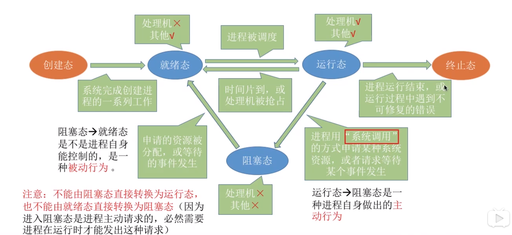
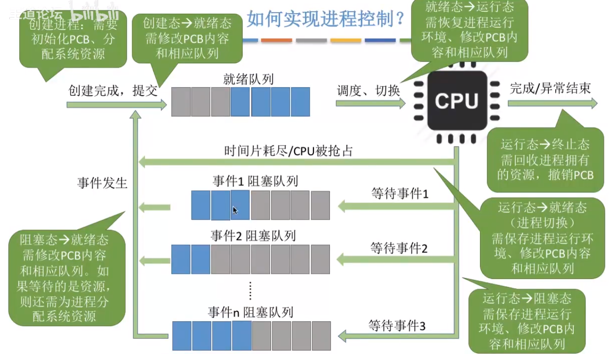
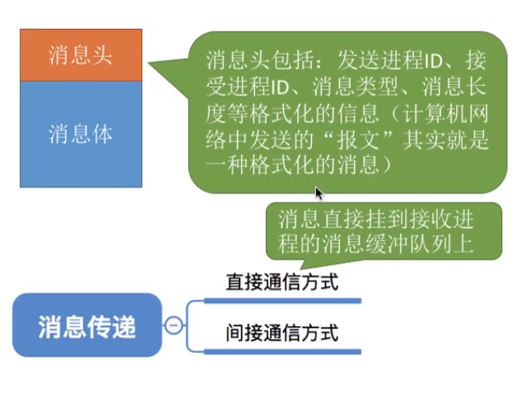

# 定义

操作系统如何找到内存中不同进程的代码、数据存放的位置？

- 系统为每个进程配置一个 进程控制块 PCB，也叫做 task_struct，用来描述进程的各种信息，也称为进程描述符
- PCB、程序段、数据段三部分构成了进程实体（进程映像）
- PCB 是进程存在的唯一标志，
  - 进程标识符 PID
  - 用户标识符 UID
  - 进程当前状态
  - 进程优先级
  - 程序段指针、数据段指针
  - 打开文件集合
  - 寄存器值
- 进程是一个动态过程，是一个进程实体的运行过程，而进程实体是数据的集合，是静态的

# 进程基本状态

- 运行态
- 就绪态
- 阻塞态

额外的：

- 创建态
- 终止态

这里其实也印证了阻塞对于进程而言是一种主动行为，而且阻塞是由于进程请求的资源还没有准备好。

# 进程控制

进程管理，创建、撤销、调度进程等功能。

操作系统维护一个就绪队列（有些书上也成为工作队列），该队列存放资源已就绪等待调度的进程的进程描述符。

当某个进程因为调用了某个系统调用而阻塞自身时，该进程描述符被加入到对应事件的阻塞队列中。

## 如何实现进程控制

使用**原语**实现进程控制。

原语的特点是**执行期间不允许被中断**，也就是原子操作。

原语采用 关中断指令 和 开中断指令 实现，在关中断指令执行之后开中断指令执行之前，外部中断信号会被忽略。

## 进程创建

- 申请进程描述符
- 为新进程分配资源（内存、打开文件）
- 初始化进程描述符
- 将进程描述符插入到就绪队列

## 进程终止

- 从 PCB 集合中找到终止进程的 PCB（从红黑树中寻找）
- 若该进程描述符的状态为运行态，将其挂起
- 终止其所有子进程
- 释放资源给父进程或者操作系统
- 删除进程描述符（归还给 slab 分配器）

## 阻塞和唤醒

阻塞：

- 找到阻塞进程进程描述符
- 设置进程描述符的进程状态字段
- 保存进程上下文到进程描述符
- 将进程描述符插入对应事件等待队列

造成进程阻塞的原因：

- 等待系统分配资源
- 进程同步中等待资源释放

唤醒：

- 在事件等待队列中找到进程描述符
- 将进程描述符从等待队列移除，设置进程状态为就绪态
- 插入就绪队列

必须由阻塞进程的事件唤醒进程。

## 进程切换

- 运行环境信息存入进程描述符
- 将进程描述符移入相应队列（阻塞队列/就绪队列）
- 从就绪队列调度新的进程执行，更新其进程描述符
- 从进程描述符中恢复进程上下文

# 进程通信

进程通信是进程之间的信息交换。

为了保证安全，一个进程不能直接访问另一个进程的地址空间。

进程通信：

- 共享存储
- 消息传递
- 管道通信

## 共享存储

操作系统为多个进程分配一个共享空间，多个进程必须互斥访问共享空间。

操作系统负责提供共享空间和同步互斥工具，如信号量。

---

共享存储又分为：

- 基于数据结构的共享，速度慢、限制多，是一种低级通信方式
- 基于存储区的共享，操作系统只负责提供一块共享内存，数据类型、存放位置都由进程控制。相比之下这种共享方式速度更快，是一种高级通信方式。

## 管道通信

管道是指**用于连接读写进程的一个共享文件**，又名 pipe 文件，其实就是在内存中开辟的一个大小固定的缓冲区。

- 只能采用半双工通信，同一时间段内只能实现单向传输，全双工则需要两个管道；

- 各进程要互斥访问管道；
- 数据以字符流的形式写入管道，当管道写满时，写进程的 write() 系统调用将被阻塞，等待都进程将数据读走。读进程将数据全部读走后，管道为空，此时读进程的 read() 系统调用将被阻塞；
- 如果没写满，就不允许读；如果管道不为空，就不允许写；（阻塞队列）
- 数据一旦被读出，就从管道中被抛弃，意味着读进程最多只能有一个，否则会有读错数据的情况；

## 消息传递

进程间的数据交换以格式化的消息 Message 为单位。

消息格式为：消息头 + 消息体

- 消息头：
  - 发送进程 PID
  - 接收进程 PID
  - 消息类型、消息长度
- 消息体

消息传递又分为两种方式：

- 直接通信，发送进程通过操作系统将消息加入到接收进程的消息缓冲队列上，每个进程都有一个消息缓冲队列
- 间接通信，消息要先发送到中间实体（信箱）中，在 Linux 内核中，应该指的是 POSIX IPC 对象

# 线程

与进程的区别：

- 资源分配、调度：进程是资源分配的最小单位，线程是调度的最小单位
- 并发性：线程、进程之间都可以并发
- 开销：
  - 进程切换开销大，由两步组成： 
    - 切换页全局目录
    - 切换内核态堆栈和硬件上下文（一组寄存器值）
  - 线程切换只是把寄存器值保存到内核堆栈里，再加载被调度线程的寄存器值

# 调度算法

