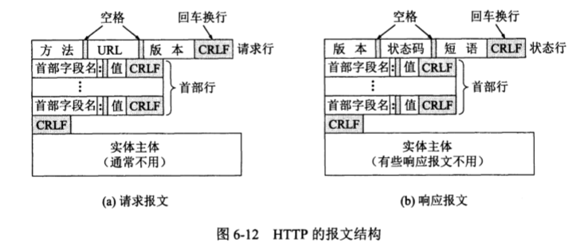
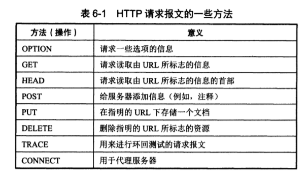

# 万维网 WWW

万维网 (World Wide Web) 是一个分布式的**超媒体系统** (hypermedia)，它是**超文本**系统的扩充。

超文本 (hypertext) 是**包含其他文档链接**的文本，一个超文本由多个信息源连接而成。

超文本是万维网的基础。

超媒体与超文本的区别在于文档内容不同，超文本文档仅包含文本信息，超媒体可包含其他表示方式的信息。

万维网这个系统以客户-服务器方式工作。浏览器进程为客户端，万维网文档所驻留的主机运行服务器程序。

客户进程向服务器进程发送请求，服务器进程向客户端进程返回客户端所请求的文档。

那么万维网的实现需要考虑以下几个问题：

- 如何标志分布在整个系统中的文档
- 用什么协议实现系统中的各种连接
- 如何统一不同风格的文档的表现形式
- 如何使用户可以进行方便查找

## 统一资源定位符 URL

互联网上的所有资源都有唯一的 URL。URL 的一般形式如下：
$$
<协议>://<主机>:<端口>/<路径>
$$

### 使用 HTTP 的 URL

HTTP 的默认端口号是 80，通常可省略。

## 超文本传输协议 HTTP

### HTTP 的操作过程

HTTP 协议定义了浏览器（客户端）怎样向服务器请求万维网文档，以及服务器怎样把文档传送给浏览器（客户端）。

HTTP 本身是无连接的，它虽然使用了 TCP 连接，但是通信双方在交换 HTTP 报文之前不需要建立 HTTP 连接。

HTTP 协议是无状态的，对客户的访问没有记忆性。

#### HTTP 与 TCP 的联系

从层次上看，HTTP 是**面向事务**的，TCP 是**面向连接**的。

事务 (transaction) 指的是一系列的信息交换，而这一系列信息交换是不可分割的整体，要么全部信息交换完成，要么一次都不交换。

也就是说，HTTP 和 TCP 虽然都是协议，但是两者服务的对象不同，HTTP 服务的是万维网中客户与服务器之间文件的请求和传输；而 TCP 服务的是互联网中数据的传输，为了保证可靠性，它的任务就是在客户端与服务器之间建立连接，而 HTTP 的任务是请求和响应请求，实现文件传输。

打个比方用来理解此差异，不知道是否恰当。HTTP 之于 TCP 就像用户定义函数之于系统接口，用底层的功能实现某种更高级任务。

#### HTTP/1.0 和 HTTP/1.1 的区别

> HTTP/1.0 每传送一个文档，就要建立一次 TCP 连接，使得每次请求一个 HTTP 文档就会有$2\times RTT$的时间开销。
>
> HTTP/1.1 为了解决此问题，使用了**持续连接 (persistant connection)**，在服务器响应后一段时间内仍保持连接。 

HTTP/1.1 有两种工作方式：非流水线方式 (without pipelining) 和流水线方式 (with pipeline)。

- 非流水线方式：客户端在收到一个响应后才能发送下一个请求，因此每访问一次对象需要消耗 $RTT$ 时间，而服务器在发送完相应之后就处于空闲状态，浪费了服务器资源；
- 流水线方式：客户端不需要等到收到响应就能发送新的请求报文，这样使得在一次连接内，访问所有文件只需要一个 $RTT$ 时间，减少了 TCP 连接中的空闲时间，提高了传输效率；

个人理解：流水线方式利用了 TCP 可靠传输的特点，只需要考虑如何提高传输效率，而不需要考虑数据丢失等问题。

### 代理服务器

代理服务器 (proxy server) 是一种网络实体，又称为**万维网高速缓存** (Web cache)。

代理服务器把最近的一些请求和响应暂存在本地磁盘上。当新请求到达时，代理服务器在本地查找该请求对应的响应是否存在，若存在，则向客户端返回本地暂存的响应。

代理服务器可在客户端或者服务器端工作，也可以在中间系统上工作。

> 个人思考：
>
> 我们平时所说的 VPN 并不是严格意义上的 VPN （虚拟专用网），而是一个连接到一个部署了代理服务器的远程主机所使用的 VPN 工具。
>
> 也正是由于代理服务器缓存响应的机制（客户端也有缓存机制），降低了网络压力，这产生了一种现象：比如，我使用 git 将本地文件同步到 github 服务器上，文件传输完毕之后，服务器上的文件应该是更新之后的了，但是使用代理访问个人网站时，总需要等一段时间才能看到更新的内容，这就是因为缓存机制的存在，在更新后的一段时间内，对相同网站的访问请求到的实际上是缓存在代理服务器本地的过时内容。而相应地，这种机制也一定需要设置一个更新过时内容的时间或者其他机制。

### HTTP 的报文结构

HTTP 有两类报文：

- 请求报文
- 响应报文

两种报文都是由三个部分组成的，在格式上仅有开始行不同。

- 开始行：用于区分报文类型。请求报文的开始行叫做**请求行** (Request-Line)，而响应报文的开始行叫做状态行 (Status-Line)。开始行的三个字段之间用空格分隔，回车换行结尾。
- 首部行：用来说明浏览器、服务器或者报文主体的一些信息，每一行以回车换行结束，首部行以一个回车换行的空行结束。
- 实体主体

对于请求行，其内容为：

- 方法，对所请求的对象进行的**操作**，实际上也就是一些命令，方法 (method) 决定了该请求报文的类型  

  > 

对于响应报文：

- HTTP 版本

- 状态码 (Status-Code) 都是三位数字，分为 5 大类。  

  > 1xx 表示通知信息
  >
  > 2xx 表示成功
  >
  > 3xx 表示重定向
  >
  > 4xx 表示客户差错
  >
  > 5xx 表示服务器差错

- 解释状态码的简单短语

### 在服务器存放用户信息

在 HTTP 中使用 Cookie 来识别用户，用于跟踪用户，表示在 HTTP 服务器和客户端之间传递的**状态信息**。

使用 Cookie 时，服务器给客户端产生一个**唯一的识别码**，并以此为索引在服务器**后端数据库**产生一个项目。接着在给客户端的 HTTP 响应中天界一个叫做 Set-cookie 的首部行。

## 万维网的文档

- 超文本标记语言 HTML
- XML (Extensible Markup Language) 可扩展标记语言，用于标记电子文件
- CSS (Cascading Style Sheets)  层叠样式表，是一种样式表语言，用于为 HTML 文档定义布局

### 动态万维网文档

动态文档是指文档内容是在浏览器访问万维网服务器时才由应用程序动态创建。

浏览器请求到达时，万维网服务器要运行另一个应用程序，并转移控制权到这个应用程序，该程序对浏览器发来的数据进行处理，并输出 HTTP 格式文档，**把进程输出作为对浏览器的响应**。

**通用网关接口 CGI (Common Gateway Interface)**  是一种标准，定义了动态文档应该如何创建，输入数据因该如何提供给应用程序，以及输出结果应如何使用。

相应地，生成动态文档的程序叫做 CGI 程序，之所以叫做网关，是因为 CGI 程序还可能访问其他的服务器资源。

CGI 程序的正式名字是 **CGI 脚本** (script)。

脚本指的是一个程序，他**被另一个程序解释或执行**，而不是计算机处理器。

## 安全性

由于 HTTP 本身是明文协议，不做任何加密，每个 HTTP 请求和返回的每个 Byte 都会在网络上明文传播，不管是 URL，header 还是 body。

为了避免传输中数据被窃取，必须做客户端到服务器的短短加密，业界通行做法就是 HTTPS——使用 SSL 协议协商出的密钥加密明文的 HTTP 数据。

