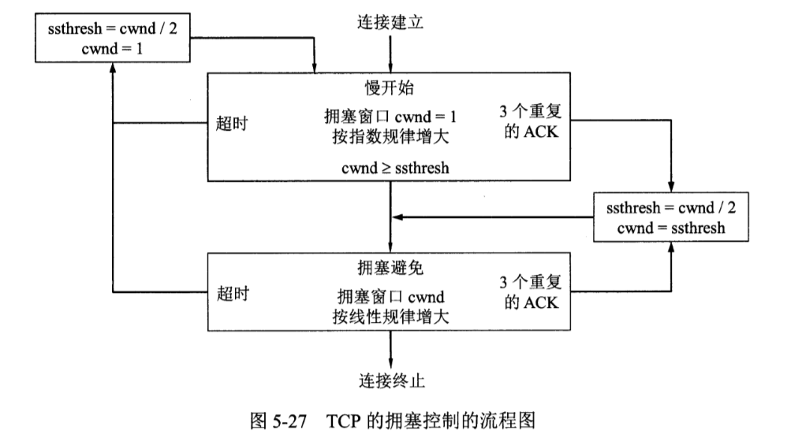
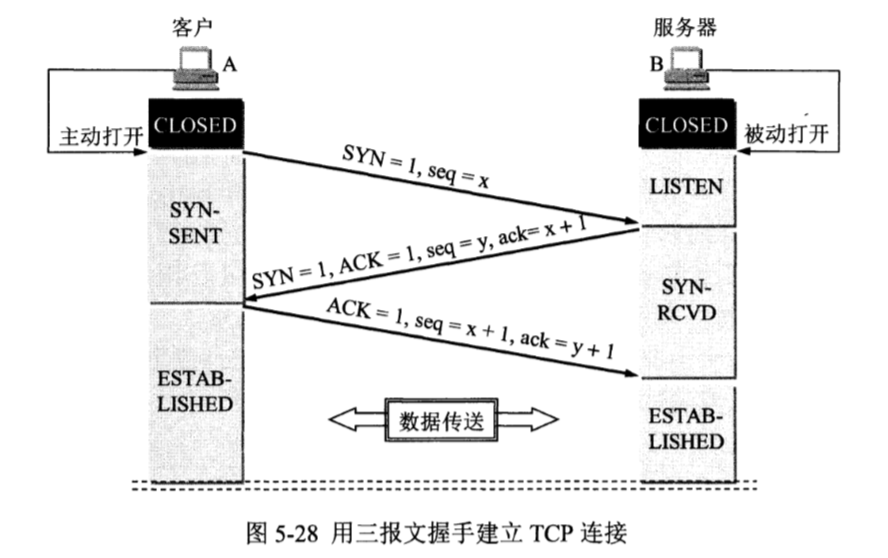
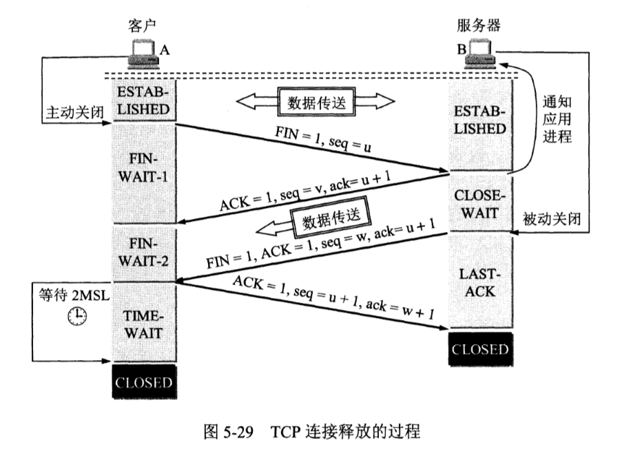
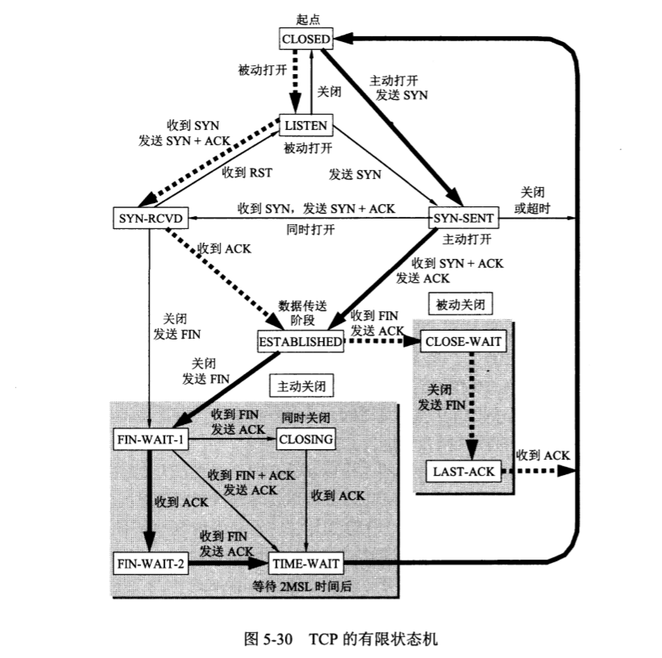

# 运输层协议概述

运输层两个主要的协议：TCP 和 UDP。

TCP (Transmission Control Protocol)，传输控制协议

UDP (User Datagram Protocol)，用户数据报协议

- TCP 面向连接，UDP 无连接。

## TCP 和 UDP

在 TCP/IP 体系中，两个对等运输实体在通讯时传输的**数据单位**，对 TCP 叫做 TCP **报文段 (segment)**，对 UDP 叫做**用户数据报 (user datagram)**。

UDP 在传送数据之前不需要建立连接，一台主机在收到 UDP 报文之后不需要给出任何确认。UDP 不提供可靠交付，有时却最有效。

TCP 提供面向连接的服务，传送数据之前必须先**建立连接**，数据传送结束要**释放连接。**不可避免地增加了许多开销：确认、流量控制、计时器、连接管理等。

## 运输层的端口

操作系统中每个进程都有自己的 PID，但是这个它是系统相关的，不同的系统使用不同格式的进程标识符，因此必须用统一的方法对 TCP/IP 体系的应用进程进行标志。

TCP/IP 的运输层用一个**16位**端口号来标志一个端口。

互联网上的计算机通信采用**客户-服务器**方式，客户在发起通信请求时，必须先知道对方服务器的 IP 地址和端口号。因此运输层的端口号分为下面两大类：

- 服务器端使用的端口号。
    - 熟知端口号 0~1023
    - 登记端口号 1024~49151
- 客户端使用的端口号 49152~65535，在客户端进程运行时动态选择，可复用。

# UDP

## UDP 特点

主要特点：

- 无连接
- 尽最大努力交付，即不保证可靠交付
- 面向报文，把应用层下交的报文添加首部后直接交付网络层
- 没有拥塞控制
- 支持一对一、一对多、多对一、多对多的交互通信
- 首部开销小

问题：正是由于 UDP 没有拥塞控制，当大量主机向互联网发送大量数据时，会造成严重网络拥塞，使大家都无法正常接收。**在这种情况下，应用进程本身可以在不影响应用实时性的前提下，增加一些提高可靠性的措施，如：前向纠错、重传丢失报文等等。**

## UDP 首部格式

UDP 的数据报有两个字段：数据字段、首部字段。

首部字段8字节：

- 源端口 2字节
- 目的端口 2字节
- 长度 两字节，最小值为8
- 检验和，有错就丢弃

如果接收方发现报文中的目的端口对应进程不存在，就丢弃该报文，由**网际控制报文协议 ICMP** 发送“端口不可达”差错报文给发送方。可以用于测试。

虽然你在 UDP 之间的通信要用到端口号，但是由于 UDP 是无连接的，不需要用套接字。（TCP 之间的通信需要在套接字之间建立连接）。

# 传输控制协议 TCP

## TCP 主要特点

- 是面向连接的运输层协议。在数据传输前需要建立连接，传输完毕后需要释放连接；
- 每一条 TCP 连接只能有两个端点，每一条 TCP 连接只能是点对点的；
- 提供可靠交付服务，无差错、不丢失、不重复，并且按序到达；
- 提供全双工通信，收发两端都设有缓存;
- 面向字节流。TCP 中的流指的是**流入进程或从进程流出的字节序列**。对应于 UDP 面向报文，TCP 发送数据时不会保留应用层下交数据的结构；而决定报文段长度的是传输层本身，对方给出的窗口值和当前网络拥塞程度，对比 UDP 的由发送数据的应用决定报文长度；

## TCP 的连接

TCP 连接的端点是**套接字 (socket)**。

根据 RFC 793 的定义：端口号拼接到 IP 地址即构成了套接字。

每一条 TCP 连接被通信两端的两个套接字所确定。

# 可靠传输的工作原理

TCP 发送的报文段是交给 IP 层传输的，但 IP 层只提供尽最大努力交付，也就是书，TCP 下面的网络提供的是不可靠传输。

理想的传输条件有以下特点：

- 传输信道不产生差错
- 不管传送方以多块的速度发送数据，接收方总是来得及处理收到的数据

然而实际网络不具备这两个条件，因此就需要一些**可靠传输协议**来弥补实际网络的不足。

## 停止等待协议

“停止等待”就是每发送完一个分组（数据单元）就停止发送，等待对方确认，收到确认后发送下一个分组。

通信过程中可能遇到的几种情况：

- 无差错情况；
- 出现差错，接收方丢弃出现差错的分组，其他什么也不做，发送方在**超时计时器**设定的等待时间内未收到确认，就会进行**超时重传**，若收到确认就撤销已设置的超时计时器；
     - 发送方在发送分组之后和收到确认之前都需要**保留已发送分组的副本**
     - 分组和确认分组都需要编号
     - 超时计时器设置的重传时间应当比数据在分组传输的平均往返时间长一些
- 确认丢失和迟到。接收方发送的确认丢失或迟到，此时发送方重新发送，接收方收到重复数据直接丢弃，并发送确认；发送方收到重复确认直接丢弃。

通过上述**确认和重传机制**，我们就可以在**不可靠的网络上实现可靠传输**。

**然而，当停止等待协议的信道利用率很低**。

为了提高传输效率，发送方可以使用**流水线传输**，意味着发送方可连续发送多个分组，不必每发送完一个分组就停下来等待确认。这种传输方式可以或者很高的信道利用率。

## 连续 ARQ 协议

发送窗口：位于发送窗口内的分组可以连续发送，不需要等待确认。

发送方**每收到一个确认，就把发送窗口向前滑动一个分组的位置**。

接收方采用**累积确认**的方式。不必对收到的分组逐个发送确认，而是在收到几个分组之后，对**按序到达的最后一个分组发送取确认**。

## TCP 报文段的首部格式

一个 TCP 报文段分为首部和数据两部分。

- 源端口和目的端口
- 序号
- 确认号，是**期望收到对方下一个报文段的第一个数据字节的序号**；
- 数据偏移，数值上等于首部长度
- 保留
- 紧急，高优先级标记
- 确认 ACK，ACK = 1时，确认号字段有效
- 推送 PSH，立即发送，理解交付（不在缓冲区中滞留）
- 复位 RST
- 同步 SYN，连接建立时用来同步序号
- 终止 FIN
- 窗口，窗口指的是对于发送该分组的发送方的接收窗口大小，而该分组的接收方用这个信息来设置自己的发送窗口
- 检验和
- 紧急指针
- 选项
  - 时间戳选项用于：计算往返时间、防止序号绕回

# TCP 可靠传输的实现

## 以字节为单位的滑动窗口

发送方和接受方都有自己的发送窗口和接收窗口。

发送缓存用来存储：进程传送给发送方 TCP 准备发送还未发送的数据，窗口内已发送但还未收到确认的数据；

接收缓存用来存储：按序收到但还未交付给目的进程的数据，未按序收到的数据；

## 超时重传时间的选择

超时重传时间设置过短会导致大量不必要的重传，使网络负荷增大；设置过长会导致信道利用率降低。

TCP 采用一种自适应算法，采用**指数加权平均**算法，通过发送报文时间和收到确认时间得到**报文段往返时间 RTT**，并用指数加权平均算法（这实际上优化了均值的计算，节省空间）：
$$
RTT_S = (1-\alpha)\times RTT_{S\_old}+\alpha\times RTT
$$
如此，$RTT_s$的值大约为$\frac{1}{\alpha}$个样本的平均值。

而超时计数器设置的超时重传时间 RTO (Retransmission Time-Out) 应略大于$RTT_s$，RFC 6298 建议使用下式：
$$
RTO = RTT_S+4\times RTT_D
$$

$$
RTT_D = (1-\beta)\times RTT_{D\_old}+\beta\times |RTT_S-RTT|
$$
$RTT_D$是偏差的加权平均值。

**考虑特殊情况：当发生超时重传时，发送方如何确认收到的确认是对重传之前分组的确认还是重传之后分组的确认？**

发生错误判断时会导致超时重传时间偏小，导致大量重发。因此，采用**每次重发都增加超时重传时间，并且不计算重发分组的 RTT**的策略。

## 选择确认 SACK

SACK (Selective ACK) 用来报告接受到的序号不连续的字节块边界，在标记边界时使用的是类似 C++ 中迭代器使用的头指针和尾后指针。

# TCP 流量控制

目的：控制发送方发送数据的速率，使其与接收方接受数据的速率相匹配。

## 利用滑动窗口进行流量控制

接收方通知发送方自己的接收窗口大小，从而使发送方控制自己的发送窗口大小。

但是这种方法可能会造成死锁：发送方窗口大小被调整为0，而接收方发送的确认丢失，使得发送方无法修改窗口大小，发送方依然不会发送数据，而接收方一直在等。

为解决死锁现象，TCP 为每个连接设置一个**持续计时器**，只要连接的一方收到另一方的**零窗口通知**，就启动持续计时器，计时器时间结束则发送一个**零窗口探测报文段**，对方在确认时给出当前接收窗口大小。

## TCP 传输效率

TCP 实现中广泛应用 Nagle 算法：若发送数据的进程把要发送的数据逐个字节写到发送方发送缓存，则发送方先将第一个字节发送出去，把后面到达的数据全部缓存起来，直到收到确认或者数据超过发送缓存大小的一半（或达到最大容量）。

糊涂窗口综合征，有时也会使 TCP 性能变差。解决：**接收方接收缓存可以接受一个最长报文段**或**接收缓存有一半空闲空间**时，立即发送确认。

# TCP 拥塞控制

## 拥塞控制的一般原理

网络资源：计算机网络中的链路容量（带宽）、交换节点中的缓存、处理机等。

在某个时间段内，
$$
\sum 资源需求 > 可用资源
$$
满足上述条件时，出现网络拥塞。

### 拥塞控制和流量控制的区别

- 目的不同：  
  - 拥塞控制是为了**防止过多数据注入网络**，使网络中的路由器和链路不致过载；
  - 流量控制是为了抑制发送方的数据发送速率，使接收方来得及处理；
- 尺度不同：
  - 拥塞控制是一个全局性的问题，涉及到所有的主机、路由器，以及其他降低网络传输性能的其他因素；
  - 流量控制是个端到端的问题，只控制点对点通信的通信量；

## TCP 的拥塞控制方法

- 慢开始
- 拥塞避免
- 快重传
- 快恢复

### 慢开始和拥塞避免

也叫做基于窗口的拥塞控制。

**发送方**维持一个叫做**拥塞窗口**的状态变量，其大小取决于网络的拥塞程度，而发送方的发送窗口大小取决于**拥塞窗口和接收方窗口的最小值**。

- 慢开始算法：由小到大逐渐增大发送窗口，每收到一个**对新的报文段的确认**，就把拥塞窗口**最多增加一个 SMSS 的数值**（SMSS，Sender Maximum Segment Size，发送方最大报文段）。  
  连接建立之初，设置较小的拥塞窗口，限制发送方的发送窗口大小。而当发送方收到确认后可以立即将拥塞窗口相应增大，并立即发送新的分组。如此，在拥塞窗口大小到达**慢开始门限 ssthreash**之前，拥塞窗口以指数速度上升。而指数速度上升如果不被限制，一定会造成网络拥塞，因此在到达慢开始门限之后，改为使用**拥塞避免算法**。

- 拥塞避免算法：与慢开始算法最直观的差别就在于拥塞窗口的增长率为线性，降低网络拥塞的几率。且拥塞避免算法在满开始算法的拥塞窗口达到慢开始门限时被使用。

- 快重传：快重传算法的目的就是解决“误判的网络拥塞”，即网络中实际上并没有发生拥塞，而接收方发送的确认由于某些原因丢失，导致发送方超时重传，并且判断当前发生了网络拥塞，重置拥塞窗口并将慢开始门限减半，这样降低了传输效率。  

  快重传算法**要求接收方立即发送确认，即使收到了失序的报文段**。例如，接收方接收到了序号为 22 的报文，却没有接收到 21 号报文，此后，接收方每接收到一个新的报文（不是 21），就要立即发送对 20 的重复确认，确认号为 21。当发送方**连续接收到 3 个重复确认**，就立即重传，重置超时重传计时器，避免触发对网络拥塞的误判。  

  此时的情况是没有超时重传，而部分报文段丢失，在快重传结束之后，发送方执行快恢复算法。

- 快恢复：所谓**快恢复**，就是在发生异常而判定不是网络拥塞之后，不重置拥塞窗口使用慢开始算法，而是将**慢开始门限减半（有些实现加了与 ACK 数量相同的偏移），而将拥塞窗口设置到慢开始门限**，直接开始拥塞避免算法。



可以看出，超时重传发生时，状态转移的结果都是从慢开始算法开始；而数据丢失发生时，状态转移的结果是拥塞避免。

## 主动队列管理 AQM

# TCP 运输连接管理

## TCP 的连接建立

TCP 建立连接的过程叫做握手，握手需要在客户端和服务器之间交换三个 TCP 报文段。



- 初始时，客户端和服务器都是 CLOSED 状态。客户端需要发起连接请求时，服务器需要开始监听连接请求时，两端均**创建传输控制块 (Transmission Control Block)**，此时服务器处于 LISTEN 状态。
- 客户端发送**连接请求报文段**，同步位 SYN = 1，初始序号 seq = x。该报文不能携带数据，但是需要占用一个序号。此时客户端进入 SYN-SENT 状态，表示连接请求已发送；
- 服务器收到连接请求，如果同意建立连接，则向客户端发送**确认**，同步位 SYN = 1，确认号 ack = x + 1，自身的初始序号 seq = y。该报文不能携带数据，但是要占用一个序号。此时服务器进入 SYN-RCVD 状态，表示同步收到；
- 客户端收到确认，向服务器发送一个确认。确认报文段的确认标志位 ACK = 1，确认号 ack =y + 1，自己的序号 seq = x + 1。该确认报文**可以携带数据，但如果不携带数据则不占用序号**。此时，客户端进入 ESTAVLISHED 状态，表示客户端已准备好建立连接；
- 服务器收到确认，也进入 ESTABLISHED 状态，至此，TCP 连接建立。

为什么需要三次握手？

- 第一次握手：若成功  
  - 从客户端角度看：不知道服务器接收是否正常；
  - 从服务器角度看：客户端发送正常，不知道客户端接收是否正常；
- 第二次握手：若成功 
  - 从客户端角度看：证明服务器接收正常，发送也正常，可以建立连接；
  - 从服务器角度看：不清楚客户端接收是否正常；
- 第三次握手：若成功
  - 从服务器角度看：客户端发送以及接收都正常，可以建立连接；

第三次握手的必要性：如果只有两次握手，那么如果有因为某种原因滞留在网络中导致超时重传的连接请求，在 TCP 连接释放之后到达服务器，那么服务器不需要客户端的确认就单方面建立连接，而客户端丢弃服务器的确认，导致服务器进程一直在等待永远不会发送的数据，浪费资源。

### 深入理解TCP握手过程中建连接的流程和队列

原文链接：http://jm.taobao.org/2017/05/25/525-1/

这里自己做一个理解和消化。


（图片来源：http://www.cnxct.com/something-about-phpfpm-s-backlog/）

由上图可见 TCP 建立连接的完整过程为：

- 服务器首先 bind() 函数绑定套接字文件描述符和地址，然后进入监听状态

> ```
> int bind(int sockfd, const struct sockaddr *addr,
>          socklen_t addrlen);
> ```
>
> ## Description
>
> When a socket is created with **[socket](https://linux.die.net/man/2/socket)**(2), it exists in a name space (address family) but has no address assigned to it. **bind**() assigns the address specified by *addr* to the socket referred to by the file descriptor *sockfd*. *addrlen* specifies the size, in bytes, of the address structure pointed to by *addr*. Traditionally, this operation is called "assigning a name to a socket".
>
> It is normally necessary to assign a local address using **bind**() before a **SOCK_STREAM** socket may receive connections (see **[accept](https://linux.die.net/man/2/accept)**(2)).

- 当客户端发起连接请求时，开始三次握手，如图所示，这里有两个队列：`syns queue`（半连接队列）和`accept queue`（全连接队列）；

  第一步中，服务器收到客户端的 SYN 同步信号后，把相关信息放到半连接队列中，同时回复 SYN, ack 给客户端（第二步）；

  > 比如syn floods 攻击就是针对半连接队列的，攻击方不停地建连接，但是建连接的时候只做第一步，第二步中攻击方收到server的syn+ack后故意扔掉什么也不做，导致server上这个队列满其它正常请求无法进来。

  第三步中，服务器收到客户端的 ack，如果这时全连接队列没满，那么从半连接队列拿出相关信息放入到全连接队列中，否则按照 `tcp_abort_on_overflow`的设置执行。

  如果第三步中，全连接队列已满，并且`tcp_abort_on_overflow`为 0，那么服务器过一段时间再次发送 SYN, ack 给客户端（即重新执行三步握手的第二步），如果客户端超时等待时间较短，那么很容易异常（超出 retry 次数），如果`tcp_abort_on_overflow`为 1，那么服务器向客户端发送一个 reset 包，重置连接。

#### 拓展

三次握手的第三步中，客户端进入 ESTABLISHED 状态之后，假如第三次握手失败，确认丢失，服务器实际上还在 SYN-RCVD 状态，此时客户端向服务器发送数据，会导致服务器丢弃这些数据，而客户端会认为丢包而进行超时重传，直到超时断开连接（主动发送 FIN 包）。以上问题叫做 client fooling。

第三步握手失败时，服务器超时后给客户端发送 RST 包，自身进入 CLOSED 状态。这样做是为了防止 SYN 泛洪攻击。

## TCP 的连接释放



数据传输结束后，通信双方都可释放连接。

如上图所示，关闭一个 TCP 连接需要四次握手。

- 开始时，服务器与客户端都处于 ESTABLISHED 状态，此时，假如客户端要主动关闭连接；
- 客户端进程**向其 TCP 发出连接释放报文段**，并停止发送数据，连接释放报文段首部终止控制位 FIN = 1，seq = u，无论是否携带数据，都占用一个序号。此时，客户端进入 FIN-WAIT-1 状态；
- 服务器收到连接释放报文段后发出**确认**，确认号为 ack = u + 1，序号 seq = v，此时服务器进入 CLOSE-WAIT 关闭等待状态。此时，TCP 连接处于半关闭状态，客户端到服务器的连接关闭（无数据发送），但服务器到客户端的连接未关闭，客户端还需要接收服务器数据；客户端**收到确认**后，进入 FIN-WAIT-2 状态，等待服务器发出的连接释放报文段；
- 服务器发送完所有数据之后，服务器进程释放 TCP 连接，此时服务器发送连接释放报文段，终止控制位 FIN = 1，确认号 ack = u + 1，序号 seq = w（上一次确认之后可能又继续发送数据），与第二步中的确认号相同，因为第三步中，客户端并未给服务器发送数据。此时服务器进入 LAST-ACK 状态，等待客户端确认；
- 客户端收到连接释放报文段之后**发出确认**，确认号 ack = w + 1，序号 seq = u + 1，此时客户端进入 TIME-WAIT 状态，**此时 TCP 连接还未释放**，必须经过**时间等待计时器设置的时间 2MSL**后，客户端才进入 CLOSED 状态。MSL (Maximum Segment Lifetime) 最长报文段寿命（我觉得翻译成**报文段最长寿命**不会有歧义）。服务器收到确认后进入 CLOSED 状态。

### TIME-WAIT 的意义

- 保证主动断开连接的一方发送的 **ACK 报文段**能够到达另一方，如果该 ACK 报文丢失，那么另一方会超时重传一个连接释放请求 FIN+ACK 报文段，而 TIME-WAIT 状态等待的 2MSL 正是为了保证主动断开方可以收到重传的 FIN+ACK 报文段。如果真的发生了 ACK 丢失，那么主动断开方在收到重复确认之后，重传确认，并重置 2MSL 计时器，直到接收方顺利收到确认，两端都进入 CLOSED 状态；否则，可能由于无法收到重复确认而使其中一方无法顺利关闭连接；
- 防止“已失效的连接请求报文段”出现在连接中。 2MSL 的时间足够本连接持续时间内所产生的所有数据都离开网络，保证下一次连接不会出现旧的连接请求报文段。

### 为什么需要四次挥手

对比连接建立时的三次握手，由于服务器可以将用于确认的 ACK 和用于同步序号的 SYN 报文合并发送给客户端，因此只需三次；而连接释放时，客户端需要发送连接释放请求 FIN 报文段，而服务器收到之后，由于可能还有数据需要发送，不能立即发送 FIN 报文给客户端，因此只能先发送 ACK，等数据全部发完了，再发送 FIN。

## TCP 的有限状态机

