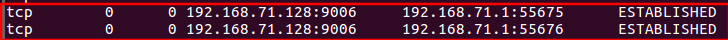

# 一面

全程大概八十分钟，面试官特别 nice，说错了的问题会提醒，没答全的问题也会提醒。

首先是需要再了解的知识：

- MySQL 半同步主从复制
- MySQL 对表的主键有什么要求？
- 有什么对称加密算法？非对称也要多了解
- 僵尸进程和孤儿进程的定义
- CPP 由源文件到可执行文件的四个过程
- 对一个类使用 sizeof 表达式，结果需要考虑什么（一定要考虑类中有无虚函数）

问题回忆：

- TCP/IP 四层模型和 OSI 七层模型

- TCP/IP 属于哪一层

- Select 和 epoll 的区别

- TCP 连接的过程是怎么样的

- 为什么是三次握手（答了同步 seq）

- 还有别的原因吗？（从 TCP
  可靠传输的角度答）

- TCP 如何实现可靠传输？（从保证正确、有序和不丢失三个角度，答了滑动窗口、超时重传、以及校验和）

- 什么情况下会出现 TIME_WAIT

- 如何用 gdb 调试多线程

- 有没有遇到过出现大量 TIME_WAIT 的情况

  - 虽然答了没有，但还是要分析一下。  
    大量 TIME_WAIT，对于服务端来说，首先一定发生了 close() 或者 shutdown()，也就是服务端主动关闭连接，出现 TIME_WAIT 是正常现象，而出现大量 TIME_WAIT 很有可能是在高并发短连接的场景中，在这种场景中，从接受连接、处理请求逻辑、到发送响应报文、断开连接所花的时间与 2MSL (Maximum Segment Lifetime) 相比会非常短，造成资源浪费。
  - 很多博客说会占用服务器端口资源？那么问题是建立 TCP 连接，或者说 accept() 时，服务器会给该连接分配什么资源？
  - 测试了服务器程序，`netstat -nat` 查看监听的 TCP 连接，发现只有指定的 9006 监听端口被占用，也就是说浏览器连接服务器并没有占用服务器主机端口资源
  - 但是对于操作系统来说，限制并发连接数的还有内存和文件描述符数量限制，对这个问题而言，大量 TIME_WAIT 占用了很多文件描述符，也会导致很多连接失败
  - 解决方法：使用 SO_REUSEADDR 套接字选项

- 进程和线程的区别

- 线程通信（后来改成进程通信方式）

- **孤儿进程和僵尸进程**

- **CPP 源文件到可执行文件过程**

- **sizeof() 一个类的注意事项**（一定要注意含有虚函数的类）

- CPP 内存空间模型

- 静态变量放在哪个区

- STL vector 和 list 有什么区别

- 哪些容器是可以使用 sort() 的

  - 经测试，list 确实不能，虽然 IDE 没有显式报错，但是编译出错

    ```c++
    ====================[ Build | prac | Debug ]====================================
    "E:\CLion\CLion 2020.1\bin\cmake\win\bin\cmake.exe" --build F:\c++prj\prac\cmake-build-debug --target prac -- -j 9
    Scanning dependencies of target prac
    [ 50%] Building CXX object CMakeFiles/prac.dir/main.cpp.obj
    In file included from E:/mingw64/lib/gcc/x86_64-w64-mingw32/8.1.0/include/c++/algorithm:62,
                     from F:\c++prj\prac\main.cpp:18:
    E:/mingw64/lib/gcc/x86_64-w64-mingw32/8.1.0/include/c++/bits/stl_algo.h: In instantiation of 'void std::__sort(_RandomAccessIterator, _RandomAccessIterator, _Compare) [with _RandomAccessIterator = std::_List_iterator<int>; _Compare = __gnu_cxx::__ops::_Iter_less_iter]':
    E:/mingw64/lib/gcc/x86_64-w64-mingw32/8.1.0/include/c++/bits/stl_algo.h:4834:18:   required from 'void std::sort(_RAIter, _RAIter) [with _RAIter = std::_List_iterator<int>]'
    F:\c++prj\prac\main.cpp:28:32:   required from here
    E:/mingw64/lib/gcc/x86_64-w64-mingw32/8.1.0/include/c++/bits/stl_algo.h:1969:22: error: no match for 'operator-' (operand types are 'std::_List_iterator<int>' and 'std::_List_iterator<int>')
         std::__lg(__last - __first) * 2,
                   ~~~~~~~^~~~~~~~~
    ```

    可以看出，因为 sort 需要容器的迭代器类型最低要求是 `_RandomAccessIterator`，而 list 的迭代器类型是 `bidirectional iterator`，不支持加减等指针运算。

  - 然而 deque 的确可以进行 sort，这一点答错了。虽然 deque 的内存不连续，但是 deque 仍然支持随机访问，其迭代器类型是 `RandomAccessIterator`，可以 sort。

  - 因此，能否使用 sort 排序归根结底还是看容器是否支持随机访问，这一点从 sort 函数形参中迭代器类型的名字也可以看出来。

- HTTP 和 TCP 的关系

- HTTPS 和 HTTP

- **有什么对称加密算法和非对称加密算法**

- **讲讲对索引的理解（B树、B+树还需要更清晰）**

- **MySQL InnoDB 对主键有什么要求**

- 讲讲事务

- 主从复制

- **半同步主从复制？**

  > 这部分内容阅读《高可用MySQL》学习
  >
  > - 理解之后再补充

- **SSRF 漏洞**

