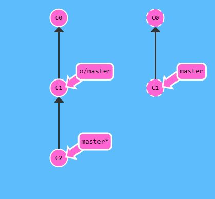

[toc]

# git branch

新建分支

```
# 新建分支并移动到新的分支
git checkout -b <yourbranchname>
```

# git clone

从远程仓库创建本地分支，并自动将该远程标记为 origin，若 clone 的是 master 分支，那么本地仓库会生成 origin/master 分支。

# git fetch

`git fetch` 主要做两步动作

- 下载远程仓库有，但是本地仓库缺失的提交
- 更新远程分支指针（比如 `origin/master`）

其最终的效果是将**远程仓库的本地表示**与远程仓库同步。

而 `git fetch` 并不会修改本地仓库任何状态，并不会更新本地 `master` 分支。

可以把 `git fetch` 当作一个下载步骤。

# git merge

用来合并两个分支的 commits，`git merge` 会创建一个特殊的 commit，它拥有两个独立的父节点，该特殊的 commit 包含了两个父节点以及他们所有的父节点的内容，为两者的并集。

假设本地有两个分支，各自含有不完全相同的内容，如下所示：


```
git merge bugFix
```

上述命令将 `bugFix` 合并到 `master` 分支中。


但是此时 `bugFix` 分支并不是最新的 commit，将 `master` 分支合并到 `bugFix` 分支：


```
git checkout bugFix
git merge master
```


这一次 git 什么都不用做，只是把 `bugFix` 分支的指针指向了最新的 commit，包含仓库中所有内容，两个分支指向了同一个 commit。

# git pull

`git` 提供了一种命令，同时完成了同步远程仓库到本地，并且合并的操作，`git pull`。

假设有本地仓库和远程仓库：


此时本地的 `master` 分支不同于远程分支的 `master`，此时，下述两种操作等效

```
git fetch				# 将远程仓库的master分支下载到本地仓库，更新origin/master指针
git merge origin/master	# 将origin/master合并到本地master分支
# or
git pull
```


- 首先把远程仓库的 `C3` commit 下载到本地仓库，并且把 `C1` commit 作为他的父节点，把 `C3` 作为更新后的 `origin/master` 节点
- 然后把 `C3` 合并到 `C2`，即将远程分支合并到本地仓库的 `master` 分支，创建一个新的包含本地分支和远程分支内容的 commit，并将其作为新的本地 `master` 分支节点，而本地的远程分支节点保持与远程仓库相同

# HEAD

`HEAD` 是最近提交节点的一个符号别名，通常指向工作树上最近的提交。

大多数 git 命令都通过首先修改 `HEAD` 来修改工作树。

通常 `HEAD` 指向一个分支名，提交一个分支时，分支的状态变化可通过 `HEAD` 看出。

## detaching HEAD

分离 `HEAD` 意味着将分支名与 `HEAD` 分开，将 `HEAD` 绑定到一个 commit 而不是一个 branch 上

> ### Detaching HEAD
>
> Detaching HEAD just means attaching it to a commit instead of a branch. This is what it looks like beforehand:
>
> HEAD -> master -> C1
>
> ```
> git checkout C1
> ```
>
> And now it's
>
> HEAD -> C1


因此，我们可以看出，`checkout` 实际上就是在移动 `HEAD` 指针，通过指定 `HEAD` 指针指向的 commit。

在工作树中引用节点的相对位置：

```
git checkout HEAD^ # 将HEAD指向其父节点
git checkout HEAD~2 # 将HEAD指向其父节点的父节点
```

# branch forcing

> One of the most common ways I use relative refs is to move branches around. You can directly reassign a branch to a commit with the `-f` option. So something like:
>
> ```
> git branch -f master HEAD~3
> ```
>
> moves (by force) the master branch to three parents behind HEAD.


上述 `git branch -f master HEAD~3` 的效果实际上就是将 `master` 分支向前移动了三个版本，而 `HEAD` 指针与 `bugFix branch` 重合，并未移动。 

# git reset & git revert

`git reset` 和 `git revert` 两条指令用来撤销变更。

## git reset

`git reset` 将当前分支的引用回退到前一个提交版本。


```
git reset HEAD~1
```


`git reset` 操作的是本地仓库的分支版本，相当于管理本地仓库的版本，对远程分支无影响。

## git revert


```
git revert HEAD
```


`git revert` 所做的事可以看出是在远程仓库的分支提交了一个新的版本，这个版本包含了本地仓库所做的回退操作结果。

# git push

> `git push` is responsible for uploading *your* changes to a specified remote and updating that remote to incorporate your new commits. Once `git push` completes, all your friends can then download your work from the remote.

可以通过 `git push` 提交更新到指定的远程分支。

> *note -- the behavior of `git push` with no arguments varies depending on one of git's settings called `push.default`. The default value for this setting depends on the version of git you're using, but we are going to use the `upstream` value in our lessons. This isn't a huge deal, but it's worth checking your settings before pushing in your own projects.*

无参的 `git push` 的行为由 `git` 设置的默认行为决定。



```
git push
```


- 提交本地变更
- 更新远程仓库分支
- 更新本地仓库的远程分支

# Diverged Work

给一个场景：

> Imagine you clone a repository on Monday and start dabbling on a side feature. By Friday you are ready to publish your feature -- but oh no! Your coworkers have written a bunch of code during the week that's made your feature out of date (and obsolete). They've also published these commits to the shared remote repository, so now *your* work is based on an *old* version of the project that's no longer relevant.
>
> In this case, the command `git push` is ambiguous. If you run `git push`, should git change the remote repository back to what it was on Monday? Should it try to add your code in while not removing the new code? Or should it totally ignore your changes since they are totally out of date?
>
> Because there is so much ambiguity in this situation (where history has diverged), git doesn't allow you to `push` your changes. It actually forces you to incorporate the latest state of the remote before being able to share your work.

大致是说，你在拿到一个版本，修改，准备提交的过程中，你拿到的版本已经被更新到新的版本，所以你所做的修改是基于旧的版本，此时 `git` 该怎么做？


```
git push
```

这种情况下，上述指令会被拒绝执行，因为你的修改基于旧的版本。

如何处理这种情况？简单来说就是 `rebase`。

```
git fetch 					# 下载C2到本地
git rebase origin/master 	# 将当前的master分支指向的版本复制一份，以C2作为其父节点
git push					# 提交修改，同步本地仓库到远程仓库，并更新状态
# 可以简化为
git pull --rebase # 先fetch再rebase
git push
# 或者
git pull # 先fetch再merge
git push
```


第二种方法：

```
git fetch
git merge origin/master
git push
```


不过使用 `merge` 会将别人提交的更新与自己的更新合并。

# Remote Rejected

当一个项目的 `master` 分支的设定是不允许直接提交时，你需要新建一个分支并提交。

如果你不小心忘记新建分支而直接提交，此时提交会被拒绝。

解决办法就是新建一个分支，回退 `master` 分支，并且把新建的分支指向你的提交，再 `git push`。