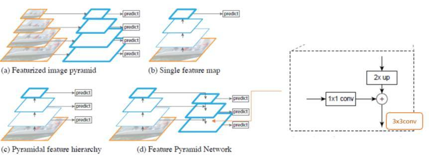
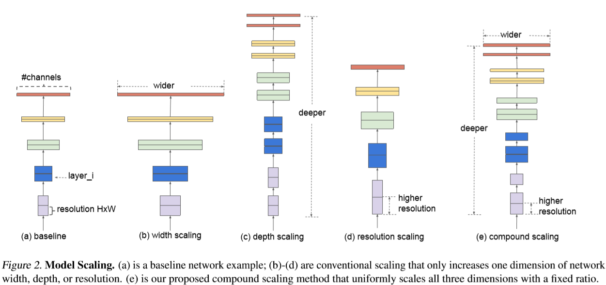
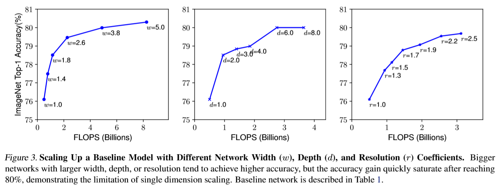
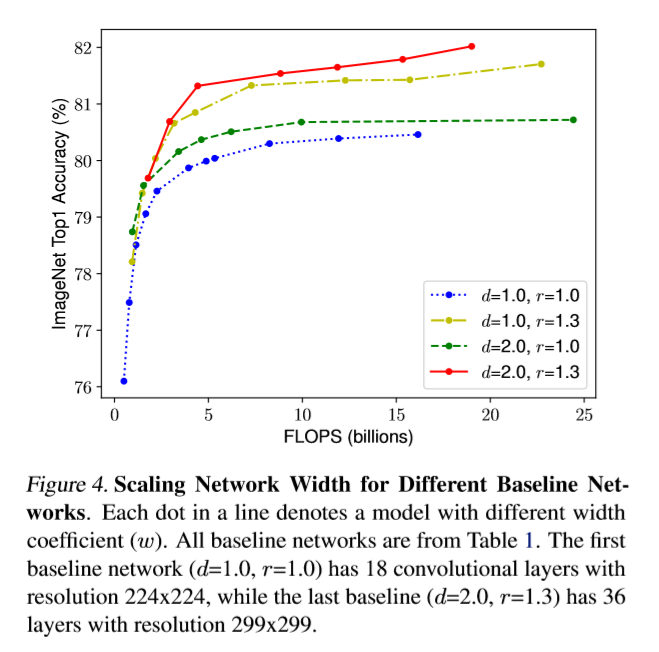
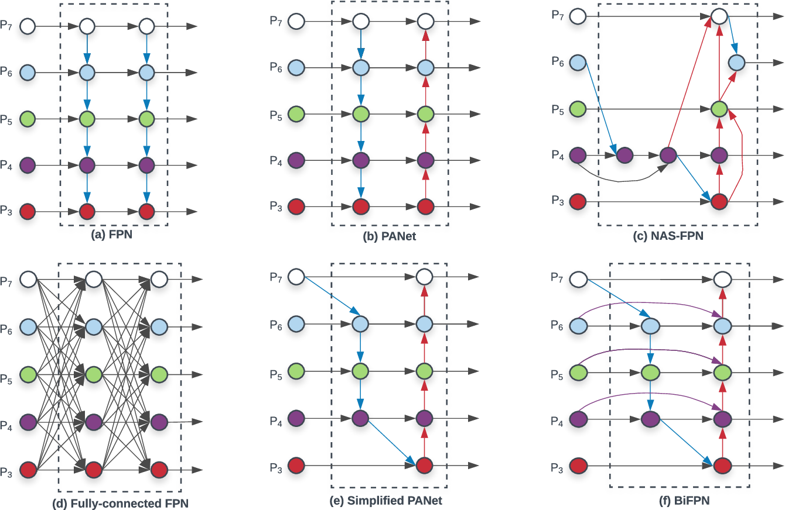
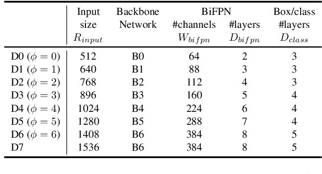

[toc]

# EfficientDet学习笔记

## 前言

最近才开始为了项目应用做深度学习，前几天训练SSD模型，没过几天同学推荐我去看EfficientDet模型，据说是最强单阶段模型？这两天我就来研究一下。

<!--more-->

## 预备知识

`EfficientDet`的贡献之一就是提出了`BIFPN`，那么什么是`BIFPN`，先来了解什么是`FPN`。

### FPN

`Feature Pyramid Networks for Object Detection` （简称`FPN`），目标检测的特征金字塔网络，是用于提取特征的一种方法。提出`FPN`的作者所做的实验主要是基于`Faster R-CNN`。

#### Faster R-CNN

看[这篇文章](https://zhuanlan.zhihu.com/p/31426458)理解`Faster R-CNN`。

#### RPN网络

`Faster R-CNN`中的`RPN`网络，首先对 backbone 提取出的 feature maps 进行`3×3`的卷积，相当于每个点又融合周围9个点的特征，然后使用`1×1`卷积生成大小与`anchor`数量、每个`anchor`对应的属性（样本为正还是为负的二分类、`regression`使用的位置预测信息）数量相对应的特征矩阵。小结，`RPN`网络输出为：

1. 大小为`50×38×2k`的`positive/negative softmax`分类特征矩阵
2. 大小为`50×38×4k`的`regression`坐标回归特征矩阵

其中，`k`为 feature map 中每个位置的`anchor`数量，`50×38`为 VGG 输出的 feature map size。

#### 特征金字塔网络FPN

论文地址：https://arxiv.org/abs/1612.03144

> FPN 主要解决的是物体检测中的多尺度问题，通过简单的网络连接改变，在基本不增加原有模型计算量情况下，大幅度提升了**小物体检测**的性能。

理解：小物体检测是通过在浅层 feature map 上设置 anchors 来实现的，然而浅层 feature map 中全局语义信息较少，使得对目标的识别效果并不好，而深层次的 feature map 具有很强的语义信息，使得识别的效果比使用浅层 feature map 效果要好。

> 在物体检测里面，有限计算量情况下，网络的深度（对应到感受野）与 stride 通常是一对矛盾的东西，常用的网络结构对应的 stride 一般会比较大（如 32），而图像中的小物体甚至会小于 stride 的大小，造成的结果就是小物体的检测性能急剧下降。传统解决这个问题的思路包括：（1）多尺度训练和测试，又称图像金字塔，如图 1(a) 所示。目前几乎所有在 ImageNet 和 COCO 检测任务上取得好成绩的方法都使用了图像金字塔方法。然而这样的方法由于很高的时间及计算量消耗，难以在实际中应用。（2）特征分层，即每层分别预测对应的 scale 分辨率的检测结果。如图 1(c) 所示。SSD 检测框架采用了类似的思想。这样的方法问题在于直接强行让不同层学习同样的语义信息。而对于卷积神经网络而言，不同深度对应着不同层次的语义特征，浅层网络分辨率高，学的更多是细节特征，深层网络分辨率低，学的更多是语义特征。
>
> 

对上图中四幅图进行一个简单的概括：

​	(a). Featurized image pyramid，翻译为图像金字塔，实际上是通过把同一张图片缩放到不同尺寸并输入网络，对不同尺寸的版本分别进行预测，也就是多尺度训练和测试。这样的确精度很高，但是计算量过大；

​	(b). Single feature map，只对最后一层 feature map 进行预测，缺点在于深层的网络分辨率较低，对于定位来说并不能做到很好的效果，且不利于小目标检测；

​	(c). Pyramidal feature hierarchy，金字塔特征分层，SSD采用了类似思想，每一层分别承担对应尺度对象的预测任务，其问题在于，不同层次的神经网络学习的特征不同，浅层学习细节特征，深层学习语义特征；

​	(d). Feature Pyramid Network，即为文章提出的特征金字塔网络，融合相邻的不同尺度的 feature map 中的语义信息。

FPN的提出是基于以下三个问题：

- 如何学习具有强语义信息的多尺度特征表示？
- 如何设计通用的特征表示来解决物体检测中的多个子问题？如 object proposal, box localization, instance segmentation. 
- 如何高效计算多尺度的特征表示？

针对上述问题，文章为每个分辨率的 feature map 引入后一个分辨率缩放两倍的 feature map，并进行 element-wise 相加。通过这样的连接，每一层预测所用的 feature map 都融合了不同分辨率、不同语义强度的特征，融合的不同分辨率的 feature map 分别做对应分辨率大小的物体检测。这样保证了每一层都有合适的分辨率以及强语义特征。同时，由于此方法只是在原网络基础上加上了额外的跨层连接，在实际应用中几乎不增加额外的时间和计算量。

## EfficientNet: Rethinking Model Scaling for Convolutional Neural Networks

论文链接：https://arxiv.org/abs/1905.11946

这篇ICML2019的论文对目前分类网络的优化提出更加泛化的思想，认为目前常用的加宽网络、加深网络和增加分辨率这3种常用的提升网络指标的方式之间不应该是相互独立的。因此提出了 compound model scaling 算法，通过综合优化网络宽度、网络深度和分辨率达到指标提升的目的，能够达到准确率指标和现有分类网络相似的情况下，大大减少模型参数量和计算量。

直观地说，depth scaling是调整网络的深度，width scaling是调整卷积层中feature map的数量，resolution scaling是调整输入图像分辨率的大小，分别对应上图 (b) (c) (d)。

**调整网络深度**是最常见的 scaling，比如 ResNet-18/50/200 等。但为什么这样做呢？直觉的解释是深的网络有更强的特征提取能力和泛化能力（没很好的理论解释）。

**调整网络宽度**是另一种常用的 scaling。更宽的网络趋向于捕捉 fine-grained features （小粒度特征），而且浅层的网络更容易训练。但问题是很宽但很浅的网络更容易精度饱和（accuracy saturation）。

**调整输入图像的分辨率**。高分辨率的图像能有更fine-grained特征，从而应该有更好的性能，但是，随着不断的提升图像分辨率，精度的提升逐渐变得很小。

那么如果不再对单一维度进行 scaling，而是将三个维度结合起来呢？这篇文章便是针对这个问题做了充分的实验。

> In particular, we investigate the central question: is there a principled method to scale up ConvNets that can achieve better accuracy and efficiency? Our empirical study shows that it is critical to balance all dimensions of network width/depth/resolution, and surprisingly such balance can be achieved by simply scaling each of them with constant ratio. Based on this observation, we propose a simple yet effective compound scaling method. 

文章使用了统一的方法，用固定参数对三个维度进行 scaling。

首先针对某个分类网络的3个维度（宽度、深度和分辨率）分别做model scaling的结果对比。显然，单独优化这3个维度都能提升模型效果，但上限也比较明显，基本上在Acc达到80后提升就很小了。

接下来，作者采用的实验方法是固定其中两个维度，每次调整其中一个维度，对前两个维度的不同组合重复实验：

可以看到，通过手动设置3个维度的 model scaling 参数就能有效提升模型的效果（突破80），这就说明多维度融合是有效的。

基于以上观察，作者提出了compound model scaling 算法。

depth: $d=\alpha^{\phi}$
		width: $w=\beta^{\phi}$
 resolution: $r=\gamma^{\phi}$
			   s.t. $\alpha \cdot \beta^{2} \cdot \gamma^{2} \approx 2$
		       $\alpha \geq 1, \beta \geq 1, \gamma \geq 1$

基于算法设计了一个 baseline 网络，也就是 EfficientNet-B0。

在最后的实验中，作者将 compound model scaling 算法应用在其他现有的分类模型中，发现同样有效，说明泛化效果还不错。

## EfficientDet: Scalable and Efficient Object Detection

神经网络的速度和精度之间存在权衡。

EfficientDet 分为 EfficientDet D1~ EfficientDet D7，速度逐渐变慢，但是精度也逐渐提高。

文章的两大主要贡献：BiFPN，Compound Scaling。

### BiFPN

#### Cross-Scale Connections

[上图](#img)展示了从 FPN 到 BiFPN的构思过程。基于 CVPR 2017 提出的 FPN 对不同层进行特征融合的思路，很多人在此基础上做了不同的改进，基本就是改进连接方式。比如 PANet 在 FPN 自上而下融合的基础上，又增加了自下而上融合的操作。

作者对不同连接方法进行了观察：

- PANet 效果好于 FPN，NAS-FPN，然而计算量更大；
- 从 PANet 出发试图降低计算量，因此假设只有一个输入的节点相对不太重要，因而移除了入度为1的节点，得到 (e) Simplified PANet 的结果；
- 假设相同层的输入输出节点之间增加一条 edge 可以融合更多特征，得到 (f) BiFPN 的结果（直观上理解，这么做实际上增加了特征融合时这一层原始特征的权值）；
- 作者认为先从下往上连，再从上往下连，这个基本结构可以用作一个基本模块，构建重复结构，而重复次数就是一个速度与精度的 trade-off。

最终，BiFPN 的效果是：相对于 FPN，在 COCO 上的 mAP 上涨了 0.4，而参数量和计算量下降。

#### Weighted Feature Fusion

作者提出，FPN采用的相邻层之间的直接上采样并相加的特征融合方式不合理。作者观察发现，由于不同的输入特征有不同的分辨率，它们对输出特征的贡献是不相同的。

因此，作者提出对每个输入增加一个额外的权重，让网络去学习每个特征的重要程度。

#### Compound Scaling

Model Scaling 指的是人们经常根据资源的限制，对模型进行调整。比如说为了把 backbone 部分 scale up，得到更大的模型，就会考虑把层数加深，比如 Res50 -> Res101 这种；或者把输入图的分辨率提高。

EfficientDet 直接将 EfficientNet 作为其backbone，通过使用 EfficientNet B0~B6，控制 backbone 的规模，以及其他的参数：

包括 input size，BiFPN 的 channels 和 layers，每个 class 分配的 box 数量。

## Reference

1. https://www.jiqizhixin.com/articles/2017-07-25-2
2. https://blog.csdn.net/dwilimeth/article/details/103206530
3. https://blog.csdn.net/u014380165/article/details/90812249
4. https://zhuanlan.zhihu.com/p/68768182