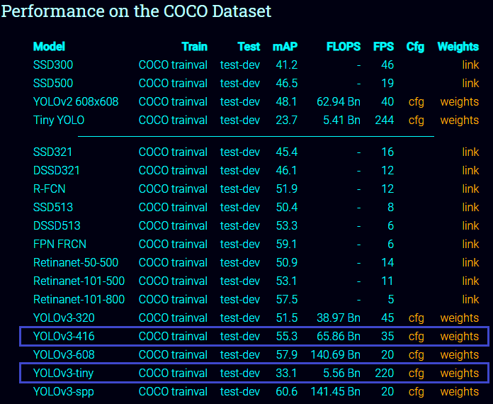
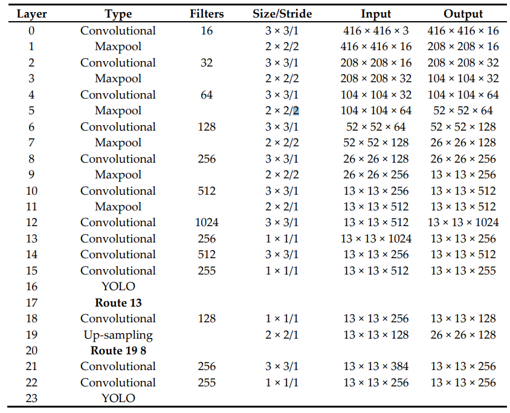
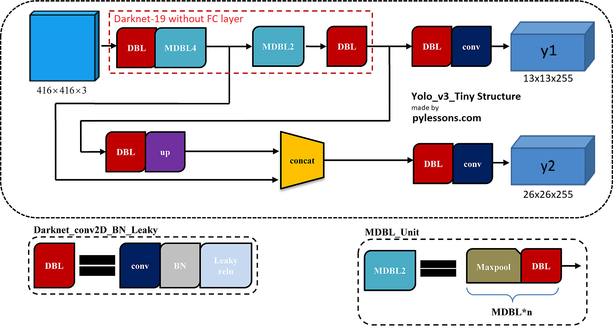

> 本文所有图片来源于https://medium.com/analytics-vidhya/tensorflow-2-yolov3-tiny-object-detection-implementation-c3ea5d4d0510

虽然 YOLOv3 已经比同样是单阶段目标检测模型的 SSD300 要快，但是对于嵌入式设备的应用，基于 Darknet53 backbone 的 YOLOv3 速度仍然不可观，因此 YOLO 的作者定义了 YOLOv3-tiny 模型，通过简化模型来追求推理速度，出于同样目的，Tiny YOLO 模型也被提出。各个版本的主流单阶段目标检测模型在 COCO 数据集上的表现如下：

从结果可以看出 YOLOv3-tiny 比常规规模的模型计算量小六倍左右，在单块 GPU 上可以达到 220 FPS 的推理速度。

YOLOv3-Tiny 使用 Darknet19 作为其 backbone，网络结构如下：

从图中可以看出，YOLOv3-Tiny 只有两层 YOLO 层，以及更少的卷积层，更形象的结构示意图如下：

与 YOLOv3 相比，YOLOv3-Tiny 保留了对 FPN 的借鉴，仍然通过 feature map 直接叠加的操作来融合特征，只是选择了更少的 feature map 进行特征融合和特征检测。基于精简的模型，很多文章都采用剪枝的策略来进一步压缩参数，在保持精度的前提下提高推理速度，因此对剪枝策略的研究可以作为模型优化的方向。

这一周在模型训练中遇到了较多问题，最严重的是数据集在转换格式的过程中出现了错误，导致训练结果 mAP 仅有 0.1，因此考虑顺便把数据集中的噪声去掉，重新转换数据集进行训练。