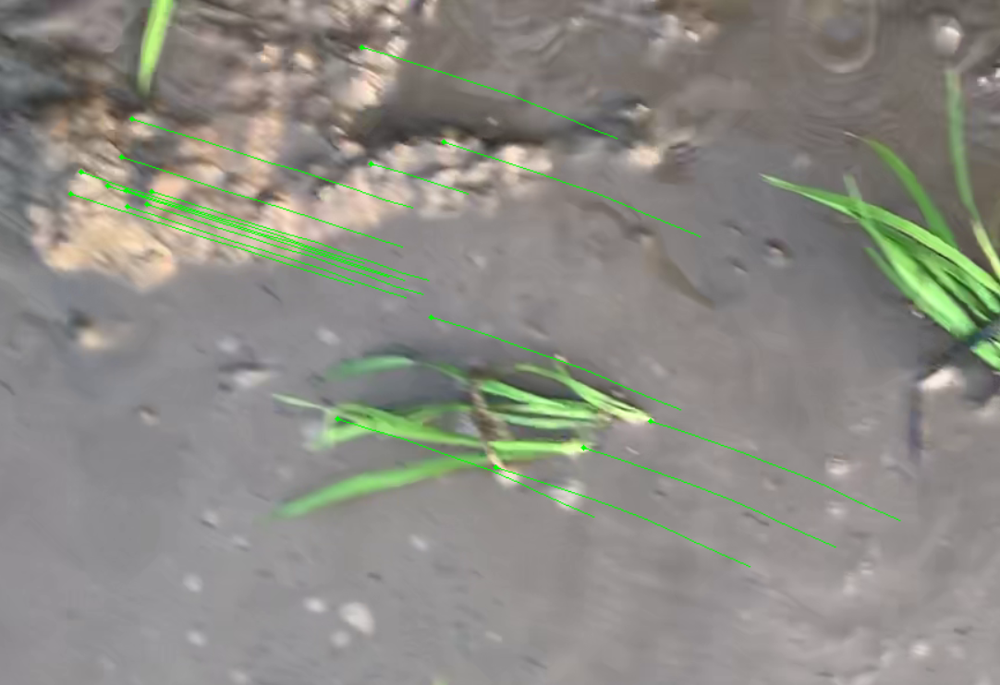
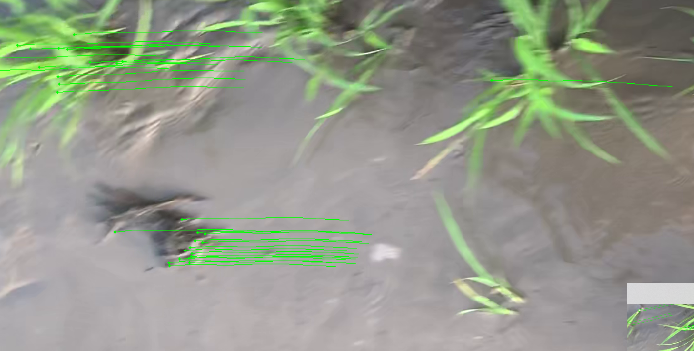

这一周主要承接上周对导航线算法框架的完善。

我们对相机的假设为：相机固定，即没有旋转，但对相机是否会随执行机构横向移动，我们不做假设。此外，考虑到相机抖动问题，我们的算法也不应该过度依赖于精确的像素坐标。

目前的算法框架为：

对视频流中的每一帧：

- 深度学习模型目标检测，生成 bbox
- 对解析后的 bbox 像素位置进行聚类
- 我们认为聚类结果将目标点按行分类
- 从每一类的目标点中最小二乘拟合出直线，直线斜率表示其走向
- 使用所有直线斜率的加权表示本帧中苗线的走向

对整个视频流：

- 选择一个窗口，使用指数加权平均计算窗口内各帧中苗线的平均走势
- 该平均走势可以体现相机移动速度在两个相互垂直的方向上的比值
- 使用 L-K 光流算法估计当前相机速度（矢量）
- 结合相机速度以及稻苗线走势计算执行机构在每一时刻的速度
- 对速度积分得到每一时刻执行机构的目标位置

# 光流法

光流是利用图像序列中像素在时间域上的变化以及相邻帧之间的相关性来找到上一帧跟当前帧之间存在的对应关系，从而计算出相邻帧之间物体的运动信息的一种方法。

研究光流场的目的就是为了从图片序列中近似得到不能直接得到的运动场，而运动场恰恰是真实世界中物体的运动。

- 运动场：物体所处的真实三维世界
- 光流场：运动场在二维空间的投影，即二维图像

计算光流的方法有三种：

- 基于区域或者基于特征的匹配方法
- 基于频域的方法
- 基于梯度的方法

计算光流的三个假设前提：

- 相邻帧之间的亮度恒定
- 相邻帧之间的物体运动幅度小
- 保持空间一致性，即相邻像素点具有相同的运动

### Lucas-Kanade 算法

Lucas-Kanade 算法是一种传统光流算法，它属于基于梯度的光流算法。

假设第一帧图像中的像素$(x, y)$在事件$dt$后移动到第二帧图像的$(x+d x, y+d y)$处。

1. 根据亮度恒定假设，我们可以得到：
   $$
   I(x, y, t)=I\left(x+d_{x}, y+d_{y}, t+d_{t}\right)
   $$
   

   $I(x, y, t)$表示在时间$t$时刻，像素$(x,y)$点的光强。

2. 对等式进行泰勒展开：
   $$
   I\left(x+d_{x}, y+d_{y}, t+d_{t}\right)=I(x, y, t)+\frac{\partial I}{\partial x} \Delta x+\frac{\partial I}{\partial y} \Delta y+\frac{\partial I}{\partial t} \Delta t+\varepsilon
   $$
   其中$\varepsilon$为无穷小，可以忽略不计，根据微小位移假设：
   $$
   I(x, y, t)=I(x, y, t)+\frac{\partial I}{\partial x} \Delta x+\frac{\partial I}{\partial y} \Delta y+\frac{\partial I}{\partial t} \Delta t
   $$
   因此有：
   $$
   \frac{\partial I}{\partial x} \Delta x+\frac{\partial I}{\partial y} \Delta y+\frac{\partial I}{\partial t} \Delta t=0
   $$

3. 等式两侧同时储以$dt$，得到：
   $$
   \frac{\partial I}{\partial x} \frac{d x}{d t}+\frac{\partial I}{\partial y} \frac{d y}{d t}+\frac{\partial I}{\partial t} \frac{d t}{d t}=0
   $$
   设$u,v$分别为光流沿$X$轴与$Y$轴的速度矢量，即：
   $$
   \mathrm{u}=\frac{d x}{d t}, v=\frac{d y}{d t}
   $$
   设$I_x,I_y$分别表示图像中像素点的灰度沿$x,y$方向的图像梯度，$I_t$表示沿$t$方向的时间梯度，即
   $$
   I_{x}=\frac{\partial I}{\partial x}, I_{y}=\frac{\partial I}{\partial y}, I_{t}=\frac{\partial I}{\partial t}
   $$
   最终得到光流方程：
   $$
   I_{x} u+I_{y} v+I_{t}=0
   $$

4. 由于方程中有两个未知数，无法求得唯一解，因此有了稀疏光流跟踪算法，根据相邻像素的空间一致性，假设一定大小的区域之内的像素点拥有相同的运动，假设该区域大小为$3\times 3$，那么就有：
   $$
   \left[\begin{array}{cc}
   I_{x}\left(\mathrm{p}_{1}\right) & I_{y}\left(\mathrm{p}_{1}\right) \\
   I_{x}\left(\mathrm{p}_{2}\right) & I_{y}\left(\mathrm{p}_{2}\right) \\
   \vdots & \vdots \\
   I_{x}\left(\mathrm{p}_9\right) & I_{y}\left(\mathrm{p}_{9}\right)
   \end{array}\right]\left[\begin{array}{c}
   u \\
   v
   \end{array}\right]=-\left[\begin{array}{c}
   I_{t}\left(\mathrm{p}_{1}\right) \\
   I_{t}\left(\mathrm{p}_{2}\right) \\
   \vdots \\
   I_{t}\left(\mathrm{p}_{9}\right)
   \end{array}\right]
   $$
   联立方程，然而由于约束条件过多，依然不能求得精确解，我们使用最小二乘来拟合解。

   将模型简化为
   $$
   \left(A^{T} A\right) d=A^{T} b
   $$
   最终得到光流的解：
   $$
   \left[\begin{array}{l}
   \mathrm{u} \\
   v
   \end{array}\right]=\left[\begin{array}{ll}
   \sum I_{x}^{2} & \sum I_{x} I_{y} \\
   \sum I_{x} I_{y} & \sum I_{y}^{2}
   \end{array}\right]^{-1}\left[\begin{array}{c}
   -\sum I_{x} I_{t} \\
   -\sum I_{y} I_{t}
   \end{array}\right]
   $$

# 效果

利用 LK 光流算法和角点选择算法，图像中被选择跟踪的角点在视频流中可视化的效果如下：

以上光流跟踪算法为每一个追踪的角点维护一个固定长度的队列，来存储连续帧中追踪点的位置，根据位置信息我们可以获得相机相对于地面移动的像素距离。

如果已知图像分辨率以及相机高度等信息，可以唯一确定一个 scale 参数，将像素距离映射到实际距离，再加入视频流帧率信息，我们就可以估计相机相对于地面移动的真实速度。

# 实时性

在30fps的视频流中，每五帧重新选取角点，最大角点数量为50个的参属下，每次迭代在 2.4GHz i7 CPU 上需要大约 0.02 s，减少角点数量还可以更快，因此使用该算法获取速度是可行的。