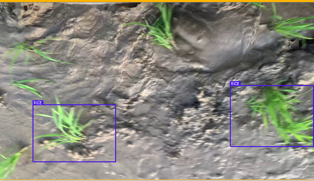
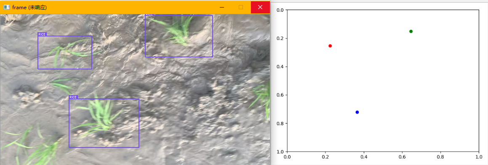
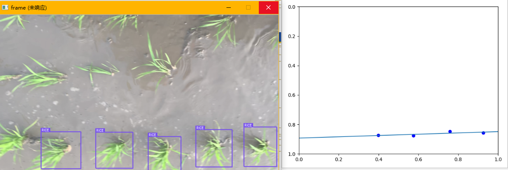
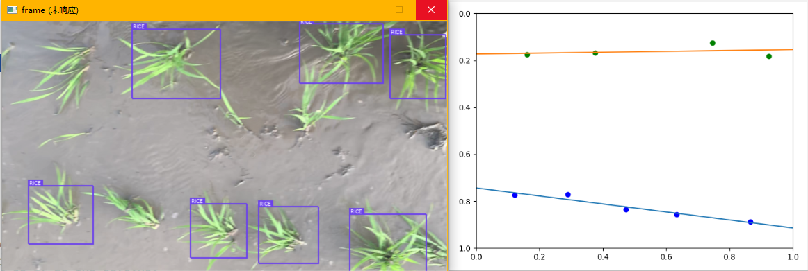

# 关于数据是否有效

有关聚类算法，我们如何优化算法使得聚类和直线拟合得到的数据最符合我们的期望？如何选择类的数目，如何映射目标点？

我们先给定一个大前提，视野内行数小于列数，而行是我们要拟合的直线。

事实上，只有载具在行间正常行驶时我们才需要进行控制，在载具本身调整方向的过程中我们并不需要控制，我们要关注的只是载具在行间正常行驶时如何控制，而在无法正常拟合出直线的情况下我们可以重置控制机构位置，有数据时启动控制器。

如何提取散点特征判断当前帧是否有效？

如果只有深度学习模型提供的目标位置，我们拥有的信息太少了，很难使用某种算法仅从散点数据中获得当前帧中有几行稻苗，当前帧所描述的稻苗位置是否是机具直线前进时获得的有效数据，或是转弯等过程中拍摄到的无效数据。这里，我们对有效数据和无效数据的定义是：需要根据所得进行控制的数据为有效数据，而转弯过程中拍摄到的图像中提取出的目标位置信息为无效数据，因为转弯过程中我们无需控制。比如下图：

从这样一幅图像中我们自己都无法判断这一帧中是否存在行，而算法如果不加限制条件的话，算法就会试图从无效数据中拟合导航线。

## 解决方法思路

对于以上问题，我们需要考虑如何把有效数据和无效数据用尽可能简单的方法区分开。因此我们考虑使用光流法提供的速度参数来过滤无效运动中的数据，特别是针对非直线前进过程中采到的数据进行过滤和丢弃。

由于速度是矢量，我们可以获得一个窗口内连续几帧中追踪点的运动方向，默认采集到有效数据的必要条件是移动方向沿 x 轴方向，那么我们可以通过计算并判断速度矢量沿 x 轴方向的与沿 y 轴方向的速度比来判断当前数据是否有效。

# 关于聚类算法

此外，K-Means 聚类算法在这里的应用十分受限，因为它需要指定类别数量，而类别数量是无法确定的。当然我们可以给定一个类别数量的范围，遍历该范围中的所有值，选择聚类结果的方差或标准差最小的类别数量作为聚类结果，但是算法到这里已经过于复杂。

因此我们需要一种无需类别数目先验知识的聚类算法对散点进行聚类，这里使用 DBSCAN 传统聚类算法。

## DBSCAN密度聚类算法

DBSCAN是一种基于密度的聚类算法，这类密度聚类算法一般假定类别可以通过样本分布的紧密程度决定。同一类别的样本，他们之间的紧密相连的，也就是说，在该类别任意样本周围不远处一定有同类别的样本存在。通过将紧密相连的样本划为一类，这样就得到了一个聚类类别。通过将所有各组紧密相连的样本划为各个不同的类别，则我们就得到了最终的所有聚类类别结果。

总地来说，DBSCAN 算法具有如下特点：

- 基于密度，对远离密度核心的噪声点鲁棒
- **无需知道聚类簇的数量**
- **可以发现任意形状的聚类簇**

具体到我们的应用场景中，DBSCAN 聚类算法可以在参数选择合适的前提下，根据集合中点之间的欧氏距离将散点分类，可以对任意形状的数据进行分类，并且可以把样本中偏差较大的样本孤立出来并舍弃。由于在我们的应用场景中，样本聚类簇之间密度差异很小，且样本数量少，并且数据维度低，因此我们的应用场景十分适合 DBSCAN 算法。

## 算法步骤

**1，寻找核心点形成临时聚类簇。**

扫描全部样本点，如果某个样本点 R 半径范围内点数目不少于 MinPoints，则将其纳入核心点列表，并将其密度直达的点形成对应的临时聚类簇。

**2，合并临时聚类簇得到聚类簇。**

对于每一个临时聚类簇，检查其中的点是否为核心点，如果是，将该点对应的临时聚类簇和当前临时聚类簇合并，得到新的临时聚类簇。

重复此操作，直到当前临时聚类簇中的每一个点要么不在核心点列表，要么其密度直达的点都已经在该临时聚类簇，该临时聚类簇升级成为聚类簇。

继续对剩余的临时聚类簇进行相同的合并操作，直到全部临时聚类簇被处理。

## 具体应用

由于每一帧图像中的样本点都比较少，所以 MinPoints 取为 1，在此基础上，对样本点使用归一化像素坐标，设置半径 0.1 时，可以较好地实现聚类，使聚类结果尽可能符合预期。

将深度学习模型的结果提取出来，加上后续的导航线提取算法，我们可以看到有以下几种情况：（聚类类别过多的情况一定不存在有效数据，因此直接丢弃）

分别对应：

- 无效数据
- 一行的情况
- 两行的情况

对于夹杂在大量有效数据中的无效数据，我们不进行直线拟合，并且认为导航线具有瞬时稳定性，用当前窗口的平均值来代替当前导航线数据；而对于连续的无效数据，我们认为此时没有必要进行控制，因此在这种状态下不进行任何导航线计算和控制，直到连续检测到有效数据。

至此，对于导航线提取算法，我们就已经有了一个合适的算法框架。

