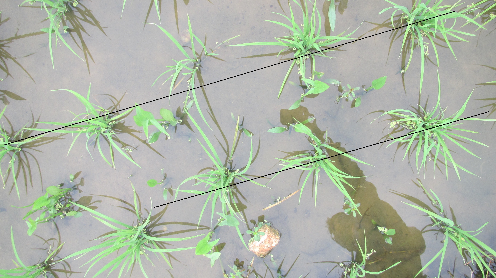
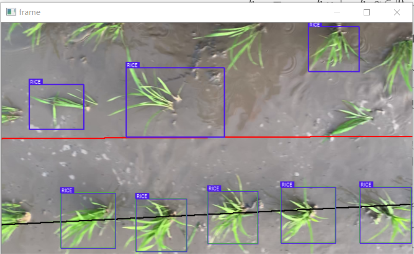
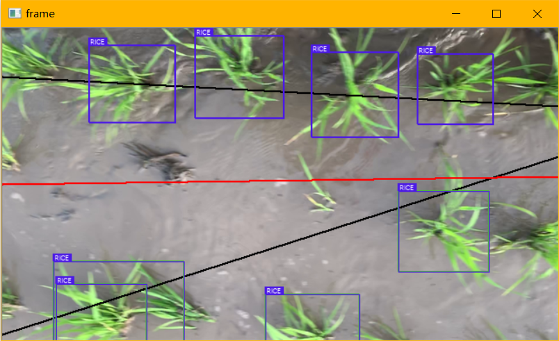
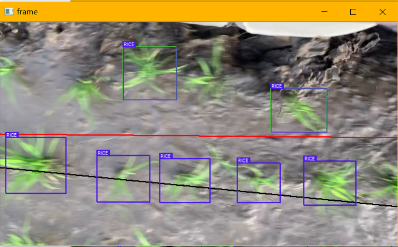

# 背景

为了解决项目中的基于目标检测的稻苗线拟合问题，需要设计一个算法实现基本功能。基于深度学习的目标检测输出 bounding boxes 的 location 的 list，表示检测出的所有稻苗的位置（我们假设为中心点，质心），而我们的目标是利用这些位置坐标，采用回归算法拟合出我们想要的稻苗导航线（也就是稻苗线按行的延伸方向）。想要的效果大概如下图所示：

# 关于导航信息提取

然而每一帧里面的目标个数实在是太少了，一般不会超过十个。我们已经采用了简单的条件判断去避免一定会发生错误的情况：

- 某一个类只有一个样本时，该类不需要拟合直线；
- 某一个类样本过少时，比如该类只有两个样本，那么拟合出的直线完全取决于这两个点是否“没有出现过大的偏移”（相较于前几帧），如果当前帧只有两个样本，而某一个样本偏离了苗线，那么直线将出现严重偏差，而这条直线对于控制系统没有任何作用，甚至会导致不稳定；
- 有时视野中可能会出现两行以上的目标，此时如果不加甄别地将这些目标聚类成两类，其结果会有严重偏差，因为我们实际上把第三条线的点强行分入了其他类中；

回到实际问题中，对苗带引导线的提取，其目的就是为了控制机具避开绝大多数的稻苗，因此我们的目的是检测出苗线的走势。

控制需要偏差，导航线给出的便是控制目标。由于抖动或者其他不确定因素，我们使用当前帧中的像素的绝对位置信息来作为控制目标是不合适的，因为这种方法依赖的是相机与稻苗之间的相对位置，如果相机出现了抖动，算法无法知道到底是谁出了问题。

所以，就像上面所说的，我们需要苗线本身的”走势“，也就是苗线在垂直于苗线方向上的变化率。要让这个变化率与目标本身的像素位置无关，就需要算法有记忆性。

而记忆性所针对的实体应该是每一帧中，由算法计算出的数据，因为帧与帧之间是割裂的，不连续的，而单帧中的数据可以保证目标之间的相对位置是没有噪声的，噪声指的是无关变量引入的误差。

同时，为了使输出平滑，尽量减少抖动，使用记忆性的算法也是合理的，这实际上也是对苗线数据的滤波处理。

至此，我们为了实现算法，需要维护一个窗口，窗口内的数据是有效的，而每个新进入窗口的数据需要一个合适的权值来更新当前苗线参数。这是我们假设有效的算法的初步模型，如果使用指数加权平均方法来降低维持窗口所需的空间资源消耗，效果是类似的。

下面把我们初步假设的算法具体化：

假设我们维护一个大小为 `m` 的窗口，新样本的权值为 $\alpha$，那么这两个参数有如下关系：
$$
m = \frac{1}{\alpha}
$$
假设我们有导航线 $y=kx+b$，那么对于 $k$ 和 $b$，分别用指数加权平均计算：
$$
k_{new} = \frac{1}{1-\alpha} k_{old} + \frac{1}{\alpha} k,\ \alpha \in [0,\ 1]
$$

$$
b_{new} = \frac{1}{1-\alpha} b_{old} + \frac{1}{\alpha} b,\ \alpha \in [0,\ 1]
$$

实际上，我们计算一帧当中的 $k$ 时，可以看成是截取了很长的一条苗线中的一部分，如果把这一部分看成一点，那么 $k$ 值为该点斜率，这个斜率表示了单位时间内，苗线横向位移与纵向位移的比例，因此如果我们有一个速度参数，就可以求出执行机构横向位移的速度，乘以采样时间，我们就有了该采样时间内机构应执行的偏移量。对这个偏移量累积求和，就得到执行机构的目标位置。因此，$b$ 值实际上是不需要的。

那么如何从一帧图像中提取导航线数据？对一帧图像，假如有多行稻苗，我们希望从这一帧提取出的 $k$ 能够反映出这一帧中苗线走势的最真实的状态，使得机器可以避开大部分稻苗，那么，最容易想到的就是，对于不同的苗线，假设其 $k$ 值为 $k_n$，对每个 $k_n$ 加权求和，权值由用来拟合直线的数据点数决定。

我们可以先假设相机高度固定时，视野中仅有两行稻苗。先来分析一下如何使用聚类较为合理。

通过把不同类别的颜色分开表示，可以看出直接使用像素位置进行聚类的结果几乎无法正确地将数据点分类到理想的直线中，因为聚类计算的是欧拉距离，将一个点归入距离类中心欧拉距离最小的类，而我们如果想要拟合直线，需要只考虑点与点之间沿着垂直于直线方向的距离，也就是将所有点映射到一个合适的一维空间进行聚类。

考虑最简单的情况，我们直接对一系列点的y值进行聚类（假设苗线方向大致平行于x轴），得到的效果：

上图中，黑线为当前帧中可信度较高的苗列线，红色线为全局导航信息，表示平滑的稻苗线的弯曲趋势，它可以表示苗线在机具前进方向上和垂直于前进方向上的速度之比，如果可以结合载具前进速度，那么就可以实现控制量的给定。

如果依赖于载具速度，我们就可以将导航信息提取与相机位置解耦，不过我们需要一种从连续视频流中估计相机运动速度的算法，这里还需要研究一下，看看是否能形成一个基本的算法框架。

### Lucas-Kanade 算法

Lucas-Kanade 算法是一种传统光流算法。

在计算机视觉中，光流用来定义图像中对象的移动，这个移动可以是相机移动或者物体移动引起的。具体是指，视频图像的一帧中的代表同一对象(物体)像素点移动到下一帧的移动量，使用二维向量表示。

根据是否选取图像稀疏点进行光流估计，可以将光流估计分为稀疏光流和稠密光流。

算法基于两个假设：

- 亮度不变假设，其假设待估计光流的两帧图像的同一物体的亮度不变，这个假设通常是成立的，因为环境光照通常不会发生太大的变化；
- 邻域光流相似假设，假设以一个像素点$(x,y)$为中心的某个大小的邻域内，所有像素点的光流一致；

基于以上两个假设，在选择合适的点的前提下，我们可以计算出光流的唯一解，即两帧之间像素点的移动距离，以像素点为单位表示。而像素点映射到实际空间距离的参数是可以确定的。

### cv2.goodFeaturesToTrack

openCV 库提供了 LK 算法的库实现。使用该库函数的流程：

- 在第一帧种利用角点选择算法选择一组角点，作为目标跟踪像素的初始点
- 利用 LK 算法迭代地跟踪这些特征点
- 在物体持续向同方向移动的过程中，每隔一段时间，算法迭代跟踪的角点会全部移出视野范围，因此需要一种策略在合适的时机重新选择角点

## 完整光流检测 demo 实现

- 每 n 帧重新计算角点
- 用一个队列维护最新的角点位置，队列长度固定，丢弃最久的数据

我们可以简单取队列首尾像素位置计算 n 帧的窗口内的相机速度，该速度为矢量，可以直接计算出选定时间内的平均速度，需要额外的 scale 参数来将像素速度转换为真实速度。

## 依然存在的问题

有关聚类算法，我们如何优化算法使得聚类和直线拟合得到的数据最符合我们的期望？如何选择类的数目，如何映射目标点？

我们先给定一个大前提，视野内行数小于列数，而行是我们要拟合的直线。

事实上，只有载具在行间正常行驶时我们才需要进行控制，在载具本身调整方向的过程中我们并不需要控制，我们要关注的只是载具在行间正常行驶时如何控制，而在无法正常拟合出直线的情况下我们可以重置控制机构位置，有数据时启动控制器。

如何提取散点特征判断当前帧是否有效？

考虑使用光流法提供的速度参数来过滤无效运动中的数据。